*********************
Academics Management
*********************

 The module deals with the management of the academics sector such as management of students, cohort, courses, activities, transcripts, certificates along with their sub categories.

* On the main Dashboard click on **“Academics Management”** by the following process as shown in the picture below.

.. image:: ./../images/academic/image221.png

* The following page will appear on clicking **‘Academics Management’**.

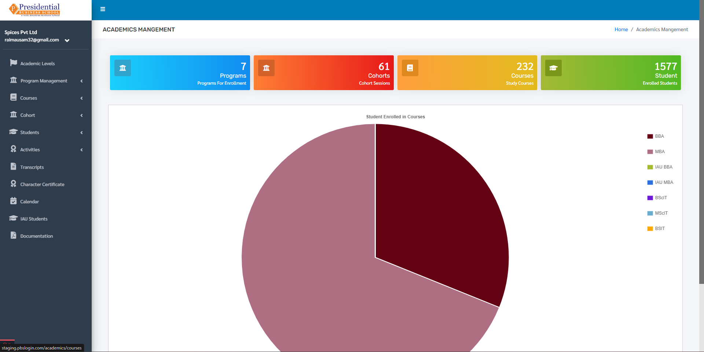

After user is landed on the dashboard of **“Academics Management”**, user will be able to see some sub=modules on the left hand side of the page:

1. Academics Level
2. Program Management
3. Courses
4. Cohort
5. Students
6. Activities
7. Transcripts
8. Character Certificate
9. Calendar
10. IAU Students
11. Documentation

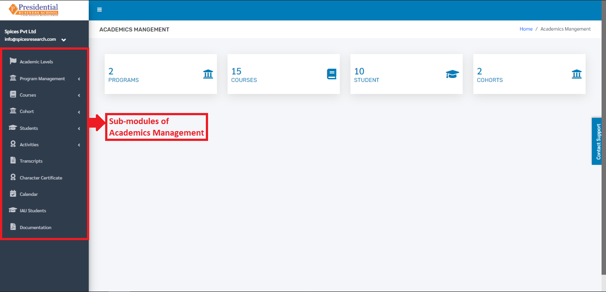

I. Academics Level
==================

As the name implies, Academics Level refers to the level of the academics that can be inherited by person(student).

* Users must click on **‘Academics Level’** on the left hand side of the dashboard to access it. This is done by the following process.

.. image:: ./../images/academic/image224.png

* On clicking on Academics Level, the following dashboard will appear on the screen.

1. Create New Academic Level
----------------------------

* To create a new academic level, the user has to fill out the form in the system. This is done by clicking on the **‘Add New’** button on the top right hand side of the page.

.. image:: ./../images/academic/image226.png

* The following page will appear on clicking the **‘Add New’** button.

.. image:: ./../images/academic/image225.png

* The form must be filled out. The **‘SUBMIT’** button must be clicked to finish up the process.

* The new academic level can be seen on the dashboard of Academic Levels once the **‘SUBMIT’** button is clicked.

.. image:: ./../images/academic/image227.png

2. Edit Academic Level
----------------------------

* If necessary, details of the academic levels can be edited as well. This is done by clicking on the **‘Edit’** icon(button) under the Operation column.

.. image:: ./../images/academic/image229.png

The following page will appear on clicking the Edit icon(button).

.. image:: ./../images/academic/image39.png

After editing the details, the user must click on the **‘UPDATE’** button to finish up the editing process.

II. Program Management
=======================

**‘Program Management’** deals with the management of levels and programs that are provided by the college.

* Users must click on **‘Program Management’** on the left hand side of the dashboard to access it. This is done by the following process.

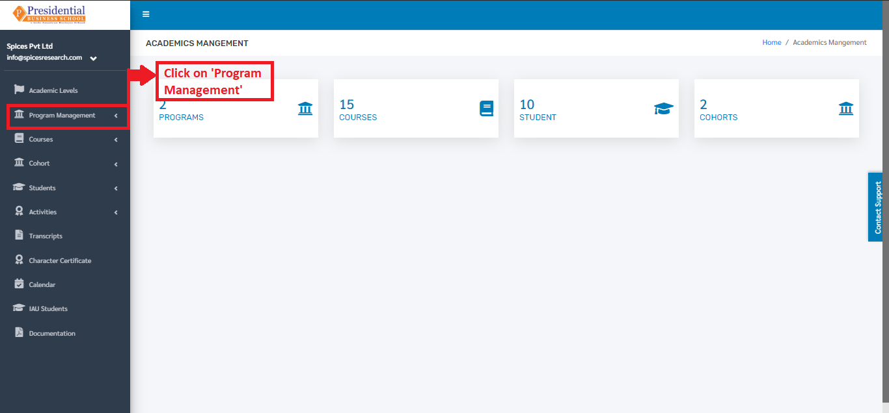

* On clicking **‘Program Management’**, two subcategories will appear namely Level and Programs.

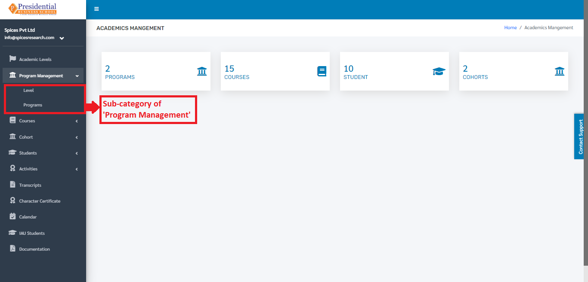

1. Level
---------

* The user from the college must click on **‘Level’** to access this subcategory. This is done by the following process.

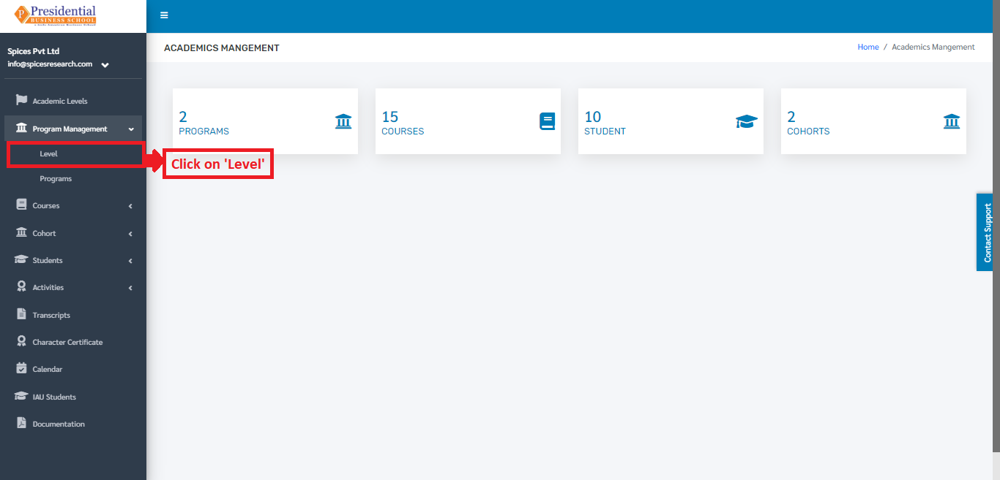

* The user will be landed on the following page after clicking **‘Level’**.

1.1 Create New Level
^^^^^^^^^^^^^^^^^^^^
* For creating a new level, the user has to click on the **‘New Program’** button. This is done by the following process.

* A page consisting of a form will appear after clicking on the **‘New Program’** button.

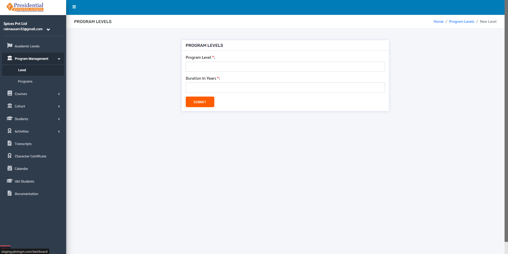

* The required details must be filled in the form and click on **‘SUBMIT’** to finish up the creation process.

.. image:: ./../images/academic/image192.png

* Once the **‘SUBMIT’** button is clicked a new level is created and seen on the dashboard of  Level.

1.2 Edit Level
^^^^^^^^^^^^^^^

* If necessary, details of the level can be edited as well. This is done by clicking on the **‘Edit’** icon(button) under the Operation column.

.. image:: ./../images/academic/image47.png

* The following page will appear on clicking the Edit icon(button).

.. image:: ./../images/academic/image21.png

After editing the details, the user must click on the **‘UPDATE’** button to finish up the editing process.

2. Programs
-------------

* The user from the college must click on **‘Programs’** to access this subcategory. This is done by the following process.

.. image:: ./../images/academic/image24.png

* The user will be landed on the following page after clicking **‘Programs’**.

.. image:: ./../images/academic/image26.png

2.1 Create New Program
^^^^^^^^^^^^^^^^^^^^^^^^^^^

* For creating a new program, the user has to click on the **‘Add New Program’** button. This is done by the following process.

.. image:: ./../images/academic/image28.png

* A page consisting of a form will appear after clicking on the **‘Add New Program’** button.

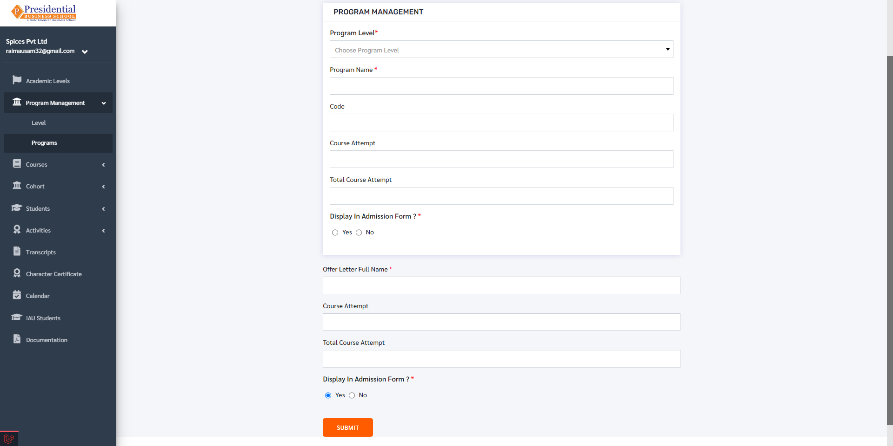

* The required details must be filled in the form and click on **‘SUBMIT’** to finish up the creation process.

.. image:: ./../images/academic/image68.png

* Once the **‘SUBMIT’** button is clicked a new program is created and seen on the dashboard of **‘Programs’**.

.. image:: ./../images/academic/image32.png

2.2 Manage Required Academic Documents
^^^^^^^^^^^^^^^^^^^^^^^^^^^^^^^^^^^^^^^^^^^

* In order to manage the required documents needed for the desired Program, the user will have to click on the ‘Manage Required Documents’ icon under the Operation column.

.. image:: ./../images/academic/image34.png

* The user will be landed on the following page.

.. image:: ./../images/academic/image36.png

* Required Academic Documents can be selected for a particular Program by clicking on the **‘New Document’** button.

.. image:: ./../images/academic/image37.png

* The type of the document must be selected in the page that appears after clicking the **‘New Document’** button.

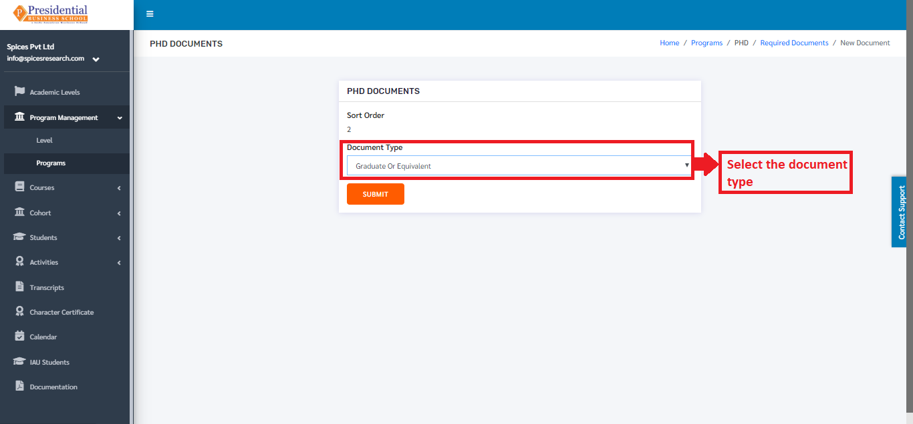

* Once the desired document type is selected, the user must click on the **‘SUBMIT’** button.

.. image:: ./../images/academic/image74.png

* After clicking the **‘SUBMIT’** button, the required document type can be seen on the dashboard.

III. Courses
=============

**‘Courses’** module allows users to view details about different courses provided by the college for different programs.

* Users must click on **‘Courses’** on the left hand side of the dashboard to access it. This is done by the following process.

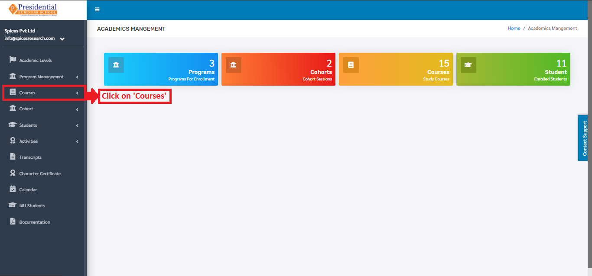

* On clicking on Courses, a subcategory named Courses itself will appear.

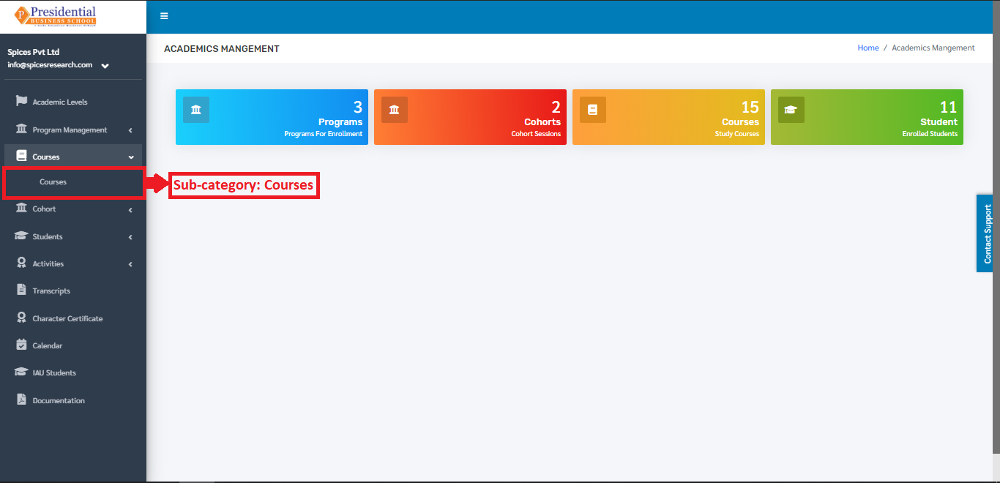

* Users must click on Courses to access the submodule.

.. image:: ./../images/academic/image82.png

* The following page will appear on clicking Courses.

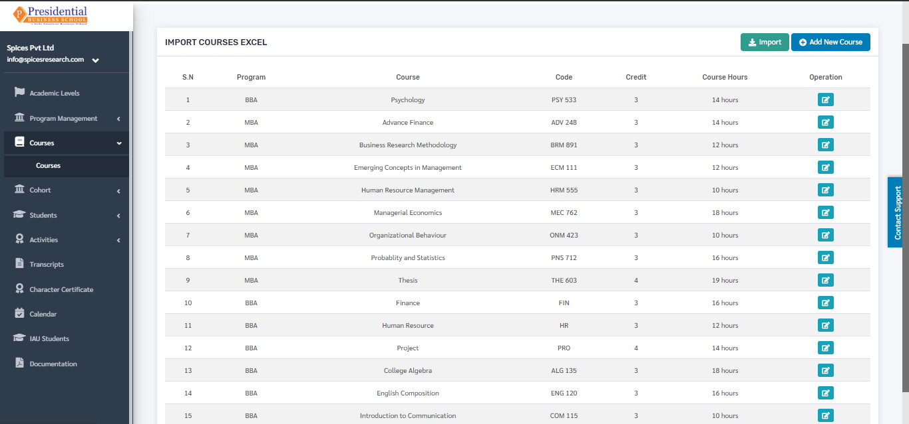

The page provides information on different courses provided by the college for different programs.

1. Create New Course
---------------------

There are two methods to create a new course.

     1.1 Create by filling the form

     1.2 Create by uploading Excel File
    

1.1 Create by filling the form
^^^^^^^^^^^^^^^^^^^^^^^^^^^^^^^^

* To create a new course, the user has to fill out the form in the system. This is done by clicking on the ‘Add New Course’ button on the top right hand side of the page.

.. image:: ./../images/academic/image86.png

* On clicking the **‘Add New Course’** button, the following page will appear.

.. image:: ./../images/academic/image88.png

* The form must be filled out. The **‘SUBMIT’** button must be clicked to finish up the process.

.. image:: ./../images/academic/image90.png

* The new course can be seen on the dashboard of courses once the **‘SUBMIT’** button is clicked.

.. image:: ./../images/academic/image50.png

1.2 Create by uploading Excel File
^^^^^^^^^^^^^^^^^^^^^^^^^^^^^^^^^^

* Excel files with correct format can be uploaded in order to create a new course as well. Before uploading the Excel file, the excel file of correct format must be downloaded first. This is done by clicking on the ‘IMPORT’ button.

.. image:: ./../images/academic/image51.png

* The following page will appear by clicking the **‘IMPORT’** button.

* The user must now click on the **‘Download Excel Format’** button to download the correct excel format.

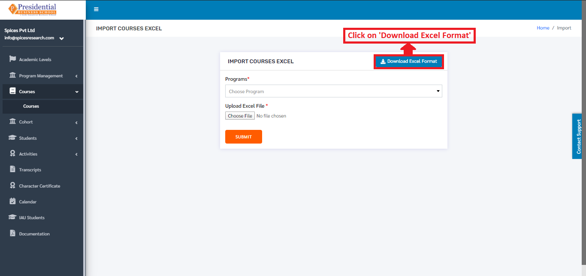

* An excel file of the following format will be downloaded on clicking **‘Download Excel Format’**.

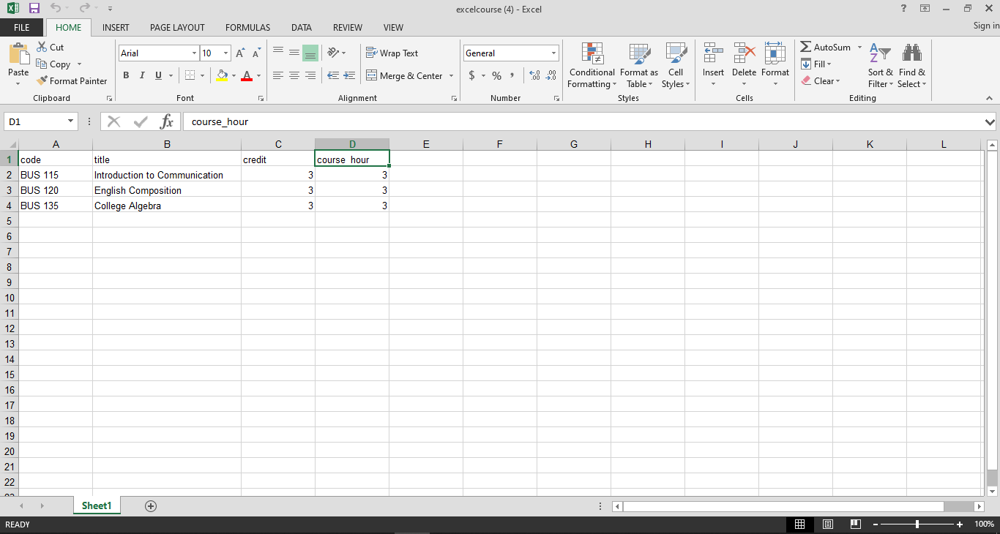

* The desired courses can be added according to the format given and the user must save the excel file after editing(adding) the courses.

.. image:: ./../images/academic/image60.png

* After saving the file, the same file has to be uploaded. This is done by selecting the program from the drop down menu and choosing the excel file by clicking **‘Choose File’**.

.. image:: ./../images/academic/image62.png

* To finish up the process, the user must click on the ‘SUBMIT’ button after choosing the program and the excel file.

.. image:: ./../images/academic/image64.png

* The courses from the excel file will be imported and can be seen on the dashboard of Courses.

.. image:: ./../images/academic/image65.png

2. Edit Course
----------------

* Details of the courses can be edited as well. This is done by clicking on the **‘Edit’** icon(button) under the Operation column.

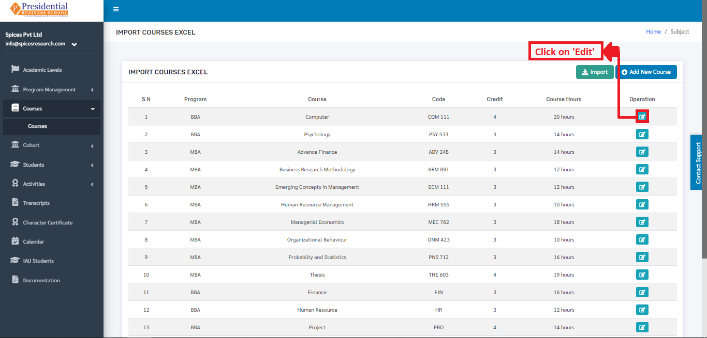

* The following page will appear on clicking the **‘Edit’** button.

.. image:: ./../images/academic/image114.png

Once the details are edited, **‘UPDATE’** button must be clicked in order to finish up the editing process.

IV. Cohort
==========

**‘Cohort’** module allows users to view details about different cohorts(batch) and the sessions that are provided by the college.

* Users must click on **‘Cohort’** on the left hand side of the dashboard to access it. This is done by the following process.

* On clicking **‘Cohort’**, two subcategories will appear namely Cohort and Sessions.

1. Cohort
---------

* The user from the college must click on **‘Cohort’** to access this subcategory. This is done by the following process.

* The following page will appear on clicking Cohort.

.. image:: ./../images/academic/image122.png

The page provides information about different Cohorts in the college.

1.1 Create New Cohort
^^^^^^^^^^^^^^^^^^^^^^

* Users can create a new cohort in the system by clicking on the **‘New Cohort’** button(icon) on the top right hand side of the dashboard as shown in the picture below.

* On clicking the **‘New Cohort’** button(icon), the user will be landed on the following page.

.. image:: ./../images/academic/image126.png

* The required details must be filled in the form and click on **‘SUBMIT’** to finish up the creation process.

.. image:: ./../images/academic/image128.png

* Once the **‘SUBMIT’** button is clicked a new cohort is created and seen on the dashboard of Cohort.

.. image:: ./../images/academic/image129.png

1.2 Edit Cohort
^^^^^^^^^^^^^^^^^^

* If necessary, details of the cohort can be edited as well. This is done by clicking on the **‘Edit’** icon(button) under the Operation column.

* The following page will appear on clicking the Edit icon(button).

The following page will appear on clicking the Edit icon(button).

.. image:: ./../images/academic/image112.png

After editing the details, the user must click on the **‘UPDATE’** button to finish up the editing process.

2. Sessions
------------

Session deals with creation of new sessions along with adding the required courses to the sessions as per the college requirement. The courses which can be added in the sessions are created on Courses submodule.

* To access this subcategory, the user must click on ‘Session’ on the left hand side of the page. This is done by the following process.

* The following page will appear on clicking Sessions.

.. image:: ./../images/academic/image6.png

The page provides information about different Cohort Sessions in the college.

2.1 Create New Session
^^^^^^^^^^^^^^^^^^^^^^

* Users can create a new session in the system by clicking on the **‘New Sessions’** button(icon) on the top right hand side of the dashboard as shown in the picture below.

.. image:: ./../images/academic/image99.png

* On clicking the **‘New Sessions’** button(icon), the user will be landed on the following page.

* The required details must be filled in the form and click on **‘SUBMIT’** to finish up the creation process of the Cohort Session.

* Once the **‘SUBMIT’** button is clicked a new Cohort Session is created and seen on the dashboard of Sessions.

.. image:: ./../images/academic/image105.png

2.2 Edit Session
^^^^^^^^^^^^^^^^^^

* If necessary, details of the sessions can be edited as well. This is done by clicking on the ‘Edit’ icon(button) under the Operation column.

* The following page will appear on clicking the Edit icon(button).

2.3 Add Session Course
^^^^^^^^^^^^^^^^^^^^^^

* The courses can be added to the sessions as per the requirement of the college. This is done by clicking on the **‘Session Courses’** icon under the Operation column.

.. image:: ./../images/academic/image110.png

* The user will be landed on the following page on clicking **‘Session Courses’** icon.

* Once the page appears, the user must click on **‘Enroll Course’** for adding the courses.

* The following page will appear by clicking the **‘Enroll Course’** button.

* The user can select the desired course from the drop down menu **‘Courses’**.

.. image:: ./../images/academic/image160.png

* Once the courses are selected, **‘ENROLL’** button must be clicked to finish up the process of adding the courses.

.. image:: ./../images/academic/image162.png

2.4 Delete Session Course
^^^^^^^^^^^^^^^^^^^^^^^^^^

* Courses can change over time, so there is an option of deleting the courses from a particular session. This is done by clicking the ‘Session Courses’ icon under the Operation column.

.. image:: ./../images/academic/image110.png

* The user will be landed on the following page on clicking **‘Session Courses’** icon.

* Once the page appears, the user must click on the delete icon under the Operation column to delete the desired course.

On clicking the delete icon(button), the course will be deleted from the selected session.

2.5 Show Session Section
^^^^^^^^^^^^^^^^^^^^^^^^^^
Users can view the session sections by clicking on the session section button.

.. image:: ./../images/academic/image182.png

On clicking on the session section button, the user will be directed to the following page:

.. image:: ./../images/academic/image17.png

To create a new section for that cohort, click on the **‘New Sections’** button.

.. image:: ./../images/academic/image14.png

After clicking on the **‘New Section’** button, the user will be directed to a page with forms for creating  a new section for that cohort.

After filling the required details, click on the **‘Submit’** button to create the new section.

.. image:: ./../images/academic/image9.png

The new section will then be displayed under the Session Section with a success message that the section was created.

To edit the section, click on the edit button.

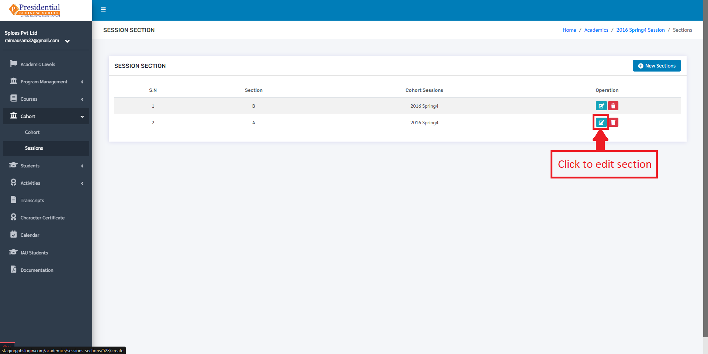

Then the user must click on the submit after editing the section to update the data.

V. Students
============

     **‘Students’** module allows users to view details about different students along with their different details.

* Users must click on **‘Students’** on the left hand side of the dashboard to access it. This is done by the following process.

* On clicking **‘Students’**, four subcategories will appear namely Students, Session Enrollment, Import Session Marks and Student Warning.

1. Students
------------

* The user must click on **‘Students’** to access this subcategory. This is done by the following process.

* The following page will appear on clicking Students.

.. image:: ./../images/academic/image220.png

The page provides information on different students enrolled in the college.

1.1 Create new Student(Import Records)
^^^^^^^^^^^^^^^^^^^^^^^^^^^^^^^^^^^^^^^^^^^^^^

* Excel files with the correct format can be uploaded in order to enroll a new student.  Before uploading the Excel file, the excel file of correct format must be downloaded first. This is done by clicking on the **‘Import Records’** button.
* The user must click on **‘Import Records’** to enroll a new student.

* On clicking **‘Import Records’**, the user will land on the following page.

.. image:: ./../images/academic/image141.png

* The user must now click on the **‘Download Excel Format’** button to download the correct excel format.

.. image:: ./../images/academic/image143.png

* An excel file of the following format will be downloaded on clicking **‘Download Excel Format’**.

* The students can be added according to the format given and the user must save the excel file after editing(adding).

.. image:: ./../images/academic/image147.png

* After saving the file, the same file has to be uploaded. This is done by selecting the cohort from the drop down menu and choosing the excel file by clicking **‘Choose File’**.

.. image:: ./../images/academic/image149.png

* To finish up the process, the user must click on the ‘SUBMIT’ button after choosing the cohort and the excel file.

* The students from the excel file will be imported and can be seen on the dashboard of Students.

.. image:: ./../images/academic/image151.png

1.2 Student Details
^^^^^^^^^^^^^^^^^^^^

* The complete details of the student can be viewed. This is done by clicking the **‘Student Details’** icon under the Operation Column.

.. image:: ./../images/academic/image134.png

* On clicking the **‘Student Details’** icon(button), the following page will appear.

.. image:: ./../images/academic/image7.png

* As the data from the uploaded excel file is not complete i.e. maximum fields of the student are missing. In order to fill up the complete details, the user must click on the **‘Edit Details’** button.

.. image:: ./../images/academic/image137.png

* On clicking the **‘Edit Details’** icon, the user will be landed on the following page.

.. image:: ./../images/academic/image139.png

A form of Personal Details and Academic Details will appear, the user will have to fill up the form.

* As shown in the picture below, the user from college must fill out the Personal Details form and click on the **‘NEXT’** button.

.. image:: ./../images/academic/image185.png

* After the **‘NEXT’** button is clicked, the page is redirected to the form of Academic Details.

* The user must fill out the Academic details of the student and the academic certificates of the degrees has to be uploaded as well.

.. image:: ./../images/academic/image1.png

* After the form fill up is done then the **‘Next’** button must be clicked to go to the Academic Details page.

.. image:: ./../images/academic/image58.png

The academic details page looks like the following:

The academic details page contains details like Single Course Attempts, Total Course Attempts. If the student is a transfer student, details like Transfer Course Code, Transfer Course Details, Transfer Course Credit and Transfer date must be filled. After filling the details, the user can click on the submit button to update the student details.

1.3 Student Sessions
^^^^^^^^^^^^^^^^^^^^

* This option is used to enroll a student in a session. To access this option, the user must click on the **‘Cohort Sessions’** button in the Student Details page.

.. image:: ./../images/academic/image11.png

* The following page will appear on clicking the **‘Cohort Sessions’** button.

* Once the page appears, the user must click on **‘Enroll Session’** for adding the student in a session.

.. image:: ./../images/academic/image205.png

* The following page will appear on clicking the **‘Enroll Session’** button.

.. image:: ./../images/academic/image219.png

The user can select the desired cohort session from the drop down menu **‘Cohort Session’** to enroll the student in the particular session and choose the section for that cohort.

.. image:: ./../images/academic/image207.png

.. image:: ./../images/academic/image8.png

* Once the cohort session is selected, **‘ENROLL’** button must be clicked to finish up the process of adding the student in the session.

.. image:: ./../images/academic/image8.png

* The student can be seen being enrolled in the session.

1.3.1 Create Session:
"""""""""""""""""""""
New sessions can also be created from this by clicking on the **‘Create New Session’** button.

.. image:: ./../images/academic/image15.png

After clicking on **‘Create New Session’** user will be redirected to the following page:

After filling the form, the user can click on the **‘Submit’** button to create a new session for the student. After submitting, user will be redirected to the student sessions along with a success message indicating that a new session has been created.

.. image:: ./../images/academic/image4.png

1.3.2 Courses:
""""""""""""""

* Courses can be added in the session from this dashboard as well. This is done by clicking on **‘Student Courses’** under the Operation Column.

* The user will be landed on the following page on clicking **‘Student Courses’**.

* A new Course can be added to the session, this is done by clicking on the **‘Enroll Course’** button.

.. image:: ./../images/academic/image203.png

* The following page will appear on clicking the **‘Enroll Course’** button.

.. image:: ./../images/academic/image201.png

* The required courses can be added by selecting the courses from the drop down menu **‘Courses’**.

* Once the required courses are selected, **‘ENROLL’** button must be clicked to finish up the process of adding courses to a particular cohort session.

* The sessions with new courses are updated and can be seen in the dashboard.

.. image:: ./../images/academic/image176.png

* The students are evaluated by the marks obtained in the courses. The status of the courses are running at first; the courses will either be completed(passed) or Incomplete(fail). This mark is entered in the system on the basis of the marks obtained by the student in the exam.
* To access this option, the user must click on the **‘Edit Course Details’** icon(button) under the Operation column.

.. image:: ./../images/academic/image175.png

* The user will be landed on the following page on clicking the **‘Edit Course Details’** icon(button).

.. image:: ./../images/academic/image178.png

* The remarks are given i.e. Marks obtained and Course Status according to the performance of the student in the particular course. To finish up the process, **‘UPDATE’** button is clicked.

* The changes can be seen on the dashboard.

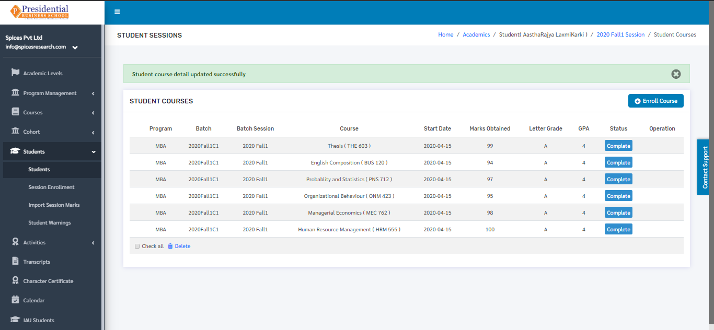

* In case all the exams of the courses are verified(finish) then the session of the student will end as well i.e. status will be completed. To change this status, the user must click on the **‘Cohort Sessions’** icon from the main dashboard of the Students.

.. image:: ./../images/academic/image11.png

* The following page will appear on clicking **Cohort Sessions** icon.

.. image:: ./../images/academic/image174.png

* To change the status, users must click on the **‘View’** icon under the Operation column.

* The following page will appear on clicking the **‘View’** column.

* Once the courses in the session have been completed, the user must change the status from **‘Running’** to **‘Completed’** from the **‘Status’** drop down menu.

* After choosing the status, the user must click on the **‘UPDATE’** button to update the status. Therefore with this process, the session of the student will be completed.

.. image:: ./../images/academic/image190.png

* The status will be seen as Completed in the Session dashboard of the student.

.. image:: ./../images/academic/image186.png

* Once the session of the student is completed, the program of the student will be completed as well. To change the status of the program to completed, the user must click on the **‘Student Details’** icon from the main dashboard of the Students.

.. image:: ./../images/academic/image134.png

* On clicking the **‘Student Details’** icon(button), the following page will appear.

* The user can click on **‘Complete Program’** to finish up the process.

On clicking the **‘Complete Program’** button, the program of the student will be completed.

1.4 Student Transfer
^^^^^^^^^^^^^^^^^^^^

.. image:: ./../images/academic/image13.png

After clicking on the transfer student button, a checklist will appear with a list of programs. The user can select the program to transfer the student to and click on the submit button.

.. image:: ./../images/academic/image19.png

If the student has incomplete sessions, the student cannot be transferred and a message will be shown indicating that.

.. image:: ./../images/academic/image16.png

The student can only be transferred if he/she has no running sessions. Once all the sessions are complete the student can be transferred.

.. image:: ./../images/academic/image135.png

If the student has all completed sessions like above then we can transfer the student to another program in the student details page. After transferring, a message will be shown indicating that the student has been transferred to another program.

Similarly, a student can only be transferred to an active program.

.. image:: ./../images/academic/image231.png

1.5 Student Login Details
^^^^^^^^^^^^^^^^^^^^^^^^^^

* This option is used to create login credentials for students to access the software provided by the college. To access this option, the user must click on the **‘Student Login Details’** icon under the Operation column.

.. image:: ./../images/academic/image181.png

* The following page appears on clicking the **‘Student Login Details’**.

* The user must tick the **‘Is User Verified’** checkbox and enter the password to provide the student with the credential(email and password) to use the software.

* Final step for creating user login details is clicking the **‘UPDATE’** button after filling the form.

.. image:: ./../images/academic/image183.png

The login email id and password for the student to use the software can be provided by the college after the creation of the login credentials.

2. Session Enrollment
------------------------

* This option is used to enroll new just enrolled students in a cohort along with the cohort session. To access this option, the user must click on the **‘Session Enrollment’** subcategory under submodule Students.

* On clicking the Session Enrollment option, the user will be landed on the following page.

.. image:: ./../images/academic/image208.png

* After filling up the form, the user must click on the **‘ENROLL’** button to finish up the session enrollment process.

.. image:: ./../images/academic/image12.png

On clicking **‘ENROLL’** new students are enrolled in the cohort session according to the requirement. This subcategory ‘Session Enrollment’ is useful in the case where more than one student is to be added in the same cohort session.

3. Import Session Marks
------------------------

* This option is used to import the marks from Excel File of a particular student of particular Cohort and the Cohort Session. To access this option, the user must click on the **‘Import Session Marks’** subcategory under submodule Students.

.. image:: ./../images/academic/image142.png

* The following page will appear on clicking Import Session Marks.

.. image:: ./../images/academic/image140.png

* Excel files with the correct format can be uploaded in order to provide marks to students. Before uploading the Excel file, the excel file of correct format must be downloaded first. This is done by clicking on the ‘Download Excel Format’ button.

.. image:: ./../images/academic/image146.png

* An excel file of the following format will be downloaded on clicking **‘Download Excel Format’**.

* Details such as Student Roll no., Course Code, Marks Obtained and Letter Grade must be filled out in the provided excel format. After adding the details, the user must save the excel file after editing(adding) the details.

.. image:: ./../images/academic/image136.png

* After saving the file, the same file has to be uploaded. This is done by selecting the Cohort and Cohort Session from the drop down menu and choosing the excel file by clicking **‘Choose File’**.

.. image:: ./../images/academic/image133.png

* To finish up the process, the user must click on the **‘IMPORT DATA’** button after choosing the cohort, cohort session and the excel file.

* The marks of the students according to the Cohort and Cohort Session will be uploaded and the result can be seen on the Dashboard of student courses in **Student Sessions**.

4. Student Warnings
------------------------

* This option is used to view the warnings given to the students for various foul behaviours. New warnings can be given to the students as well. To access this option, the user must click on the **‘Student Warnings’** subcategory under submodule Students.

* On clicking the Student Warnings option, the user will be landed on the following page.

.. image:: ./../images/academic/image169.png

The page provides information of the students with the Warning for foul behaviour that is against the college policy.

4.1 Create New Warning
^^^^^^^^^^^^^^^^^^^^^^^

* If a student is given a warning for foul behaviour then it can be stored digitally in the system for future purpose. New Warning can be created on the ‘New Warnings’ button(icon) on the top right hand side of the dashboard as shown in the picture below.

.. image:: ./../images/academic/image167.png

* The following page will appear on clicking the **‘New Warnings’** button.

* The students who have performed some foul behaviours can be selected in the form with proper details.
* On selecting a particular student, the user must click on the **‘SUBMIT’** button to finish up the process.

.. image:: ./../images/academic/image157.png

* The warning can be seen on the dashboard after the **‘SUBMIT’** button is clicked.

VI. Activities
==================

**‘Activities’** module allows users to view details about different co-curricular, extracurricular activities and certification provided by the college.

* Users must click on **‘Activities’** on the left hand side of the dashboard to access it. This is done by the following process.

.. image:: ./../images/academic/image161.png

* On clicking **‘Activities’**, three subcategories will appear namely Co-curriculum, Extra Curriculum and Certification.

1. Co-Curriculums
-------------------

* The user must click on **‘Co-Curriculums’** to access this subcategory. This is done by the following process.

* The following page will appear on clicking Co-Curriculums.

.. image:: ./../images/academic/image111.png

1.1 Create New Co-Curriculum
^^^^^^^^^^^^^^^^^^^^^^^^^^^^^

* The user must click on the **‘New’** button to create a new Co-curricular activity.

.. image:: ./../images/academic/image104.png

* The user will be landed on the following page by clicking the **‘New’** button.

.. image:: ./../images/academic/image102.png

* The form must be filled out with the required details as shown in the picture below.

* **‘SUBMIT’** button must be clicked after filling up the form to finish up the creation of Co-curricular activity.

.. image:: ./../images/academic/image106.png

The new Co-curricular activity can be seen in the dashboard after clicking on the **‘SUBMIT’** button.

1.2 Edit Co-Curriculum
^^^^^^^^^^^^^^^^^^^^^^^^^^^^^

* If necessary, details of the co-curricular activities can be edited as well. This is done by clicking on the ‘Edit’ icon(button) under the Operation column.

* The following page will appear on clicking the Edit icon(button).

.. image:: ./../images/academic/image95.png

2. Co-Curriculums
-------------------

* The user must click on **‘Extra-Curriculums’** to access this subcategory. This is done by the following process.

* The following page will appear on clicking Extra-Curriculums.

.. image:: ./../images/academic/image98.png

2.1 Create New Extra-Curriculum
^^^^^^^^^^^^^^^^^^^^^^^^^^^^^^^^

* The user must click on the **‘New’** button to create a new Extra-curricular activity.

.. image:: ./../images/academic/image92.png

* The user will be landed on the following page by clicking the **‘New’** button.

* The form must be filled out with the required details as shown in the picture below.

* **‘SUBMIT’** button must be clicked after filling up the form to finish up the creation of Extra-curricular activity.

The new Extra-curricular activity can be seen in the dashboard after clicking on the **‘SUBMIT’** button.

2.2 Edit Co-Curriculum
^^^^^^^^^^^^^^^^^^^^^^^^^^^^^^^^

* If necessary, details of the extra-curricular activities can be edited as well. This is done by clicking on the **‘Edit’** icon(button) under the Operation column.

.. image:: ./../images/academic/image121.png

* The following page will appear on clicking the Edit icon(button).

.. image:: ./../images/academic/image127.png

3. Certification
-------------------

* The user must click on **‘Certification’** to access this subcategory. This is done by the following process.

* The following page will appear on clicking Certification.

3.1 Create New Certification
^^^^^^^^^^^^^^^^^^^^^^^^^^^^^^

* The user must click on the **‘New’** button to create a new activity for the certification.

* The user will be landed on the following page by clicking the **‘New’** button.

* The form must be filled out with the required details as shown in the picture below.

* **‘SUBMIT’** button must be clicked after filling up the form to finish up the creation of activity for certification.

.. image:: ./../images/academic/image63.png

The new Certification activity can be seen in the dashboard after clicking on the **‘SUBMIT’** button.

3.2 Edit Certification
^^^^^^^^^^^^^^^^^^^^^^^^^^^^^^

* If necessary, details of the certification activities can be edited as well. This is done by clicking on the ‘Edit’ icon(button) under the Operation column.

.. image:: ./../images/academic/image69.png

* The following page will appear on clicking the Edit icon(button).

.. image:: ./../images/academic/image66.png

VII. Transcripts
==================

A transcript is an inventory of the courses taken and grades earned of a student throughout a course of study. For the process of developing the transcript, the request is added by the normal user on behalf of a student and the requested transcript is either approved or declined by the admin user of the college.

* Users must click on **‘Transcripts’** on the left hand side of the dashboard to access it. This is done by the following process.

.. image:: ./../images/academic/image56.png

* On clicking **‘Transcripts’**, the following page will appear.

.. image:: ./../images/academic/image54.png
    
1. Create New Transcript Request
---------------------------------

* Creating a new request for the transcript is done by clicking **‘New Request’** on the top right hand side of the dashboard.

.. image:: ./../images/academic/image61.png

* On clicking the **‘New Request’** button, the following form will appear.

.. image:: ./../images/academic/image59.png

* The form must be filled out with the desired details to request for the transcript and click on the **‘ENROLL’** button.

* On clicking the **‘ENROLL’** button, a new request is created and can be seen on the dashboard of Transcripts.

.. image:: ./../images/academic/image48.png

Once the request is sent then the admin user will have to accept(approve) or Decline the request which is shown in **‘Approve or Decline Request’**.

2. Approve or Decline Request(ADMIN USER)
-----------------------------------------

* Once the request is sent by the user, the request ought to be approved or declined by the admin personnel of the college. This is done by clicking the **‘View Details’** icon of the New Request under the Operation column.

* On clicking the **‘View Details’** icon, the following page will appear where the Admin user can either approve or decline the request.

* On clicking the **‘Decline’** button, it implies that the request is rejected and the status of the request can be seen as ‘Declined’ in the Transcript dashboard.

* On clicking the **‘Approve’** button, it implies that the request is approved and the status of the request can be seen as ‘Approved’ in the Transcript dashboard.

.. image:: ./../images/academic/image89.png

* The transcript can be generated after the request is approved. This is done by clicking on the ‘Download’ icon under Operation column of the requests that is Approved.

* On clicking the ‘Download’ icon the transcript will appear on the new tab of the browser.

.. image:: ./../images/academic/image77.png

VIII. Character Certificate
==============================

A Character certificate states the moral conduct or behavior (good or bad) during the time in the college along with the CGPA marks.

* Users must click on **‘Character Certificate’** on the left hand side of the dashboard to access it. This is done by the following process.

.. image:: ./../images/academic/image75.png

* On clicking **‘Character Certificate’**, the following page will appear.

.. image:: ./../images/academic/image81.png

1. Create New Character Certificate Request
--------------------------------------------

* Creating a new request for the character certificate is done by clicking **‘New Request’** on the top right hand side of the dashboard.

* On clicking the ‘New Request’ button, the following form will appear.

* The form must be filled out with the desired details to request for the character certificate and click on the ‘ENROLL’ button. The students having completed the Program will only appear on the **‘Students’** dropdown menu in the form.

.. image:: ./../images/academic/image71.png

* On clicking the **‘ENROLL’** button, a new request is created and can be seen on the dashboard of Character Certificate.

.. image:: ./../images/academic/image38.png

Once the request is sent then the admin user will have to accept(approve) or Decline the request which is shown in **‘Approve or Decline Request’**.

2. Approve or Decline Request(ADMIN USER)
--------------------------------------------

* Once the request is sent by the user, the request ought to be approved or declined by the admin personnel of the college. This is done by clicking the ‘View’ icon of the New Request under the Operation column.

* On clicking the **‘View’** icon, the following page will appear where the Admin must choose the passout year and the Conduct status(either satisfactory or good or very good). After selecting the options, the admin user can either approve or decline the request.

.. image:: ./../images/academic/image30.png

* On clicking the **‘Decline’** button, it implies that the request is rejected and the status of the request can be seen as **‘Declined’** in the Character Certificate dashboard.

.. image:: ./../images/academic/image35.png

* On clicking the **‘Approve’** button, it implies that the request is approved and the status of the request can be seen as **‘Approved’** in the Character Certificate  dashboard.

.. image:: ./../images/academic/image33.png

* The character certificate can be generated after the request is approved. This is done by clicking on the **‘Print’** icon under Operation column of the requests that is Approved.

* On clicking the ‘Print’ icon the character certificate will appear on the next tab of the browser.

The Character Certificate can be printed out using the ‘CTRL + P’ button.

IX. Calendar
==============

As the name implies, a calendar is a chart or series of pages showing the days, weeks, and months of a particular year, or giving particular seasonal information.

In this software, the calendar provides information on the holidays that is provided by the college. New events can be added to the calendar as well. Users must click on **‘Calendar’** on the left hand side of the dashboard to access it. This is done by the following process

.. image:: ./../images/academic/image29.png

* On clicking **‘Calendar’**, the following page will appear.

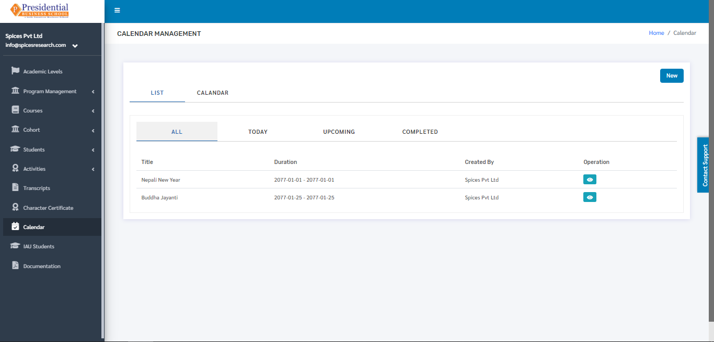

* In the page, the **‘LIST’** tab is defaultly selected. The page provides information on all the holidays or events given by the college in a calendar year.

.. image:: ./../images/academic/image22.png

* The calendar can be viewed monthly also. This is done by clicking on the **‘CALENDAR’** option beside the ‘LIST’ option.

.. image:: ./../images/academic/image216.png

* The following page will appear by clicking on **‘Calendar’**.

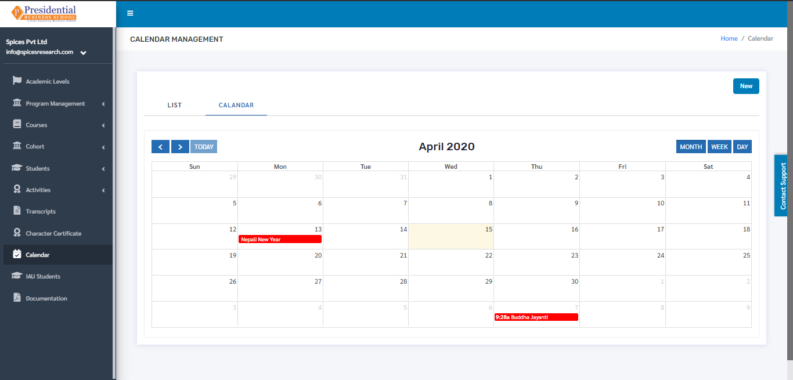

1. Create New Event 
---------------------

* New events or holidays can be assigned on the calendar with the reference of the events or holidays provided by the college or the government. This is done by clicking on the **‘NEW’** button on the page.

.. image:: ./../images/academic/image217.png

* The user will land on the following page after clicking the **‘New’** button.

.. image:: ./../images/academic/image213.png

* The required details such as Start Date, Start Time, End Date, End Time, Event Name must be entered for creating an event. **‘SUBMIT’** button must be clicked after filling up the details.

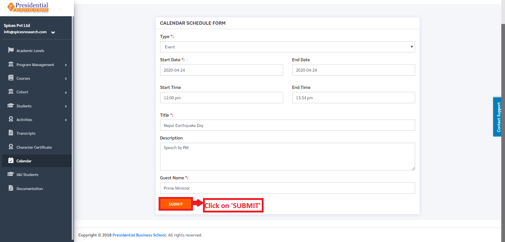

Holidays can be created as well in this form. The ‘Type’ must be selected as Holiday for creating a holiday in the calendar. A new holiday/event is created on clicking the **‘SUBMIT’** button.

2. Edit Event
---------------------

* If necessary, details of the events or holidays can be edited as well. This is done by clicking on the ‘View Details’ icon(button) under the Operation column.

.. image:: ./../images/academic/image215.png

* The following page will appear on clicking the Edit icon(button).

.. image:: ./../images/academic/image214.png

X. IAU Students
================

* To access the IAU Students option, the user will have to click on the **‘IAU Students’** on the left hand side of the dashboard.

.. image:: ./../images/academic/image210.png

* The following page will appear on clicking the **‘IAU Students’**.

1. Import IAU Records
---------------------

* n order to import the IAU Student details, the user must click on the **‘Import IAU Records’** button.

* The following page will appear on clicking Import IAU Records.

.. image:: ./../images/academic/image197.png

* Excel files with the correct format can be uploaded in order to import IAU Students.  Before uploading the Excel file, the excel file of correct format must be downloaded first. This is done by clicking on the **‘Download Excel Format’** button.

.. image:: ./../images/academic/image196.png

* An excel file of the following format will be downloaded on clicking ‘Download Excel Format’.

* The details of the IAU Students can be added according to the format given and the user must save the excel file after editing(adding).

.. image:: ./../images/academic/image198.png

* After saving the file, the same file has to be uploaded. This is done by selecting the Program from the drop down menu and choosing the excel file by clicking ‘Choose File’.

.. image:: ./../images/academic/image194.png

* To finish up the process, the user must click on the **‘SUBMIT’** button after choosing the Program and the excel file.

* The IAU students from the excel file will be imported and can be seen on the dashboard of  IAU Students.

.. image:: ./../images/academic/image195.png