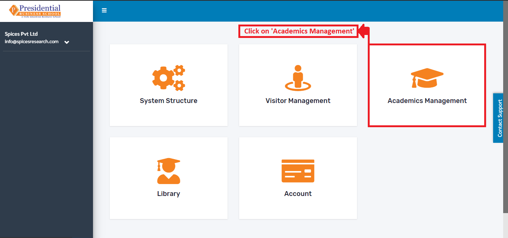
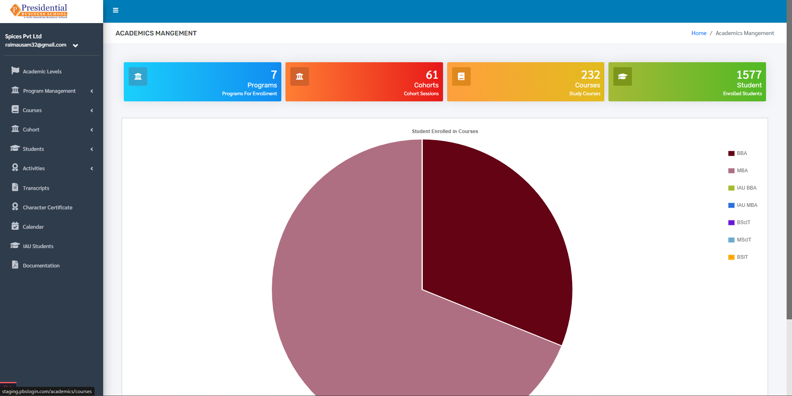
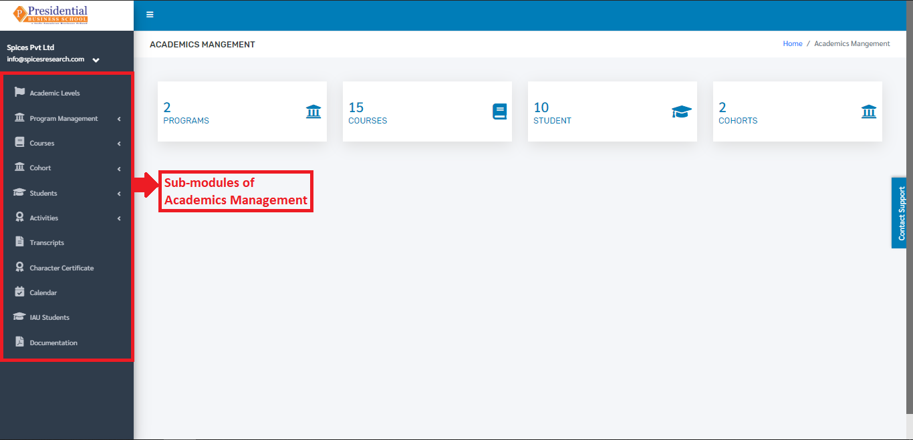

Introduction
=============

 The module deals with the management of the academics sector such as management of students, cohort, courses, activities, transcripts, certificates along with their sub categories.

* On the main Dashboard click on **“Academics Management”** by the following process as shown in the picture below.

* The following page will appear on clicking **‘Academics Management’**.

After user is landed on the dashboard of **“Academics Management”**, user will be able to see some sub=modules on the left hand side of the page:

1. Academics Level
2. Program Management
3. Courses
4. Cohort
5. Students
6. Activities
7. Transcripts
8. Character Certificate
9. Calendar
10. IAU Students
11. Documentation

