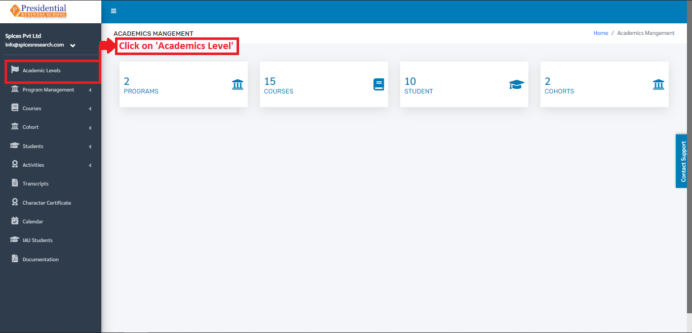
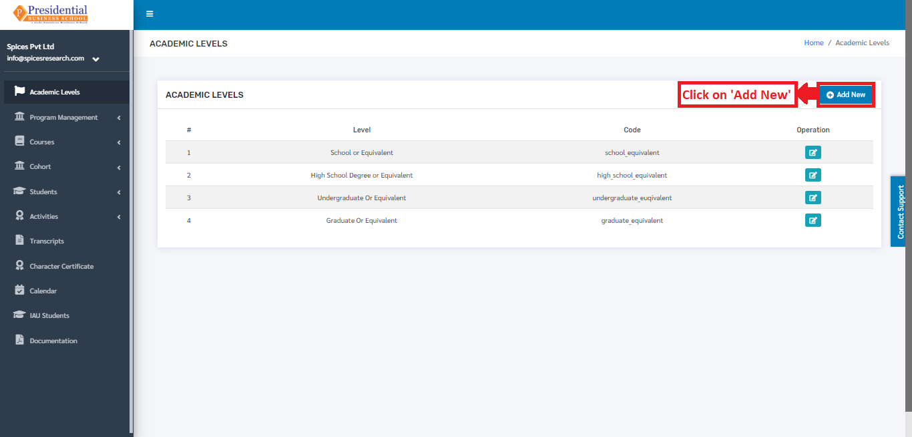
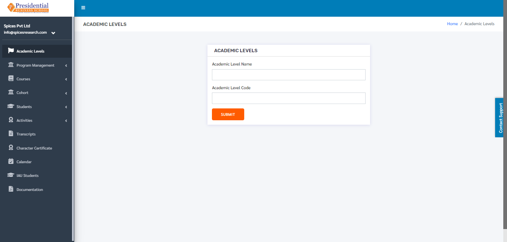
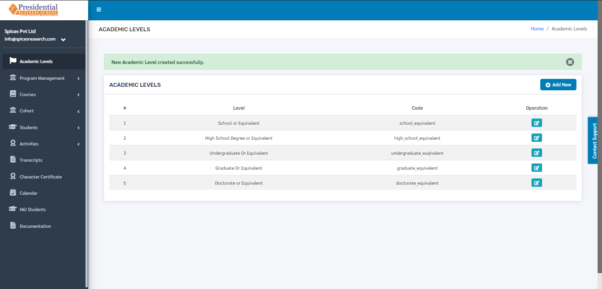
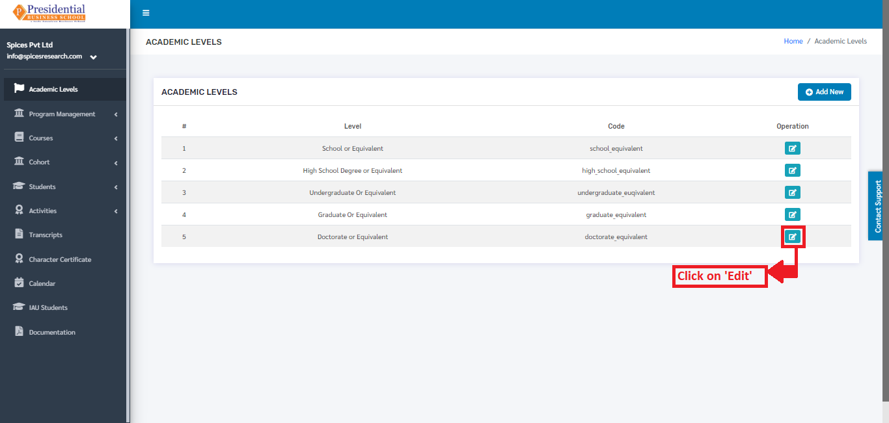
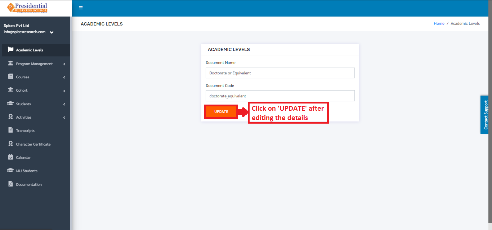

Academics Level
================

As the name implies, Academics Level refers to the level of the academics that can be inherited by person(student).

* Users must click on **‘Academics Level’** on the left hand side of the dashboard to access it. This is done by the following process.

* On clicking on Academics Level, the following dashboard will appear on the screen.

.. image:: ./../../images/academic/image223.png

1. Create New Academic Level
----------------------------

* To create a new academic level, the user has to fill out the form in the system. This is done by clicking on the **‘Add New’** button on the top right hand side of the page.

* The following page will appear on clicking the **‘Add New’** button.

* The form must be filled out. The **‘SUBMIT’** button must be clicked to finish up the process.

.. image:: ./../../images/academic/image228.png

* The new academic level can be seen on the dashboard of Academic Levels once the **‘SUBMIT’** button is clicked.

2. Edit Academic Level
----------------------------

* If necessary, details of the academic levels can be edited as well. This is done by clicking on the **‘Edit’** icon(button) under the Operation column.

The following page will appear on clicking the Edit icon(button).

After editing the details, the user must click on the **‘UPDATE’** button to finish up the editing process.
