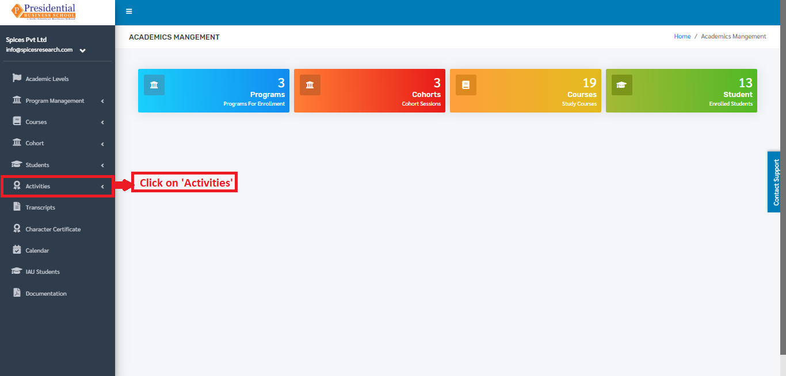
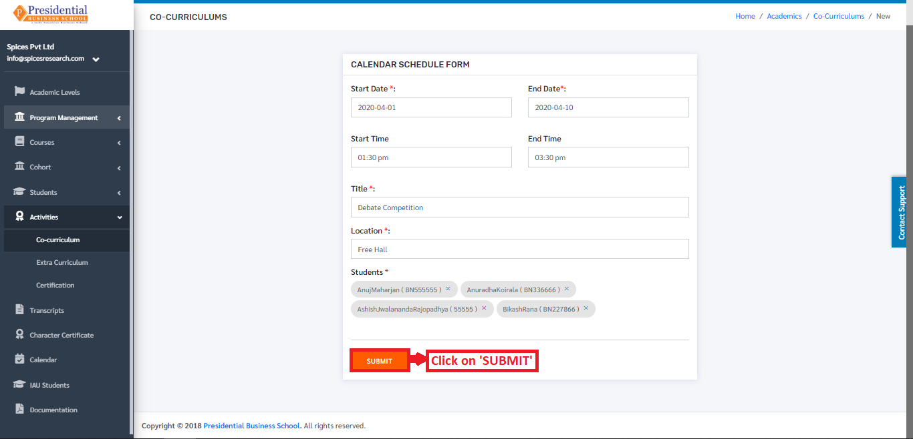
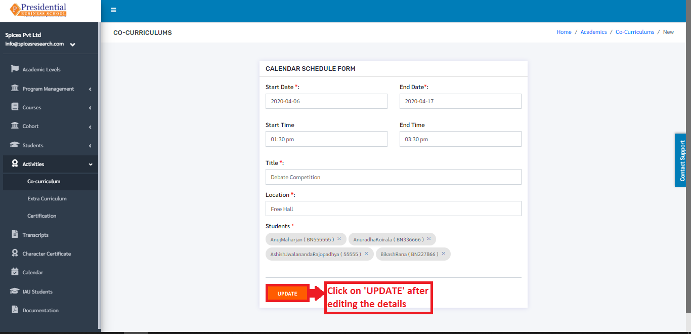
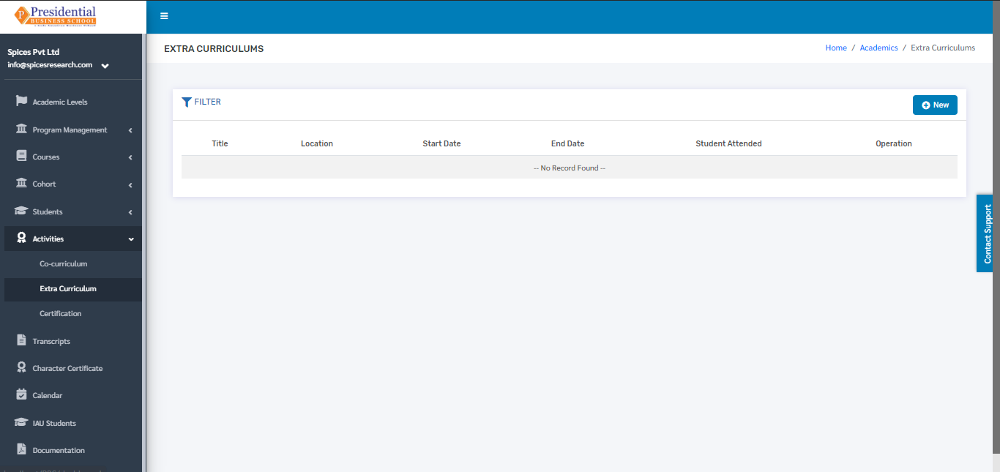
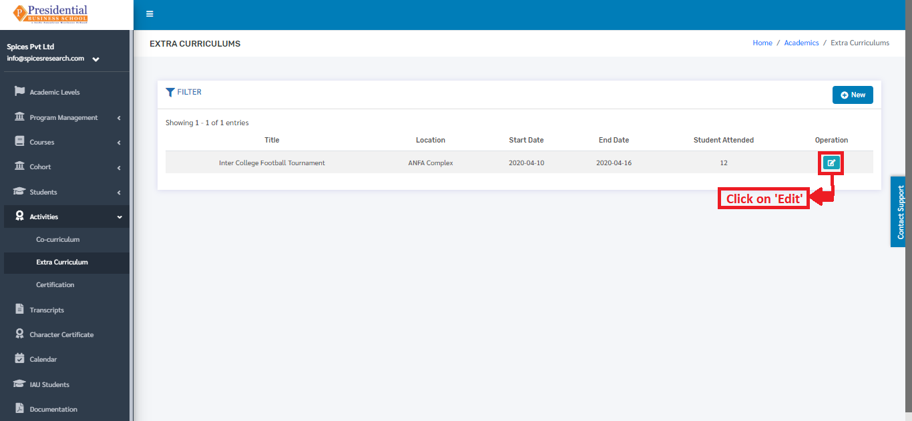
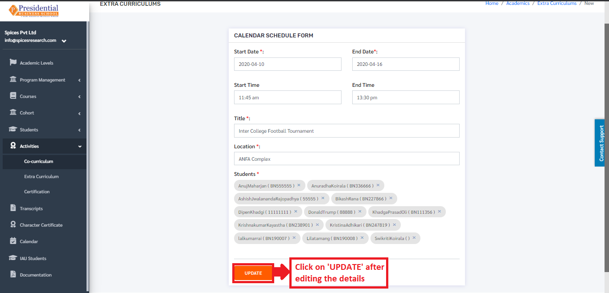
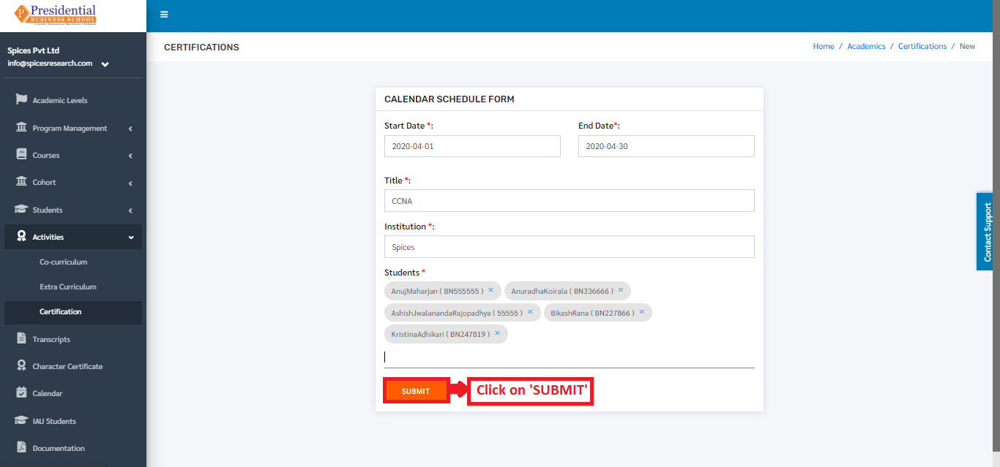
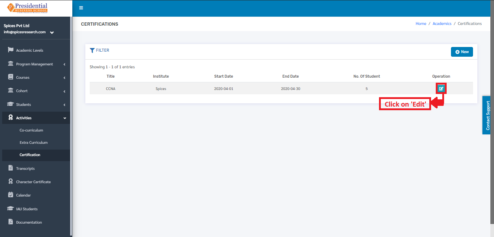

Activities
===========

**‘Activities’** module allows users to view details about different co-curricular, extracurricular activities and certification provided by the college.

* Users must click on **‘Activities’** on the left hand side of the dashboard to access it. This is done by the following process.

* On clicking **‘Activities’**, three subcategories will appear namely Co-curriculum, Extra Curriculum and Certification.

.. image:: ./../../images/academic/image154.png

1. Co-Curriculums
-------------------

* The user must click on **‘Co-Curriculums’** to access this subcategory. This is done by the following process.

.. image:: ./../../images/academic/image153.png

* The following page will appear on clicking Co-Curriculums.

1.1 Create New Co-Curriculum
^^^^^^^^^^^^^^^^^^^^^^^^^^^^^

* The user must click on the **‘New’** button to create a new Co-curricular activity.

.. image:: ./../../images/academic/image104.png

* The user will be landed on the following page by clicking the **‘New’** button.

* The form must be filled out with the required details as shown in the picture below.

.. image:: ./../../images/academic/image108.png

* **‘SUBMIT’** button must be clicked after filling up the form to finish up the creation of Co-curricular activity.

The new Co-curricular activity can be seen in the dashboard after clicking on the **‘SUBMIT’** button.

1.2 Edit Co-Curriculum
^^^^^^^^^^^^^^^^^^^^^^^^^^^^^

* If necessary, details of the co-curricular activities can be edited as well. This is done by clicking on the ‘Edit’ icon(button) under the Operation column.

.. image:: ./../../images/academic/image97.png

* The following page will appear on clicking the Edit icon(button).

2. Co-Curriculums
-------------------

* The user must click on **‘Extra-Curriculums’** to access this subcategory. This is done by the following process.

.. image:: ./../../images/academic/image100.png

* The following page will appear on clicking Extra-Curriculums.

2.1 Create New Extra-Curriculum
^^^^^^^^^^^^^^^^^^^^^^^^^^^^^^^^

* The user must click on the **‘New’** button to create a new Extra-curricular activity.

.. image:: ./../../images/academic/image92.png

* The user will be landed on the following page by clicking the **‘New’** button.

.. image:: ./../../images/academic/image132.png

* The form must be filled out with the required details as shown in the picture below.

.. image:: ./../../images/academic/image131.png

* **‘SUBMIT’** button must be clicked after filling up the form to finish up the creation of Extra-curricular activity.

.. image:: ./../../images/academic/image123.png

The new Extra-curricular activity can be seen in the dashboard after clicking on the **‘SUBMIT’** button.

2.2 Edit Co-Curriculum
^^^^^^^^^^^^^^^^^^^^^^^^^^^^^^^^

* If necessary, details of the extra-curricular activities can be edited as well. This is done by clicking on the **‘Edit’** icon(button) under the Operation column.

* The following page will appear on clicking the Edit icon(button).

3. Certification
-------------------

* The user must click on **‘Certification’** to access this subcategory. This is done by the following process.

.. image:: ./../../images/academic/image125.png

* The following page will appear on clicking Certification.

.. image:: ./../../images/academic/image115.png

3.1 Create New Certification
^^^^^^^^^^^^^^^^^^^^^^^^^^^^^^

* The user must click on the **‘New’** button to create a new activity for the certification.

.. image:: ./../../images/academic/image115.png

* The user will be landed on the following page by clicking the **‘New’** button.

.. image:: ./../../images/academic/image119.png

* The form must be filled out with the required details as shown in the picture below.

.. image:: ./../../images/academic/image117.png

* **‘SUBMIT’** button must be clicked after filling up the form to finish up the creation of activity for certification.

The new Certification activity can be seen in the dashboard after clicking on the **‘SUBMIT’** button.

3.2 Edit Certification
^^^^^^^^^^^^^^^^^^^^^^^^^^^^^^

* If necessary, details of the certification activities can be edited as well. This is done by clicking on the ‘Edit’ icon(button) under the Operation column.

* The following page will appear on clicking the Edit icon(button).

.. image:: ./../../images/academic/image66.png