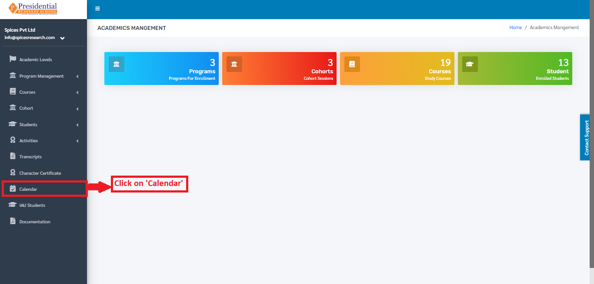
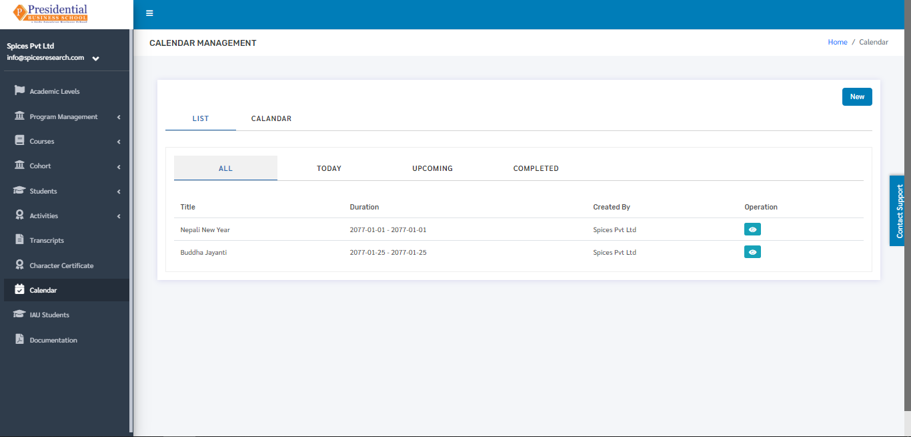
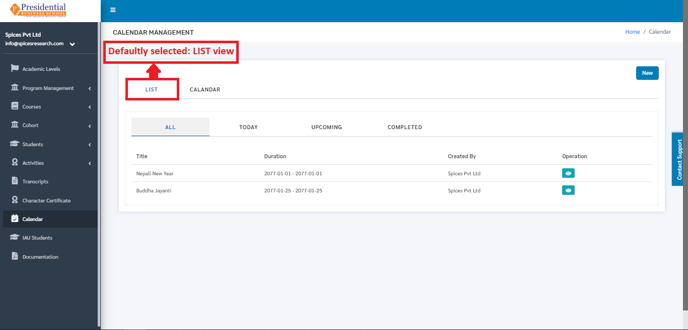
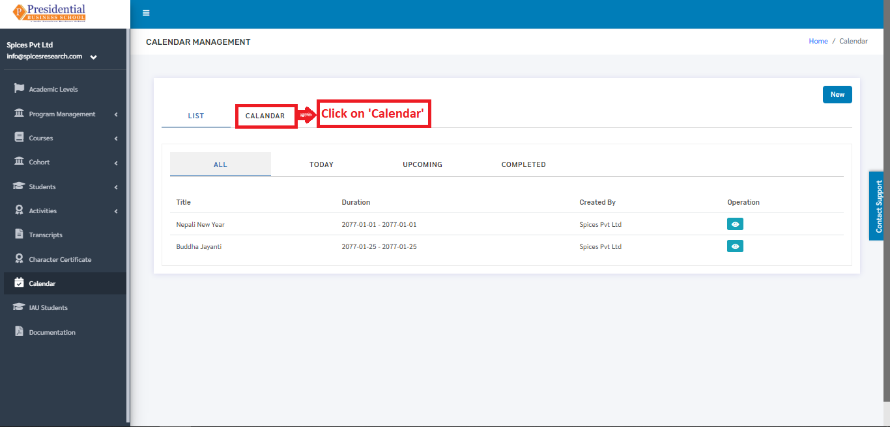
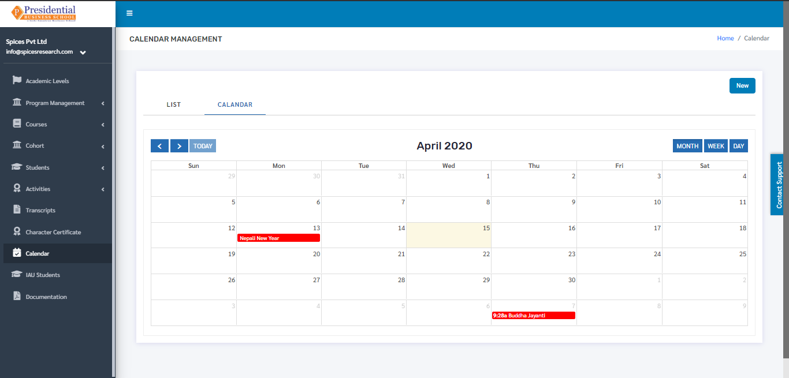
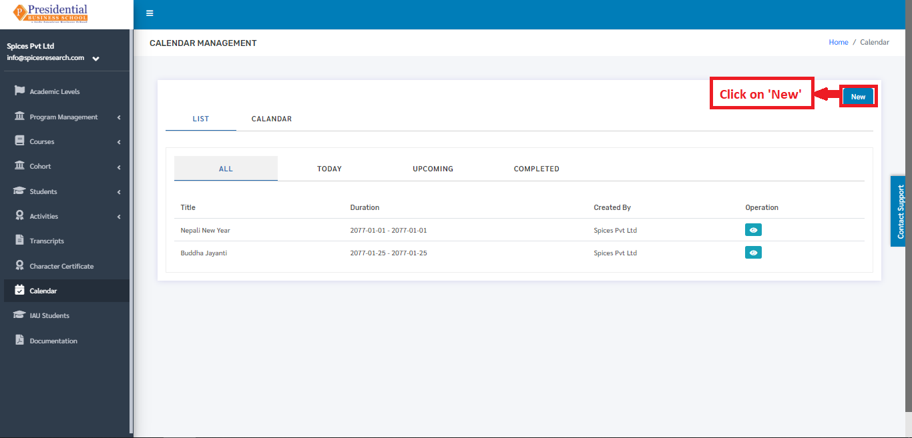
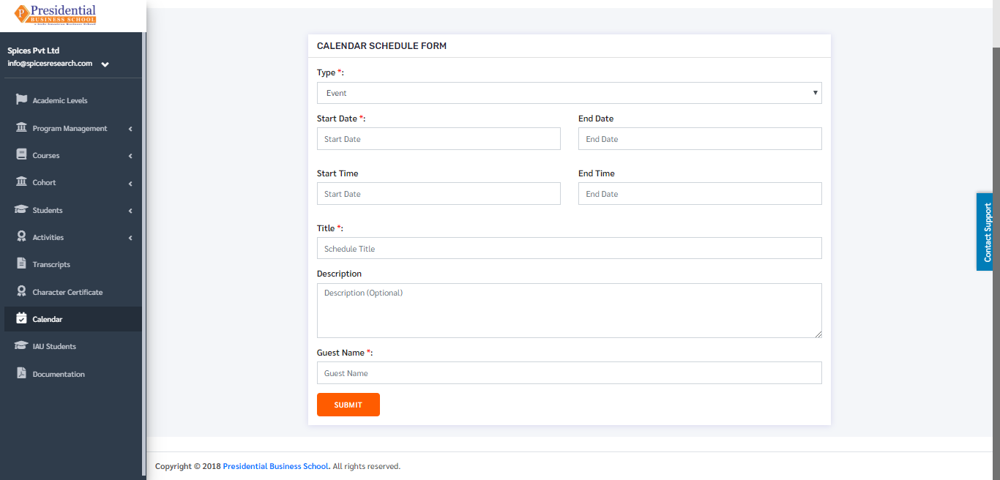
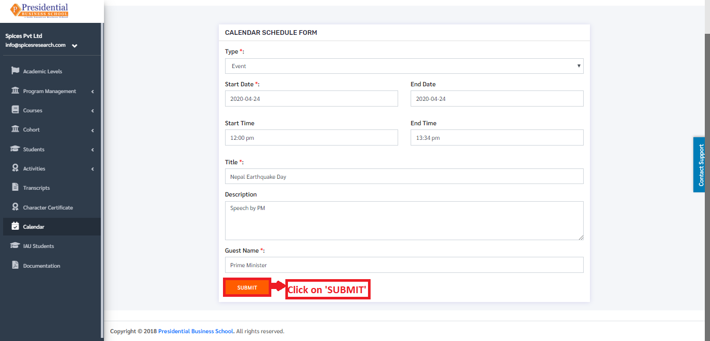
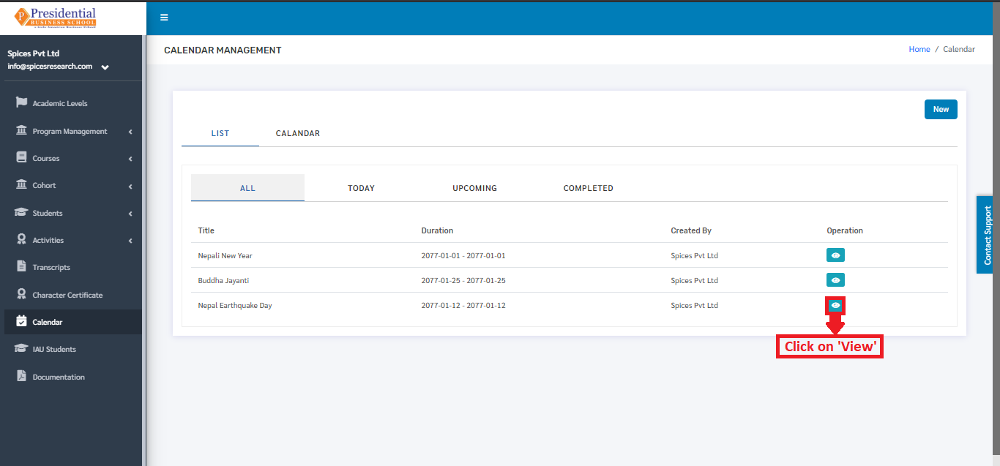
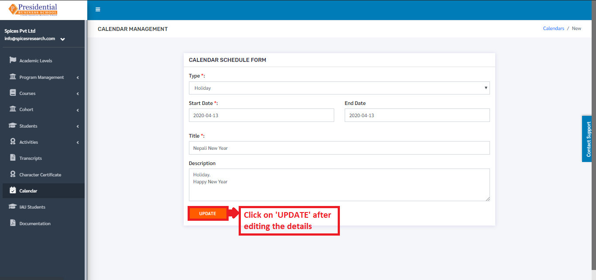

Calendar
--------

As the name implies, a calendar is a chart or series of pages showing the days, weeks, and months of a particular year, or giving particular seasonal information.

In this software, the calendar provides information on the holidays that is provided by the college. New events can be added to the calendar as well. Users must click on **‘Calendar’** on the left hand side of the dashboard to access it. This is done by the following process

* On clicking **‘Calendar’**, the following page will appear.

* In the page, the **‘LIST’** tab is defaultly selected. The page provides information on all the holidays or events given by the college in a calendar year.

* The calendar can be viewed monthly also. This is done by clicking on the **‘CALENDAR’** option beside the ‘LIST’ option.

* The following page will appear by clicking on **‘Calendar’**.

1. Create New Event 
====================

* New events or holidays can be assigned on the calendar with the reference of the events or holidays provided by the college or the government. This is done by clicking on the **‘NEW’** button on the page.

* The user will land on the following page after clicking the **‘New’** button.

* The required details such as Start Date, Start Time, End Date, End Time, Event Name must be entered for creating an event. **‘SUBMIT’** button must be clicked after filling up the details.

Holidays can be created as well in this form. The ‘Type’ must be selected as Holiday for creating a holiday in the calendar. A new holiday/event is created on clicking the **‘SUBMIT’** button.

2. Edit Event
==============

* If necessary, details of the events or holidays can be edited as well. This is done by clicking on the ‘View Details’ icon(button) under the Operation column.

* The following page will appear on clicking the Edit icon(button).

