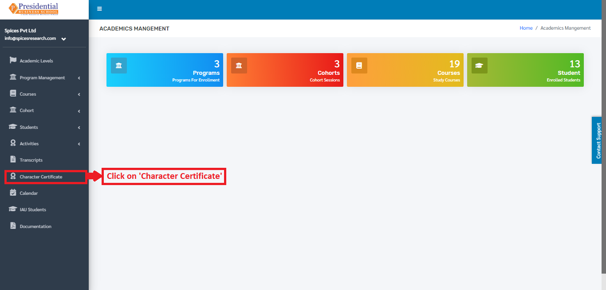
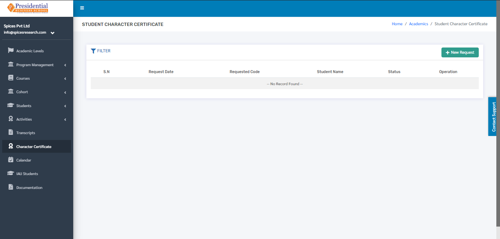
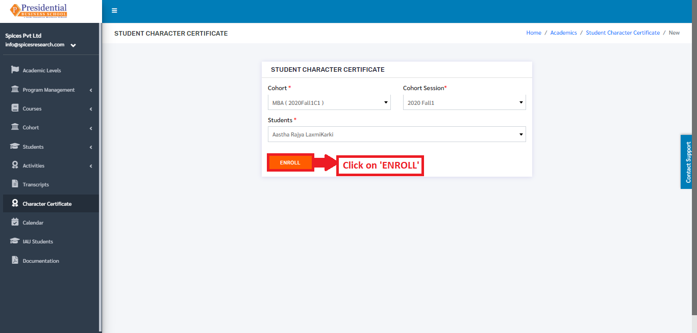
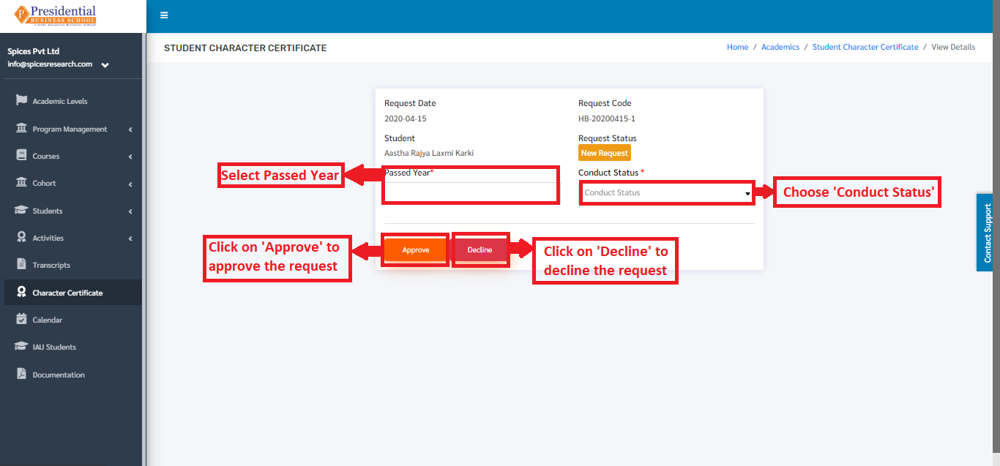
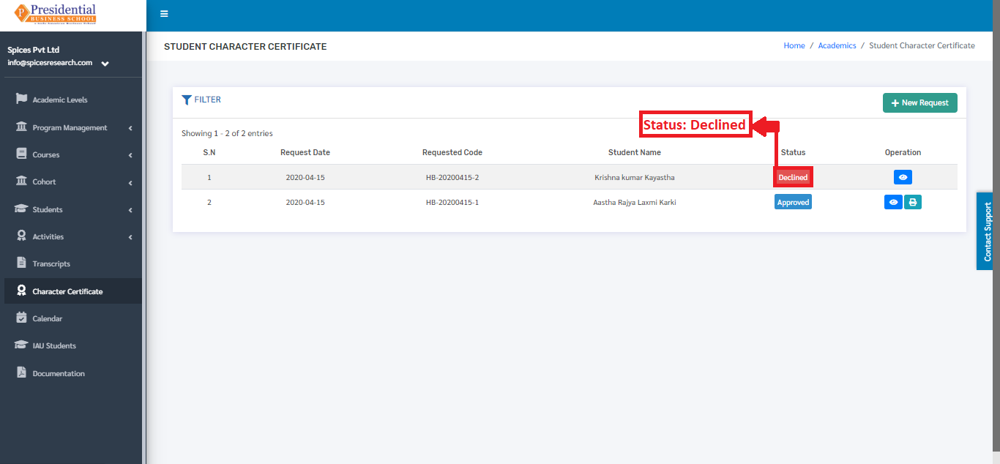
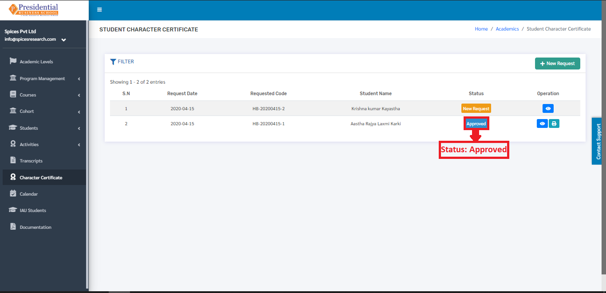

Character Certificate
======================

A Character certificate states the moral conduct or behavior (good or bad) during the time in the college along with the CGPA marks.

* Users must click on **‘Character Certificate’** on the left hand side of the dashboard to access it. This is done by the following process.

* On clicking **‘Character Certificate’**, the following page will appear.

1. Create New Character Certificate Request
--------------------------------------------

* Creating a new request for the character certificate is done by clicking **‘New Request’** on the top right hand side of the dashboard.

.. image:: ./../../images/academic/image79.png

* On clicking the ‘New Request’ button, the following form will appear.

.. image:: ./../../images/academic/image72.png

* The form must be filled out with the desired details to request for the character certificate and click on the ‘ENROLL’ button. The students having completed the Program will only appear on the **‘Students’** dropdown menu in the form.

* On clicking the **‘ENROLL’** button, a new request is created and can be seen on the dashboard of Character Certificate.

Once the request is sent then the admin user will have to accept(approve) or Decline the request which is shown in **‘Approve or Decline Request’**.

2. Approve or Decline Request(ADMIN USER)
--------------------------------------------

* Once the request is sent by the user, the request ought to be approved or declined by the admin personnel of the college. This is done by clicking the ‘View’ icon of the New Request under the Operation column.

.. image:: ./../../images/academic/image31.png

* On clicking the **‘View’** icon, the following page will appear where the Admin must choose the passout year and the Conduct status(either satisfactory or good or very good). After selecting the options, the admin user can either approve or decline the request.

* On clicking the **‘Decline’** button, it implies that the request is rejected and the status of the request can be seen as **‘Declined’** in the Character Certificate dashboard.

* On clicking the **‘Approve’** button, it implies that the request is approved and the status of the request can be seen as **‘Approved’** in the Character Certificate  dashboard.

* The character certificate can be generated after the request is approved. This is done by clicking on the **‘Print’** icon under Operation column of the requests that is Approved.

.. image:: ./../../images/academic/image25.png

* On clicking the ‘Print’ icon the character certificate will appear on the next tab of the browser.

.. image:: ./../../images/academic/image23.png

The Character Certificate can be printed out using the ‘CTRL + P’ button.