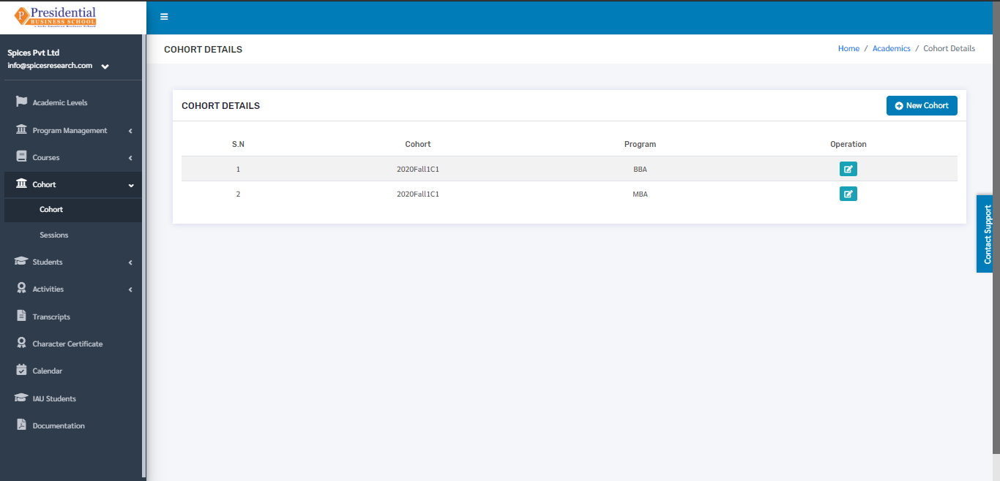
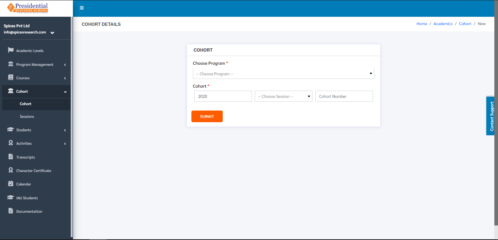
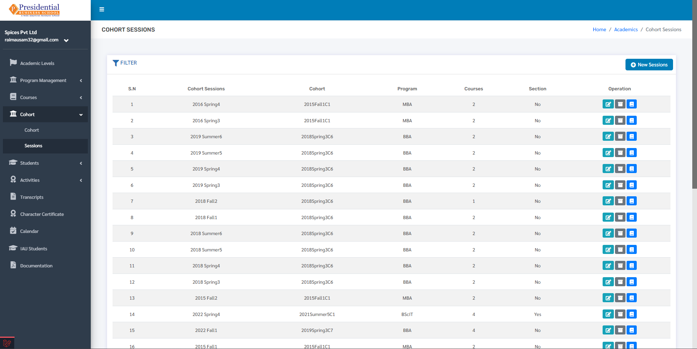
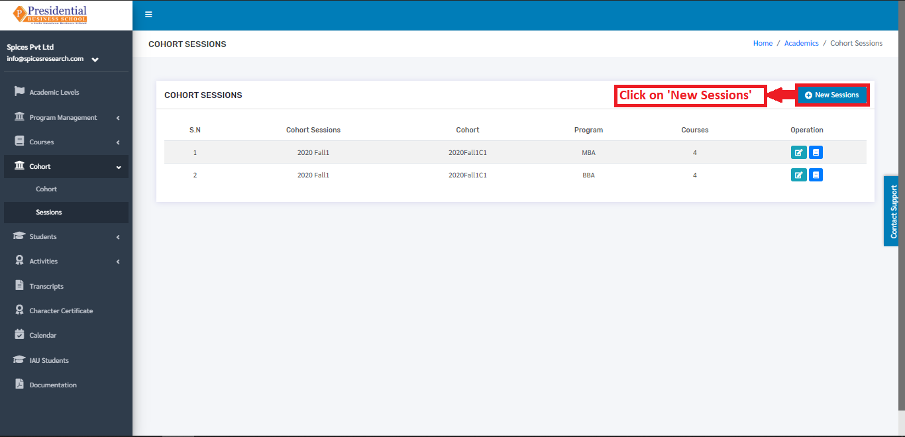
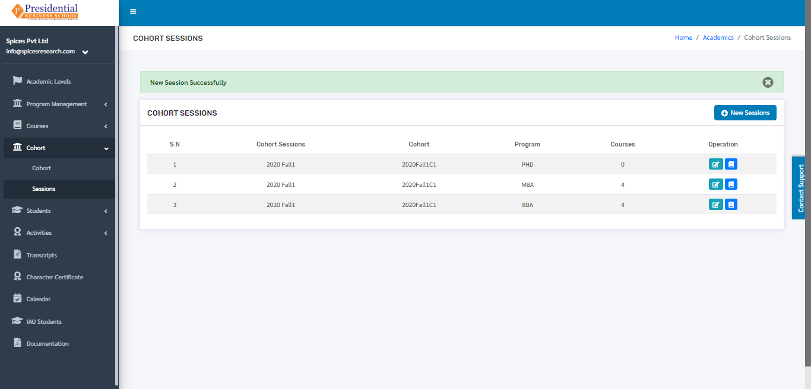
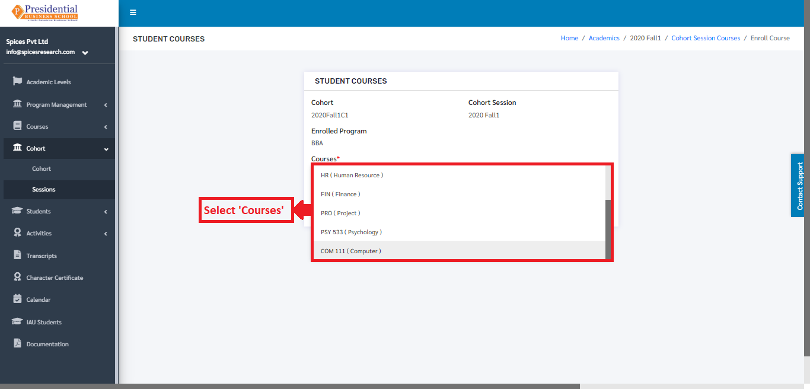
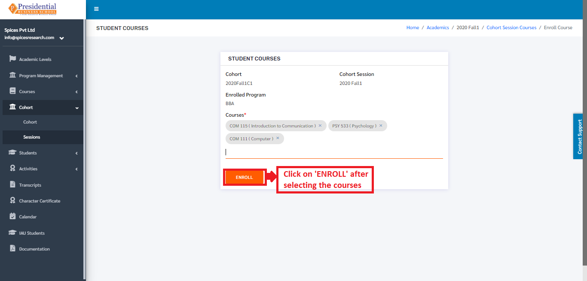
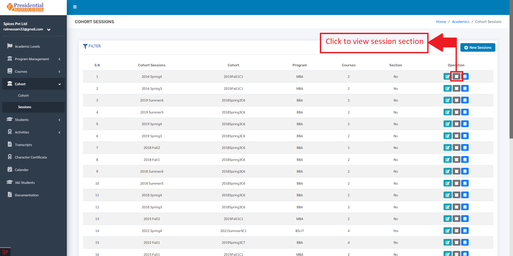
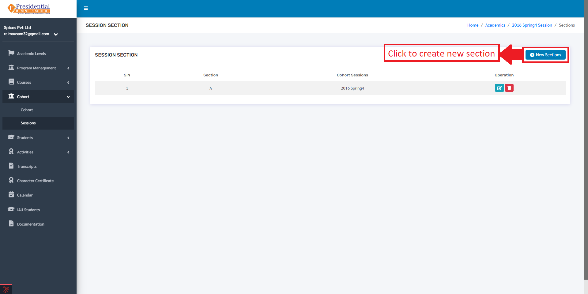
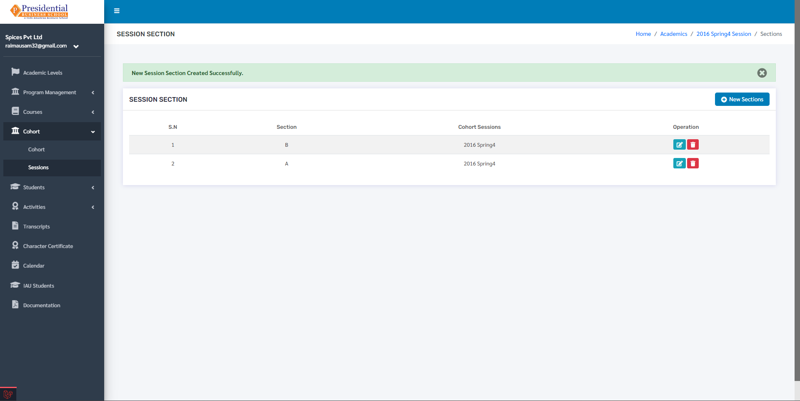

Cohort
=======

**‘Cohort’** module allows users to view details about different cohorts(batch) and the sessions that are provided by the college.

* Users must click on **‘Cohort’** on the left hand side of the dashboard to access it. This is done by the following process.

.. image:: ./../../images/academic/image116.png

* On clicking **‘Cohort’**, two subcategories will appear namely Cohort and Sessions.

.. image:: ./../../images/academic/image118.png

1. Cohort
---------

* The user from the college must click on **‘Cohort’** to access this subcategory. This is done by the following process.

.. image:: ./../../images/academic/image120.png

* The following page will appear on clicking Cohort.

The page provides information about different Cohorts in the college.

1.1 Create New Cohort
^^^^^^^^^^^^^^^^^^^^^^

* Users can create a new cohort in the system by clicking on the **‘New Cohort’** button(icon) on the top right hand side of the dashboard as shown in the picture below.

.. image:: ./../../images/academic/image124.png

* On clicking the **‘New Cohort’** button(icon), the user will be landed on the following page.

* The required details must be filled in the form and click on **‘SUBMIT’** to finish up the creation process.

* Once the **‘SUBMIT’** button is clicked a new cohort is created and seen on the dashboard of Cohort.

1.2 Edit Cohort
^^^^^^^^^^^^^^^^^^

* If necessary, details of the cohort can be edited as well. This is done by clicking on the **‘Edit’** icon(button) under the Operation column.

.. image:: ./../../images/academic/image130.png

* The following page will appear on clicking the Edit icon(button).

The following page will appear on clicking the Edit icon(button).

.. image:: ./../../images/academic/image112.png

After editing the details, the user must click on the **‘UPDATE’** button to finish up the editing process.

2. Sessions
------------

Session deals with creation of new sessions along with adding the required courses to the sessions as per the college requirement. The courses which can be added in the sessions are created on Courses submodule.

* To access this subcategory, the user must click on ‘Session’ on the left hand side of the page. This is done by the following process.

.. image:: ./../../images/academic/image96.png

* The following page will appear on clicking Sessions.

The page provides information about different Cohort Sessions in the college.

2.1 Create New Session
^^^^^^^^^^^^^^^^^^^^^^

* Users can create a new session in the system by clicking on the **‘New Sessions’** button(icon) on the top right hand side of the dashboard as shown in the picture below.

* On clicking the **‘New Sessions’** button(icon), the user will be landed on the following page.

.. image:: ./../../images/academic/image101.png

* The required details must be filled in the form and click on **‘SUBMIT’** to finish up the creation process of the Cohort Session.

.. image:: ./../../images/academic/image103.png

* Once the **‘SUBMIT’** button is clicked a new Cohort Session is created and seen on the dashboard of Sessions.

2.2 Edit Session
^^^^^^^^^^^^^^^^^^

* If necessary, details of the sessions can be edited as well. This is done by clicking on the ‘Edit’ icon(button) under the Operation column.

.. image:: ./../../images/academic/image107.png

* The following page will appear on clicking the Edit icon(button).

.. image:: ./../../images/academic/image109.png

2.3 Add Session Course
^^^^^^^^^^^^^^^^^^^^^^

* The courses can be added to the sessions as per the requirement of the college. This is done by clicking on the **‘Session Courses’** icon under the Operation column.

.. image:: ./../../images/academic/image110.png

* The user will be landed on the following page on clicking **‘Session Courses’** icon.

.. image:: ./../../images/academic/image93.png

* Once the page appears, the user must click on **‘Enroll Course’** for adding the courses.

.. image:: ./../../images/academic/image94.png

* The following page will appear by clicking the **‘Enroll Course’** button.

.. image:: ./../../images/academic/image158.png

* The user can select the desired course from the drop down menu **‘Courses’**.

* Once the courses are selected, **‘ENROLL’** button must be clicked to finish up the process of adding the courses.

2.4 Delete Session Course
^^^^^^^^^^^^^^^^^^^^^^^^^^

* Courses can change over time, so there is an option of deleting the courses from a particular session. This is done by clicking the ‘Session Courses’ icon under the Operation column.

.. image:: ./../../images/academic/image110.png

* The user will be landed on the following page on clicking **‘Session Courses’** icon.

.. image:: ./../../images/academic/image93.png

* Once the page appears, the user must click on the delete icon under the Operation column to delete the desired course.

.. image:: ./../../images/academic/image166.png

On clicking the delete icon(button), the course will be deleted from the selected session.

2.5 Show Session Section
^^^^^^^^^^^^^^^^^^^^^^^^^^
Users can view the session sections by clicking on the session section button.

On clicking on the session section button, the user will be directed to the following page:

.. image:: ./../../images/academic/image17.png

To create a new section for that cohort, click on the **‘New Sections’** button.

After clicking on the **‘New Section’** button, the user will be directed to a page with forms for creating  a new section for that cohort.

.. image:: ./../../images/academic/image20.png

After filling the required details, click on the **‘Submit’** button to create the new section.

The new section will then be displayed under the Session Section with a success message that the section was created.

To edit the section, click on the edit button.

.. image:: ./../../images/academic/image5.png

Then the user must click on the submit after editing the section to update the data.

.. image:: ./../../images/academic/image3.png