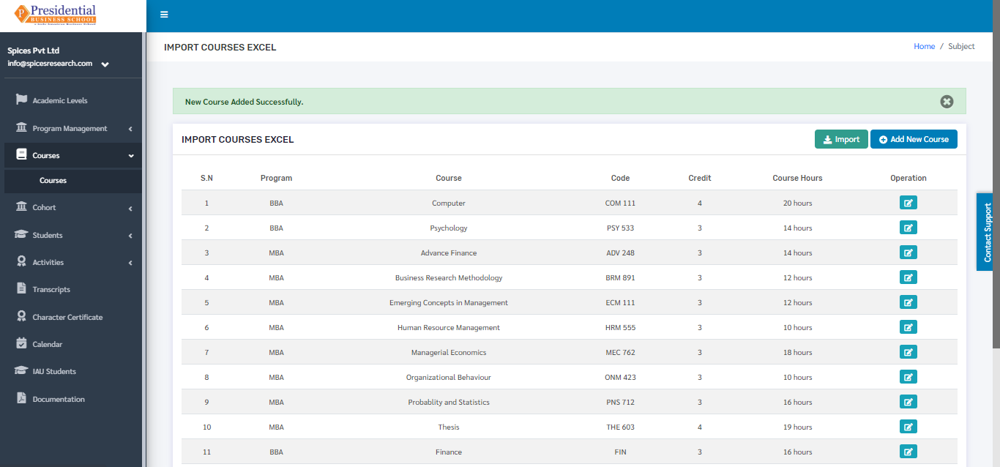

Courses
========

**‘Courses’** module allows users to view details about different courses provided by the college for different programs.

* Users must click on **‘Courses’** on the left hand side of the dashboard to access it. This is done by the following process.

.. image:: ./../../images/academic/image78.png

* On clicking on Courses, a subcategory named Courses itself will appear.

.. image:: ./../../images/academic/image80.png

* Users must click on Courses to access the submodule.

* The following page will appear on clicking Courses.

.. image:: ./../../images/academic/image84.png

The page provides information on different courses provided by the college for different programs.

1. Create New Course
---------------------

There are two methods to create a new course.

     1.1 Create by filling the form

     1.2 Create by uploading Excel File
    

1.1 Create by filling the form
^^^^^^^^^^^^^^^^^^^^^^^^^^^^^^^^

* To create a new course, the user has to fill out the form in the system. This is done by clicking on the ‘Add New Course’ button on the top right hand side of the page.

* On clicking the **‘Add New Course’** button, the following page will appear.

* The form must be filled out. The **‘SUBMIT’** button must be clicked to finish up the process.

* The new course can be seen on the dashboard of courses once the **‘SUBMIT’** button is clicked.

1.2 Create by uploading Excel File
^^^^^^^^^^^^^^^^^^^^^^^^^^^^^^^^^^

* Excel files with correct format can be uploaded in order to create a new course as well. Before uploading the Excel file, the excel file of correct format must be downloaded first. This is done by clicking on the ‘IMPORT’ button.

* The following page will appear by clicking the **‘IMPORT’** button.

.. image:: ./../../images/academic/image53.png

* The user must now click on the **‘Download Excel Format’** button to download the correct excel format.

.. image:: ./../../images/academic/image55.png

* An excel file of the following format will be downloaded on clicking **‘Download Excel Format’**.

.. image:: ./../../images/academic/image57.png

* The desired courses can be added according to the format given and the user must save the excel file after editing(adding) the courses.

* After saving the file, the same file has to be uploaded. This is done by selecting the program from the drop down menu and choosing the excel file by clicking **‘Choose File’**.

* To finish up the process, the user must click on the ‘SUBMIT’ button after choosing the program and the excel file.

* The courses from the excel file will be imported and can be seen on the dashboard of Courses.

2. Edit Course
----------------

* Details of the courses can be edited as well. This is done by clicking on the **‘Edit’** icon(button) under the Operation column.

.. image:: ./../../images/academic/image67.png

* The following page will appear on clicking the **‘Edit’** button.

Once the details are edited, **‘UPDATE’** button must be clicked in order to finish up the editing process.
