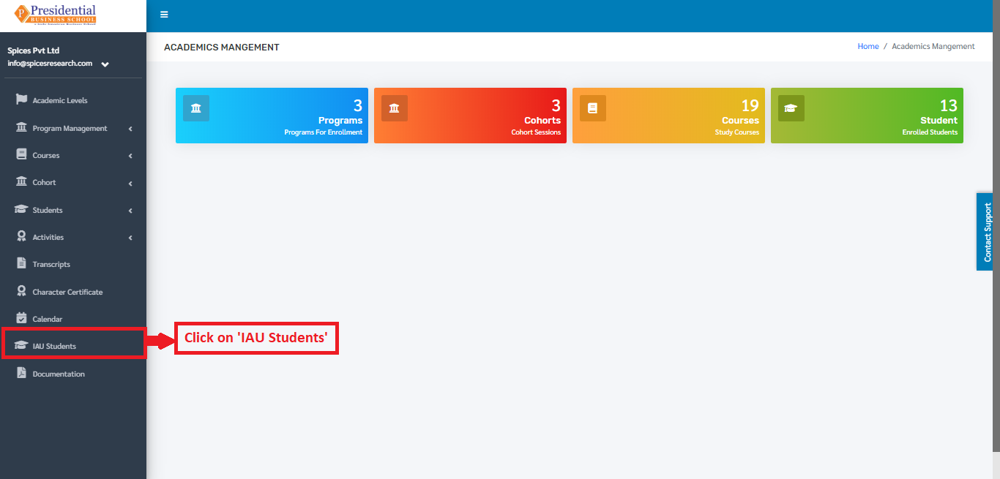
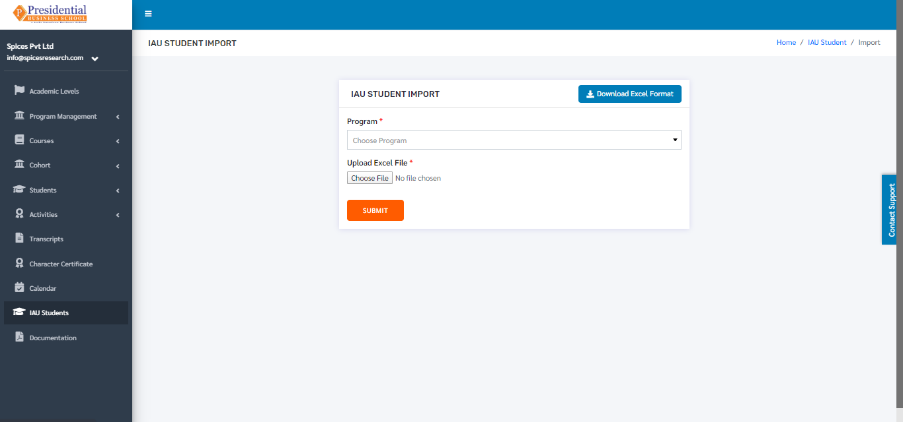
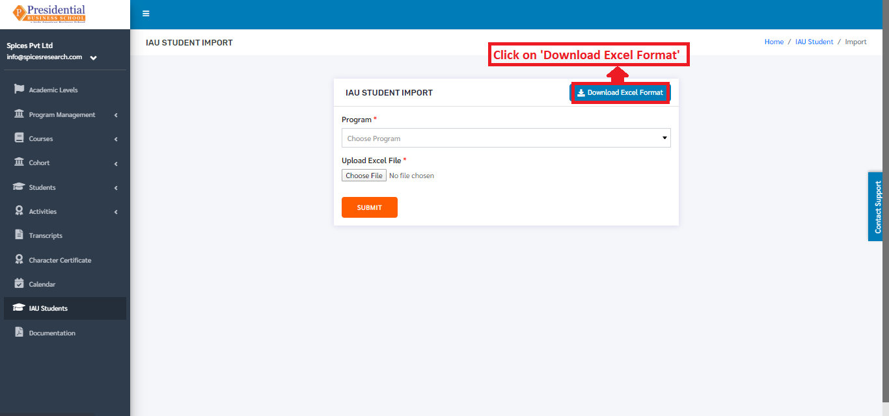
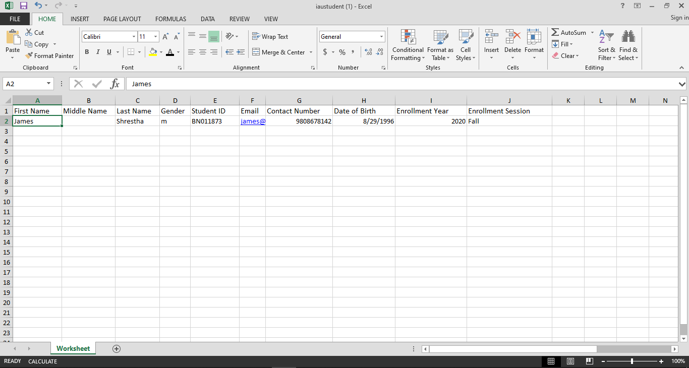
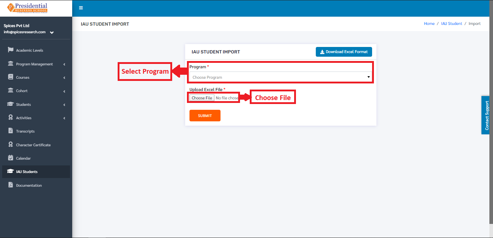
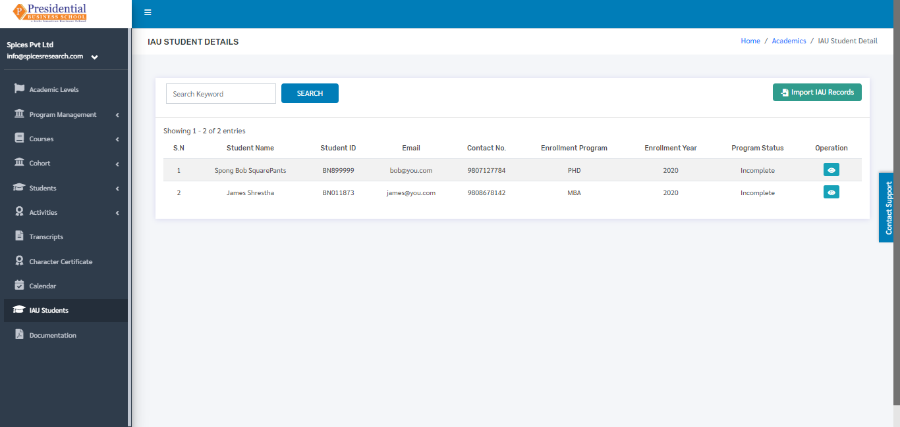

IAU Students
================

* To access the IAU Students option, the user will have to click on the **‘IAU Students’** on the left hand side of the dashboard.

* The following page will appear on clicking the **‘IAU Students’**.

.. image:: ./../../images/academic/image209.png

1. Import IAU Records
---------------------

* n order to import the IAU Student details, the user must click on the **‘Import IAU Records’** button.

.. image:: ./../../images/academic/image211.png

* The following page will appear on clicking Import IAU Records.

* Excel files with the correct format can be uploaded in order to import IAU Students.  Before uploading the Excel file, the excel file of correct format must be downloaded first. This is done by clicking on the **‘Download Excel Format’** button.

* An excel file of the following format will be downloaded on clicking ‘Download Excel Format’.

.. image:: ./../../images/academic/image199.png

* The details of the IAU Students can be added according to the format given and the user must save the excel file after editing(adding).

* After saving the file, the same file has to be uploaded. This is done by selecting the Program from the drop down menu and choosing the excel file by clicking ‘Choose File’.

* To finish up the process, the user must click on the **‘SUBMIT’** button after choosing the Program and the excel file.

.. image:: ./../../images/academic/image193.png

* The IAU students from the excel file will be imported and can be seen on the dashboard of  IAU Students.

