Program Management
==================

**‘Program Management’** deals with the management of levels and programs that are provided by the college.

* Users must click on **‘Program Management’** on the left hand side of the dashboard to access it. This is done by the following process.

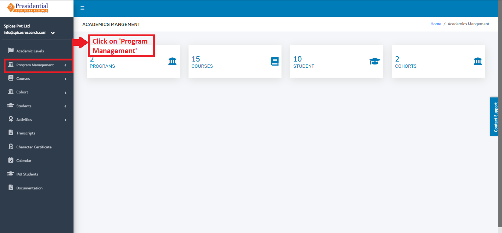

* On clicking **‘Program Management’**, two subcategories will appear namely Level and Programs.

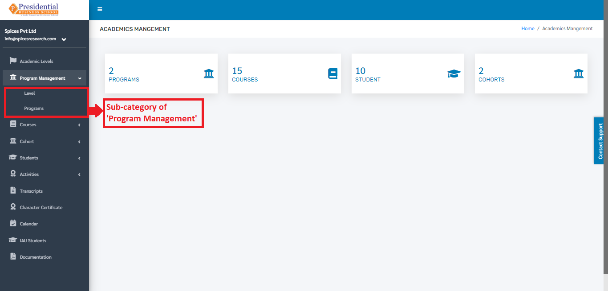

1. Level
---------

* The user from the college must click on **‘Level’** to access this subcategory. This is done by the following process.

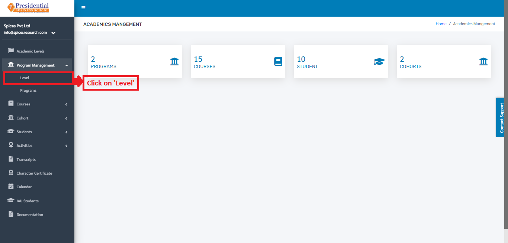

* The user will be landed on the following page after clicking **‘Level’**.

1.1 Create New Level
^^^^^^^^^^^^^^^^^^^^
* For creating a new level, the user has to click on the **‘New Program’** button. This is done by the following process.

.. image:: ./../../images/academic/image45.png

* A page consisting of a form will appear after clicking on the **‘New Program’** button.

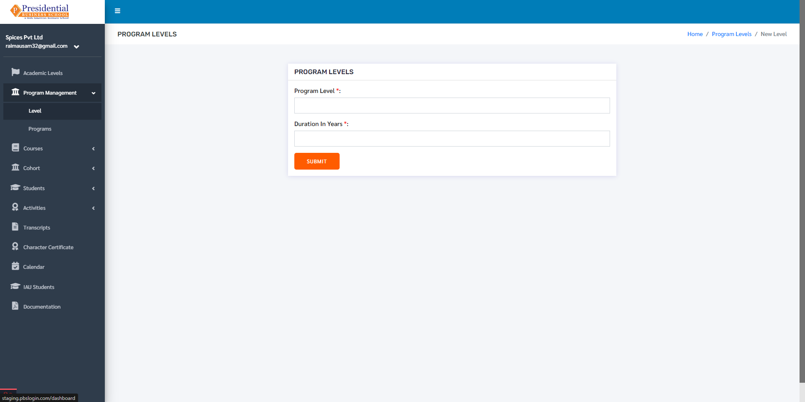

* The required details must be filled in the form and click on **‘SUBMIT’** to finish up the creation process.

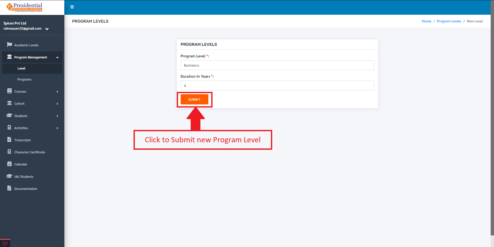

* Once the **‘SUBMIT’** button is clicked a new level is created and seen on the dashboard of  Level.

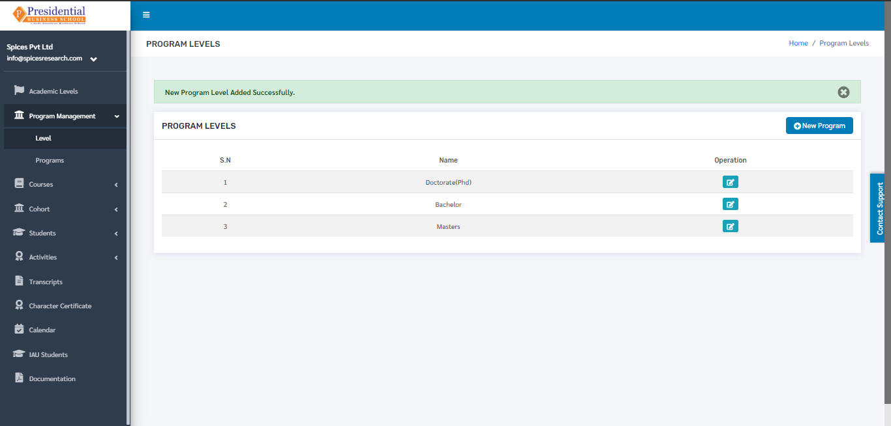

1.2 Edit Level
^^^^^^^^^^^^^^^

* If necessary, details of the level can be edited as well. This is done by clicking on the **‘Edit’** icon(button) under the Operation column.

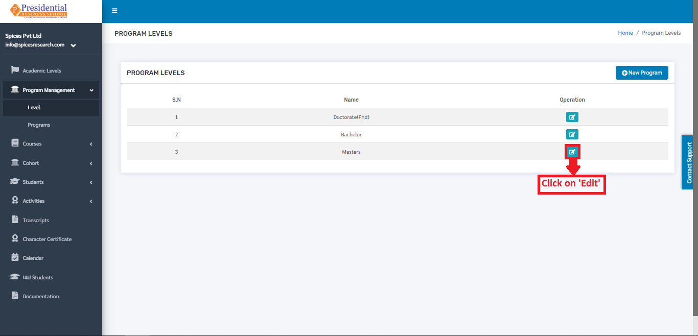

* The following page will appear on clicking the Edit icon(button).

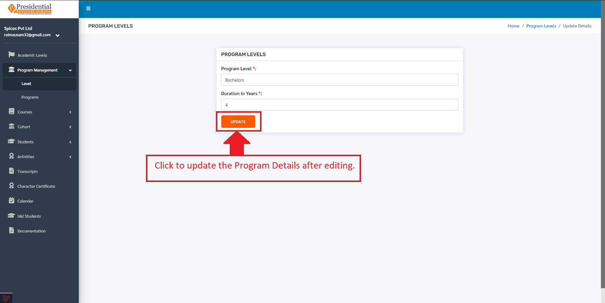

After editing the details, the user must click on the **‘UPDATE’** button to finish up the editing process.

2. Programs
-------------

* The user from the college must click on **‘Programs’** to access this subcategory. This is done by the following process.

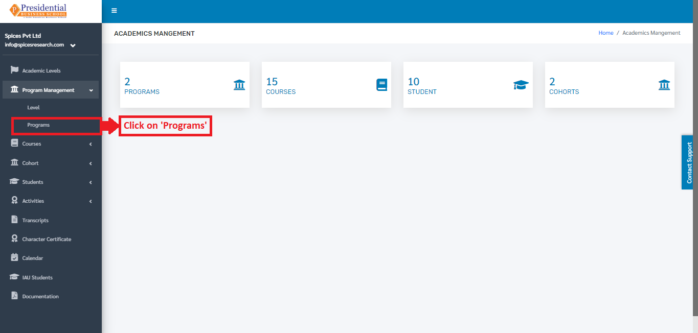

* The user will be landed on the following page after clicking **‘Programs’**.

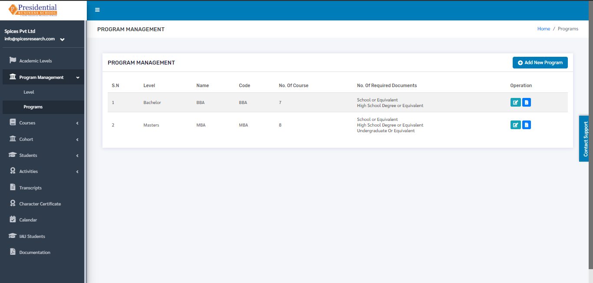

2.1 Create New Program
^^^^^^^^^^^^^^^^^^^^^^^^^^^

* For creating a new program, the user has to click on the **‘Add New Program’** button. This is done by the following process.

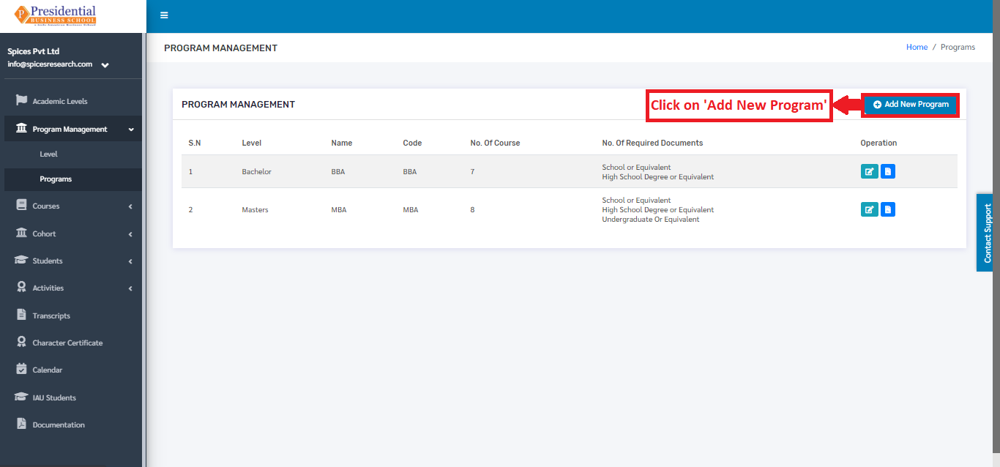

* A page consisting of a form will appear after clicking on the **‘Add New Program’** button.

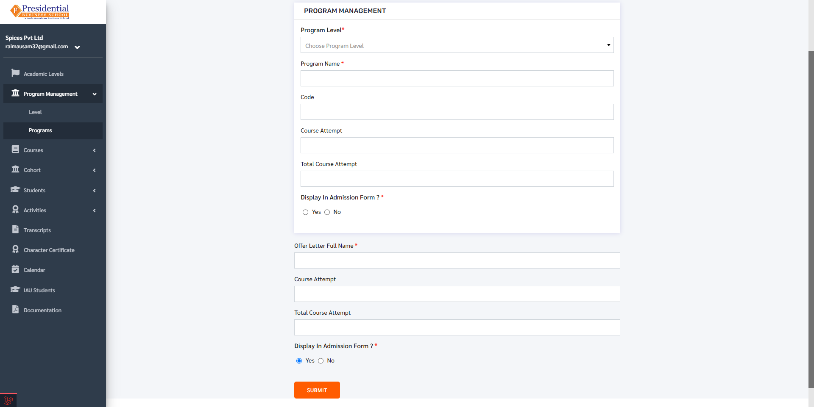

* The required details must be filled in the form and click on **‘SUBMIT’** to finish up the creation process.

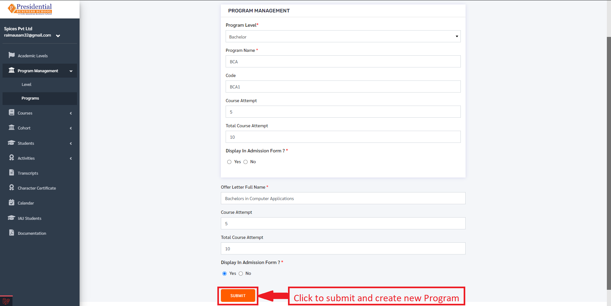

* Once the **‘SUBMIT’** button is clicked a new program is created and seen on the dashboard of **‘Programs’**.

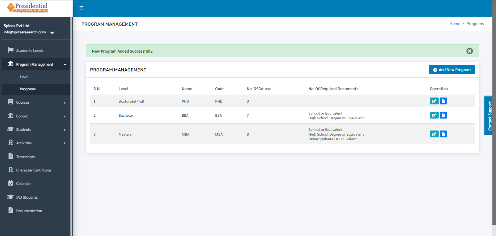

2.2 Manage Required Academic Documents
^^^^^^^^^^^^^^^^^^^^^^^^^^^^^^^^^^^^^^^^^^^

* In order to manage the required documents needed for the desired Program, the user will have to click on the ‘Manage Required Documents’ icon under the Operation column.

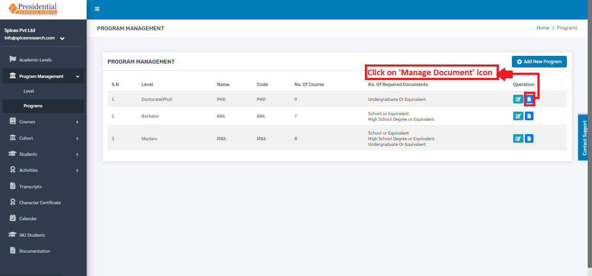

* The user will be landed on the following page.

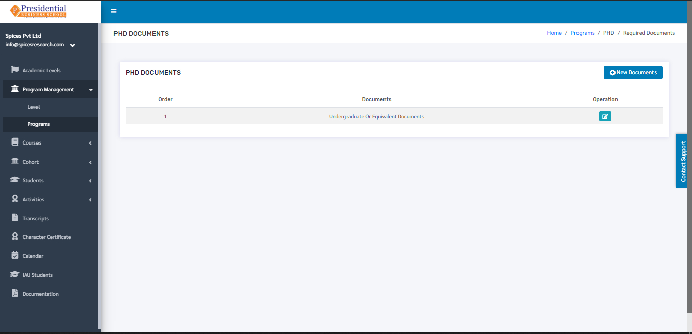

* Required Academic Documents can be selected for a particular Program by clicking on the **‘New Document’** button.

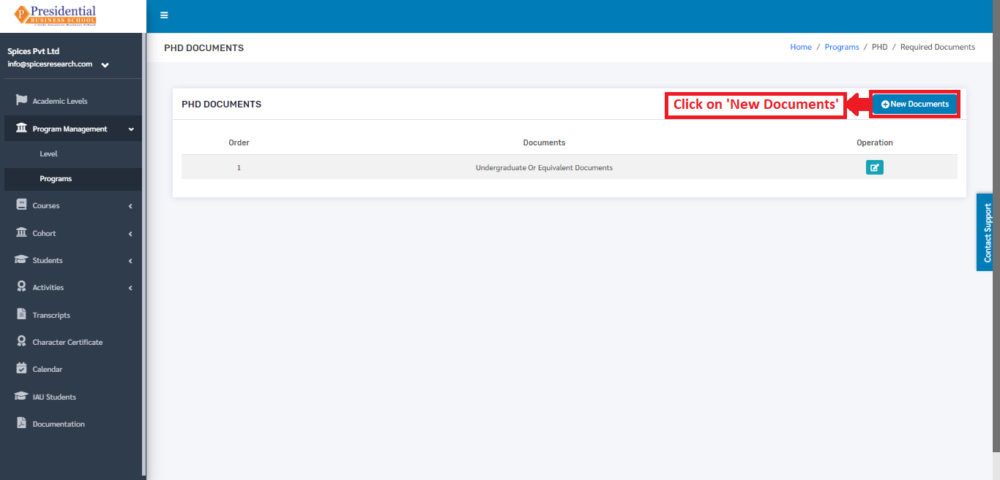

* The type of the document must be selected in the page that appears after clicking the **‘New Document’** button.

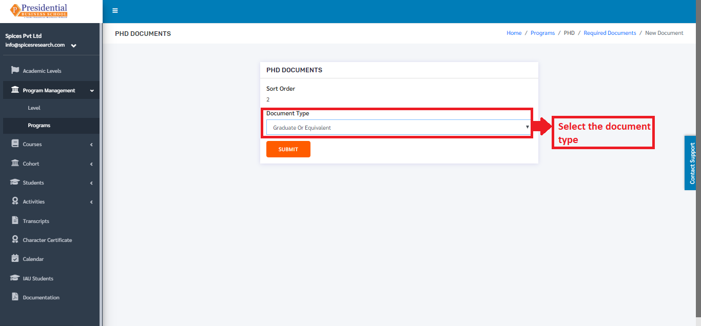

* Once the desired document type is selected, the user must click on the **‘SUBMIT’** button.

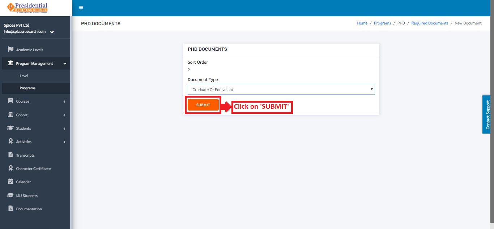

* After clicking the **‘SUBMIT’** button, the required document type can be seen on the dashboard.

