Students
================

     **‘Students’** module allows users to view details about different students along with their different details.

* Users must click on **‘Students’** on the left hand side of the dashboard to access it. This is done by the following process.

.. image:: ./../../images/academic/image168.png

* On clicking **‘Students’**, four subcategories will appear namely Students, Session Enrollment, Import Session Marks and Student Warning.

.. image:: ./../../images/academic/image170.png

1. Students
------------

* The user must click on **‘Students’** to access this subcategory. This is done by the following process.

.. image:: ./../../images/academic/image155.png

* The following page will appear on clicking Students.

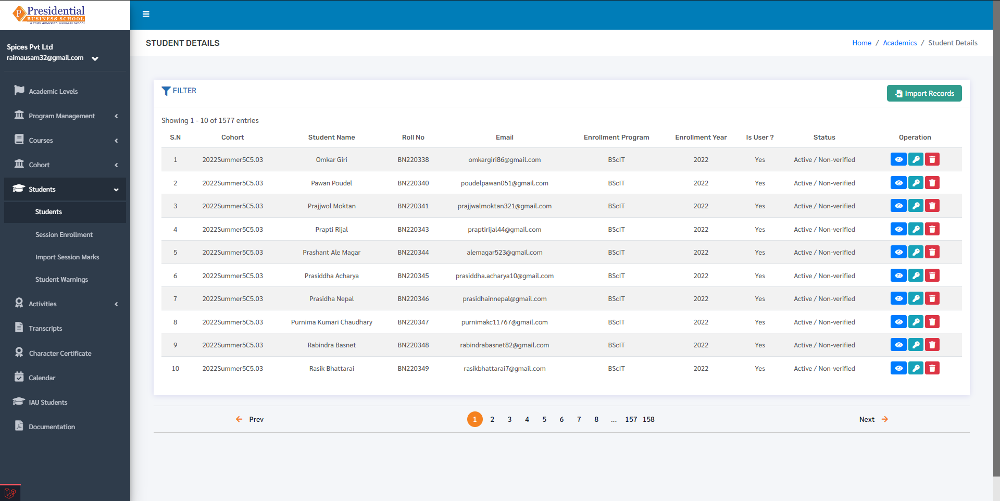

The page provides information on different students enrolled in the college.

1.1 Create new Student(Import Records)
^^^^^^^^^^^^^^^^^^^^^^^^^^^^^^^^^^^^^^^^^^^^^^

* Excel files with the correct format can be uploaded in order to enroll a new student.  Before uploading the Excel file, the excel file of correct format must be downloaded first. This is done by clicking on the **‘Import Records’** button.
* The user must click on **‘Import Records’** to enroll a new student.

.. image:: ./../../images/academic/image156.png

* On clicking **‘Import Records’**, the user will land on the following page.

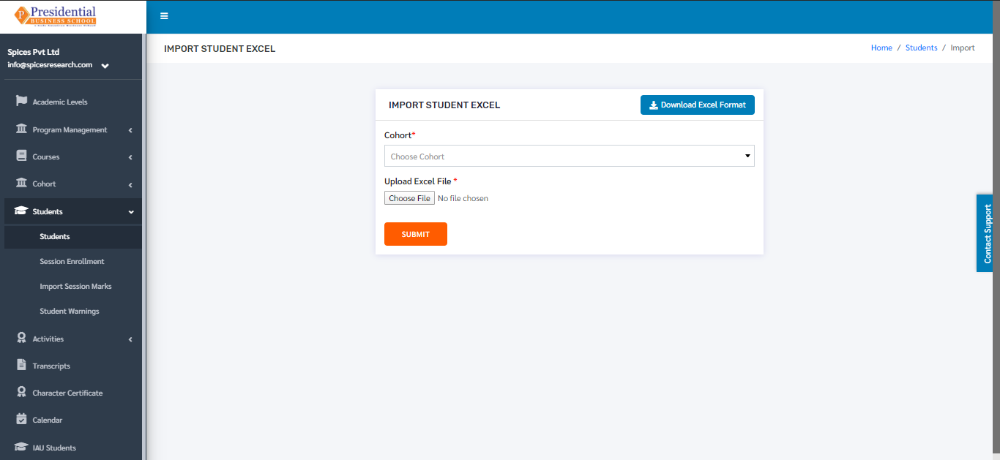

* The user must now click on the **‘Download Excel Format’** button to download the correct excel format.

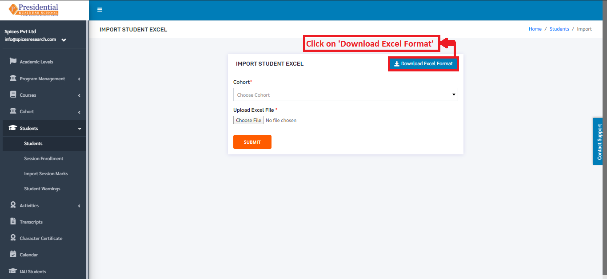

* An excel file of the following format will be downloaded on clicking **‘Download Excel Format’**.

.. image:: ./../../images/academic/image145.png

* The students can be added according to the format given and the user must save the excel file after editing(adding).

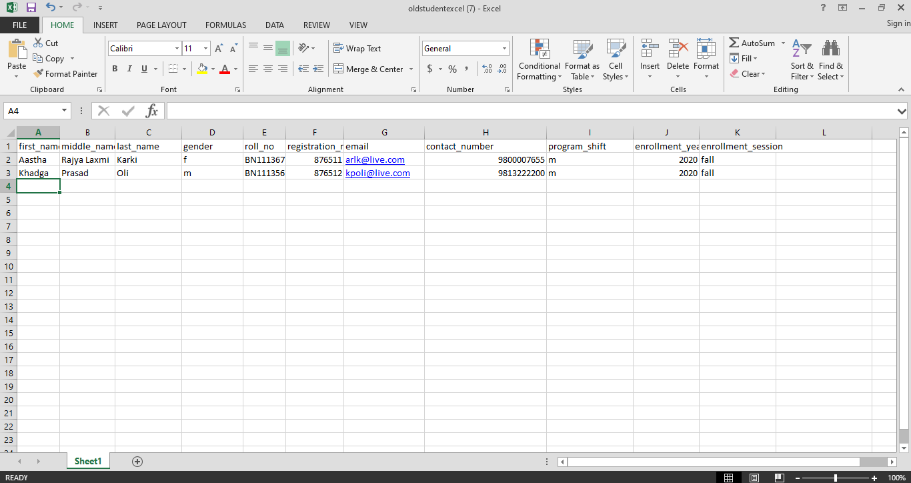

* After saving the file, the same file has to be uploaded. This is done by selecting the cohort from the drop down menu and choosing the excel file by clicking **‘Choose File’**.

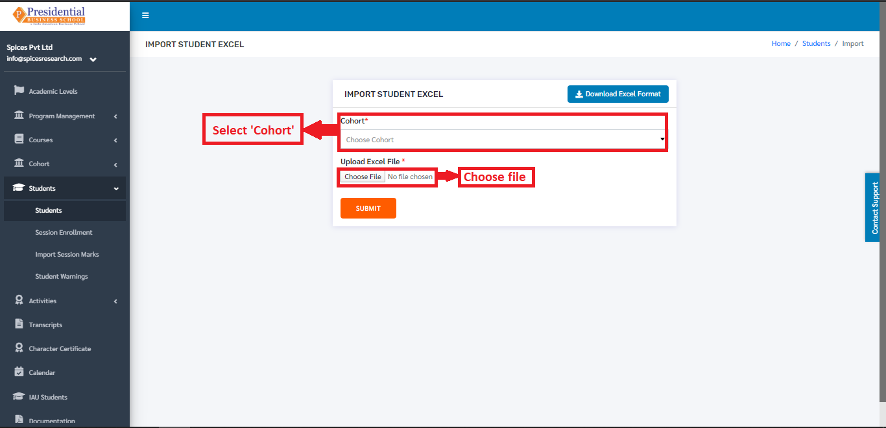

* To finish up the process, the user must click on the ‘SUBMIT’ button after choosing the cohort and the excel file.

.. image:: ./../../images/academic/image150.png

* The students from the excel file will be imported and can be seen on the dashboard of Students.

1.2 Student Details
^^^^^^^^^^^^^^^^^^^^

* The complete details of the student can be viewed. This is done by clicking the **‘Student Details’** icon under the Operation Column.

.. image:: ./../../images/academic/image134.png

* On clicking the **‘Student Details’** icon(button), the following page will appear.

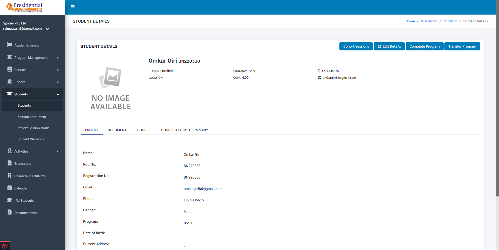

* As the data from the uploaded excel file is not complete i.e. maximum fields of the student are missing. In order to fill up the complete details, the user must click on the **‘Edit Details’** button.

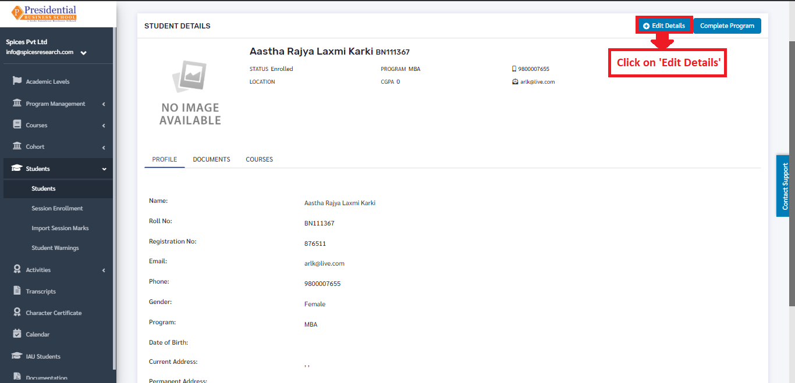

* On clicking the **‘Edit Details’** icon, the user will be landed on the following page.

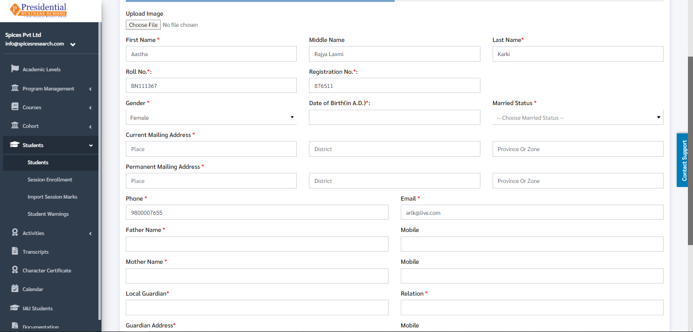

A form of Personal Details and Academic Details will appear, the user will have to fill up the form.

* As shown in the picture below, the user from college must fill out the Personal Details form and click on the **‘NEXT’** button.

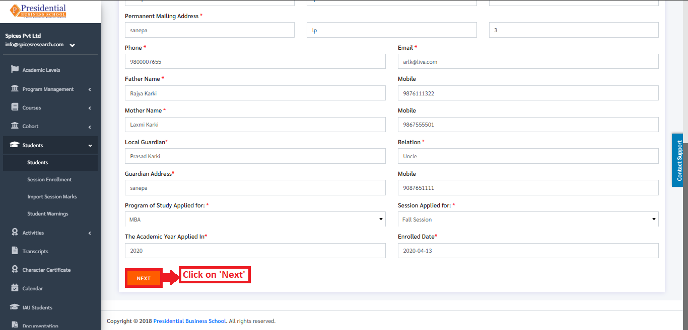

* After the **‘NEXT’** button is clicked, the page is redirected to the form of Academic Details.

.. image:: ./../../images/academic/image187.png

* The user must fill out the Academic details of the student and the academic certificates of the degrees has to be uploaded as well.

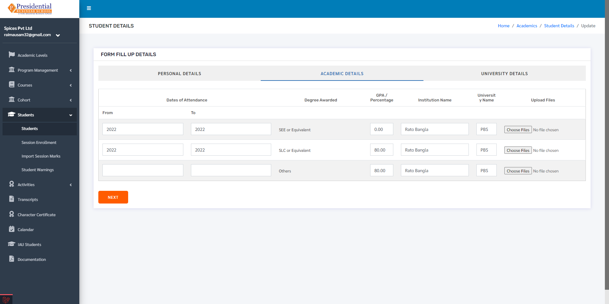

* After the form fill up is done then the **‘Next’** button must be clicked to go to the Academic Details page.

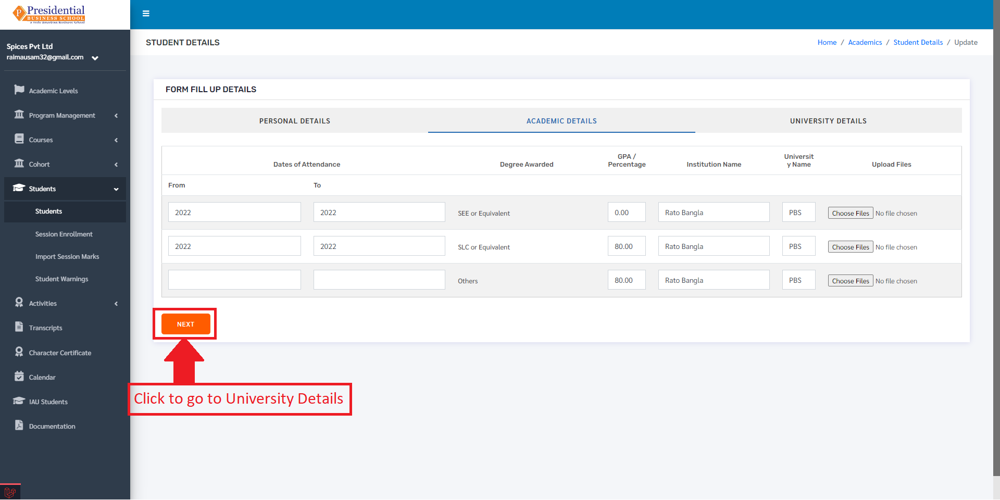

The academic details page looks like the following:

.. image:: ./../../images/academic/image152.png

The academic details page contains details like Single Course Attempts, Total Course Attempts. If the student is a transfer student, details like Transfer Course Code, Transfer Course Details, Transfer Course Credit and Transfer date must be filled. After filling the details, the user can click on the submit button to update the student details.

1.3 Student Sessions
^^^^^^^^^^^^^^^^^^^^

* This option is used to enroll a student in a session. To access this option, the user must click on the **‘Cohort Sessions’** button in the Student Details page.

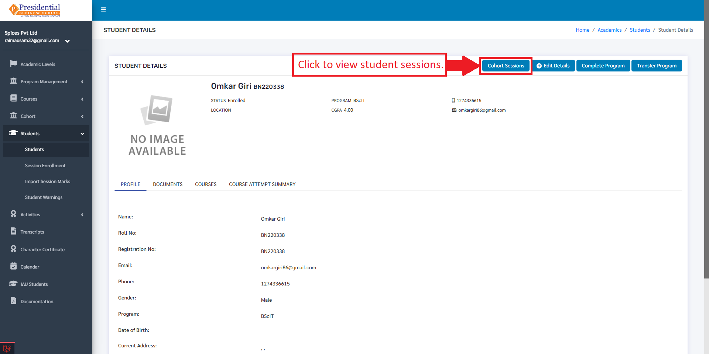

* The following page will appear on clicking the **‘Cohort Sessions’** button.

.. image:: ./../../images/academic/image2.png

* Once the page appears, the user must click on **‘Enroll Session’** for adding the student in a session.

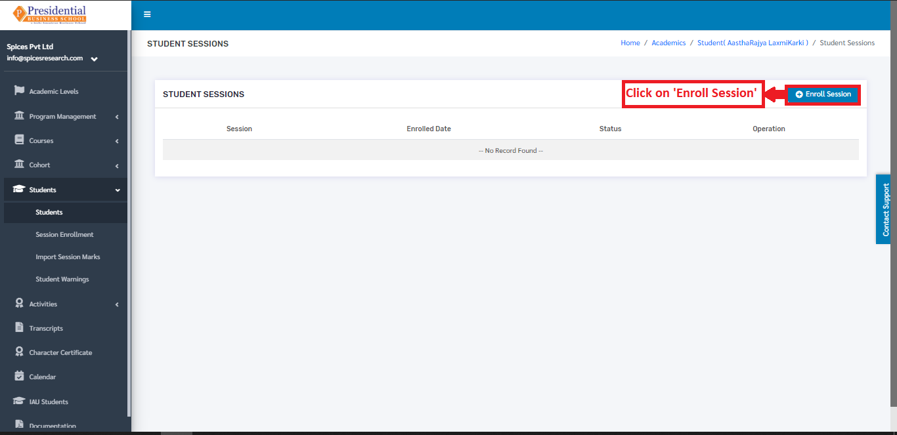

* The following page will appear on clicking the **‘Enroll Session’** button.

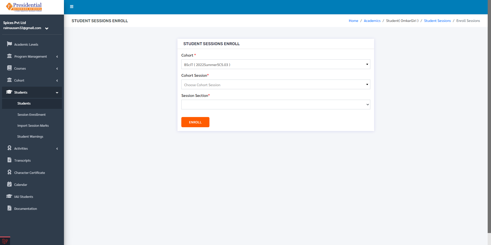

The user can select the desired cohort session from the drop down menu **‘Cohort Session’** to enroll the student in the particular session and choose the section for that cohort.

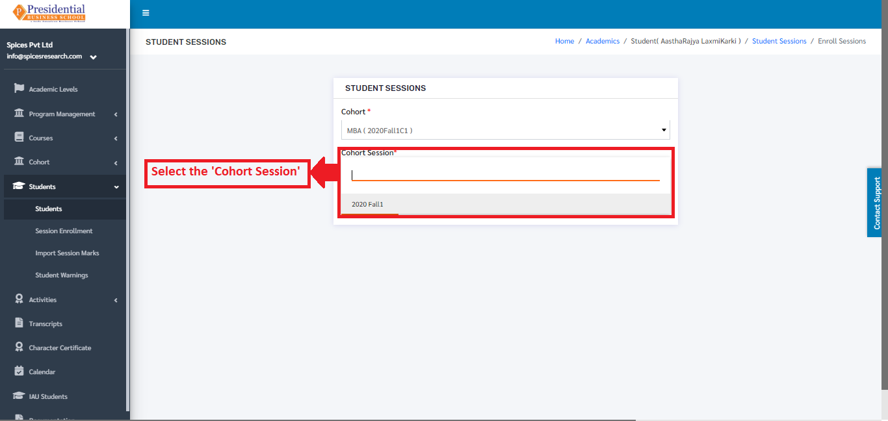

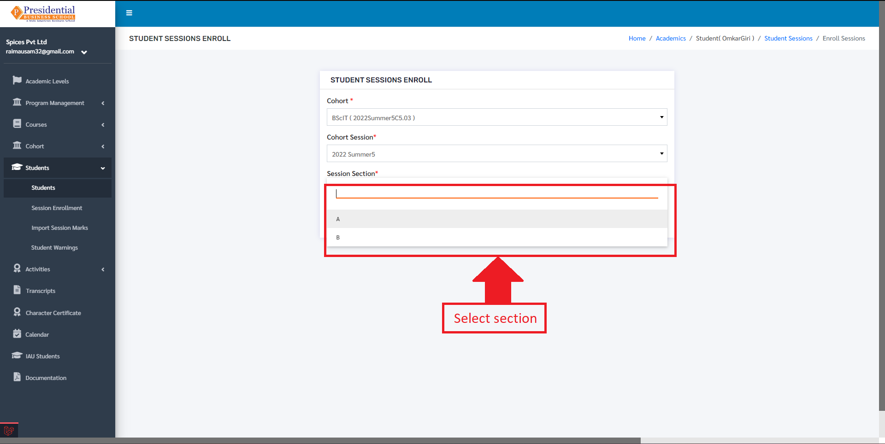

* Once the cohort session is selected, **‘ENROLL’** button must be clicked to finish up the process of adding the student in the session.

* The student can be seen being enrolled in the session.

.. image:: ./../../images/academic/image230.png

1.3.1 Create Session:
"""""""""""""""""""""
New sessions can also be created from this by clicking on the **‘Create New Session’** button.

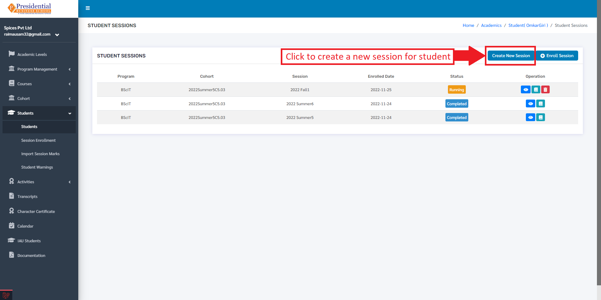

After clicking on **‘Create New Session’** user will be redirected to the following page:

.. image:: ./../../images/academic/image91.png

After filling the form, the user can click on the **‘Submit’** button to create a new session for the student. After submitting, user will be redirected to the student sessions along with a success message indicating that a new session has been created.

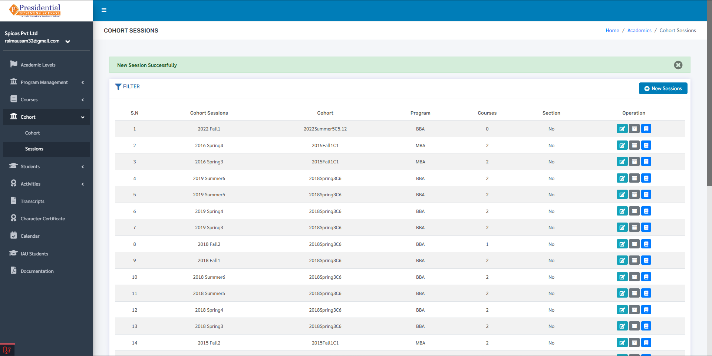

1.3.2 Courses:
""""""""""""""

* Courses can be added in the session from this dashboard as well. This is done by clicking on **‘Student Courses’** under the Operation Column.

.. image:: ./../../images/academic/image202.png

* The user will be landed on the following page on clicking **‘Student Courses’**.

.. image:: ./../../images/academic/image204.png

* A new Course can be added to the session, this is done by clicking on the **‘Enroll Course’** button.

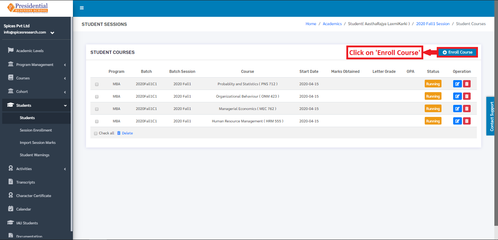

* The following page will appear on clicking the **‘Enroll Course’** button.

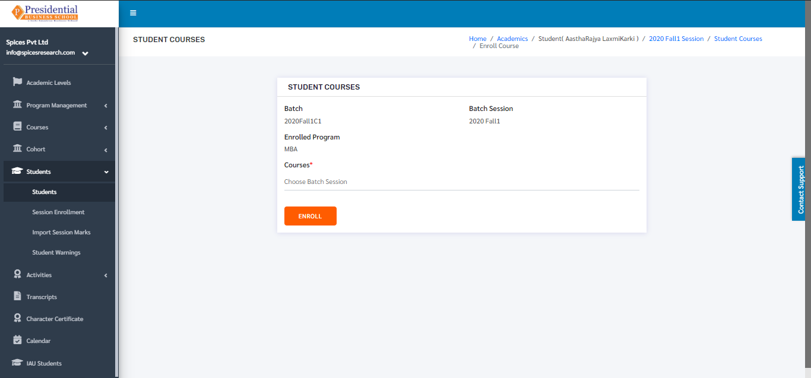

* The required courses can be added by selecting the courses from the drop down menu **‘Courses’**.

.. image:: ./../../images/academic/image200.png

* Once the required courses are selected, **‘ENROLL’** button must be clicked to finish up the process of adding courses to a particular cohort session.

.. image:: ./../../images/academic/image179.png

* The sessions with new courses are updated and can be seen in the dashboard.

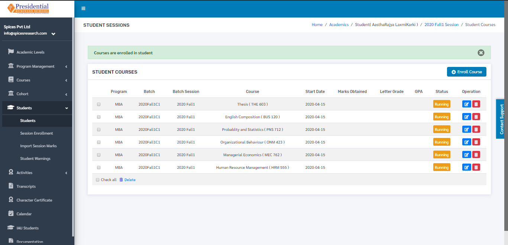

* The students are evaluated by the marks obtained in the courses. The status of the courses are running at first; the courses will either be completed(passed) or Incomplete(fail). This mark is entered in the system on the basis of the marks obtained by the student in the exam.
* To access this option, the user must click on the **‘Edit Course Details’** icon(button) under the Operation column.

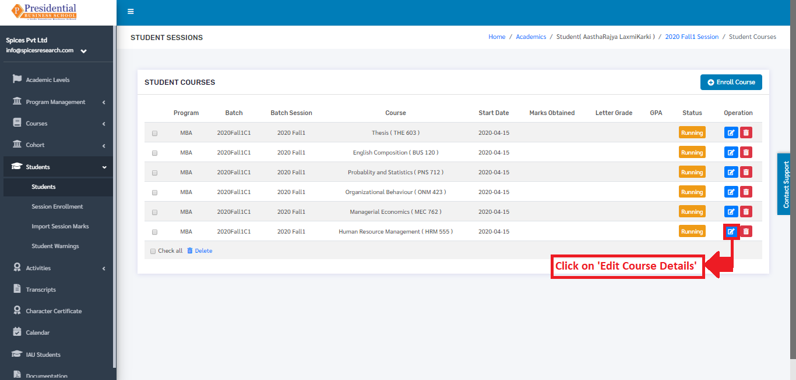

* The user will be landed on the following page on clicking the **‘Edit Course Details’** icon(button).

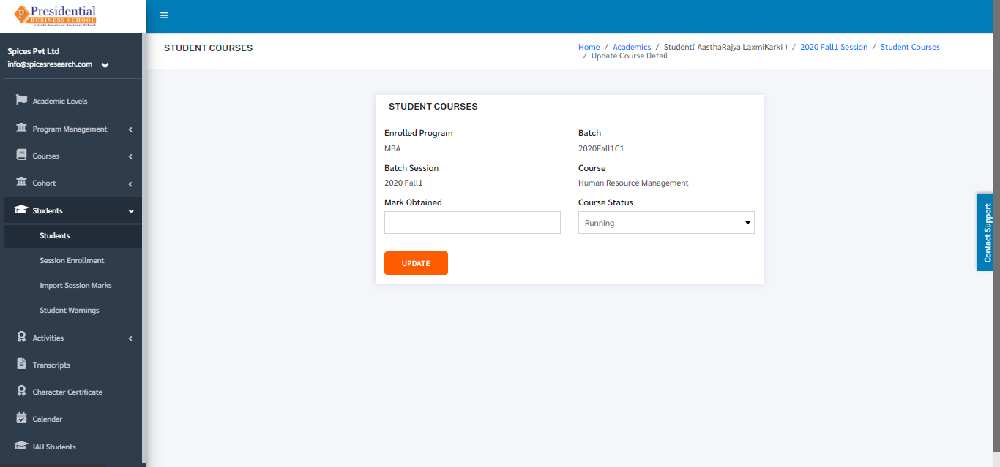

* The remarks are given i.e. Marks obtained and Course Status according to the performance of the student in the particular course. To finish up the process, **‘UPDATE’** button is clicked.

.. image:: ./../../images/academic/image177.png

* The changes can be seen on the dashboard.

.. image:: ./../../images/academic/image172.png

* In case all the exams of the courses are verified(finish) then the session of the student will end as well i.e. status will be completed. To change this status, the user must click on the **‘Cohort Sessions’** icon from the main dashboard of the Students.

* The following page will appear on clicking **Cohort Sessions** icon.

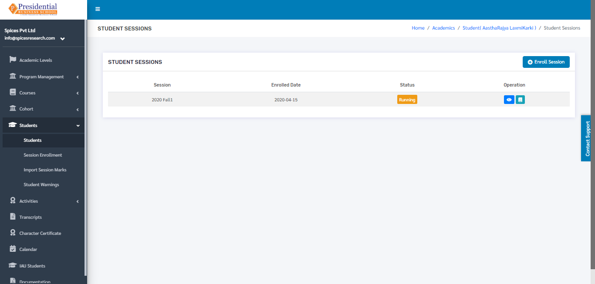

* To change the status, users must click on the **‘View’** icon under the Operation column.

.. image:: ./../../images/academic/image173.png

* The following page will appear on clicking the **‘View’** column.

.. image:: ./../../images/academic/image171.png

* Once the courses in the session have been completed, the user must change the status from **‘Running’** to **‘Completed’** from the **‘Status’** drop down menu.

.. image:: ./../../images/academic/image191.png

* After choosing the status, the user must click on the **‘UPDATE’** button to update the status. Therefore with this process, the session of the student will be completed.

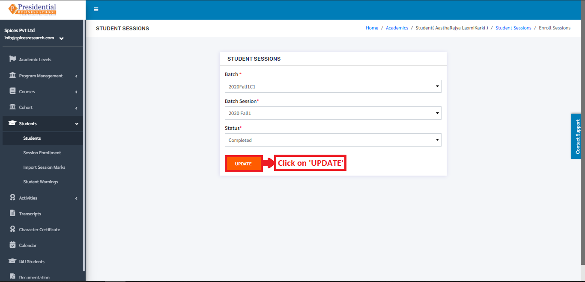

* The status will be seen as Completed in the Session dashboard of the student.

* Once the session of the student is completed, the program of the student will be completed as well. To change the status of the program to completed, the user must click on the **‘Student Details’** icon from the main dashboard of the Students.

.. image:: ./../../images/academic/image134.png

* On clicking the **‘Student Details’** icon(button), the following page will appear.

.. image:: ./../../images/academic/image189.png

* The user can click on **‘Complete Program’** to finish up the process.

.. image:: ./../../images/academic/image188.png

On clicking the **‘Complete Program’** button, the program of the student will be completed.

1.4 Student Transfer
^^^^^^^^^^^^^^^^^^^^

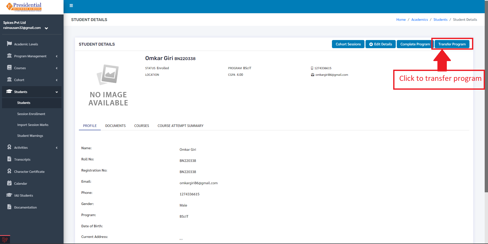

After clicking on the transfer student button, a checklist will appear with a list of programs. The user can select the program to transfer the student to and click on the submit button.

.. image:: ./../../images/academic/image19.png

If the student has incomplete sessions, the student cannot be transferred and a message will be shown indicating that.

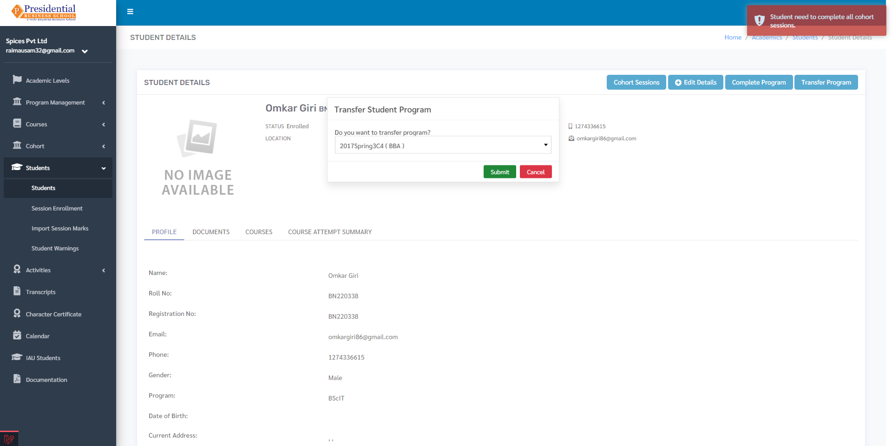

The student can only be transferred if he/she has no running sessions. Once all the sessions are complete the student can be transferred.

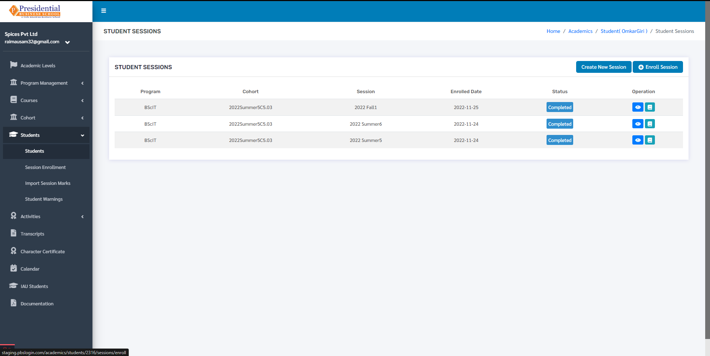

If the student has all completed sessions like above then we can transfer the student to another program in the student details page. After transferring, a message will be shown indicating that the student has been transferred to another program.

Similarly, a student can only be transferred to an active program.

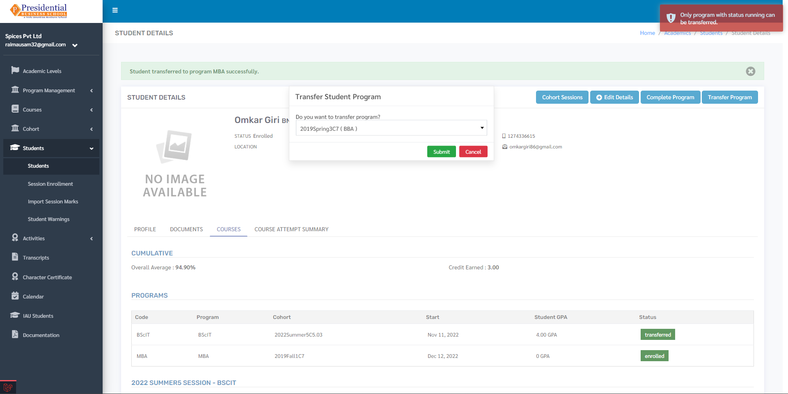

.. image:: ./../../images/academic/image10.png

1.5 Student Login Details
^^^^^^^^^^^^^^^^^^^^^^^^^^

* This option is used to create login credentials for students to access the software provided by the college. To access this option, the user must click on the **‘Student Login Details’** icon under the Operation column.

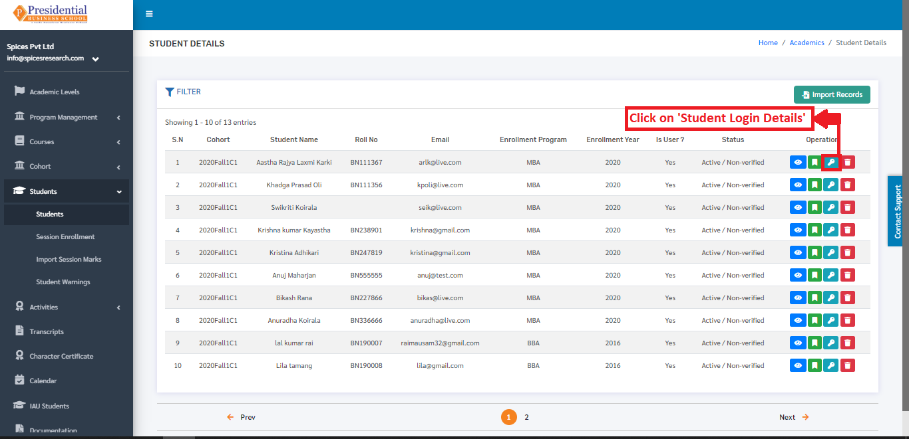

* The following page appears on clicking the **‘Student Login Details’**.

.. image:: ./../../images/academic/image180.png

* The user must tick the **‘Is User Verified’** checkbox and enter the password to provide the student with the credential(email and password) to use the software.

.. image:: ./../../images/academic/image184.png

* Final step for creating user login details is clicking the **‘UPDATE’** button after filling the form.

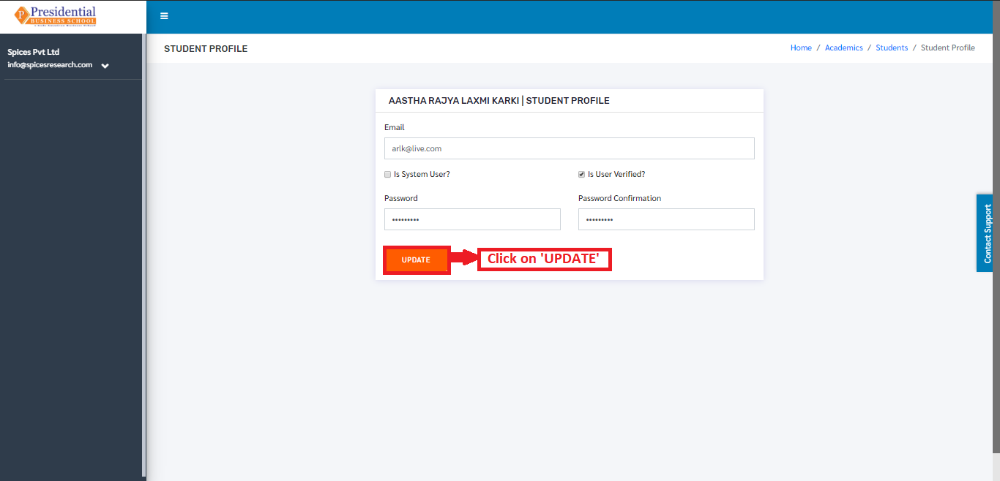

The login email id and password for the student to use the software can be provided by the college after the creation of the login credentials.

2. Session Enrollment
------------------------

* This option is used to enroll new just enrolled students in a cohort along with the cohort session. To access this option, the user must click on the **‘Session Enrollment’** subcategory under submodule Students.

.. image:: ./../../images/academic/image148.png

* On clicking the Session Enrollment option, the user will be landed on the following page.

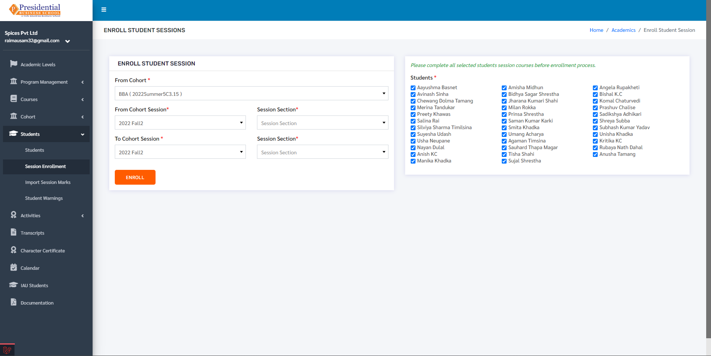

* After filling up the form, the user must click on the **‘ENROLL’** button to finish up the session enrollment process.

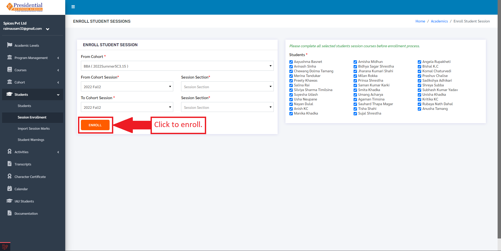

On clicking **‘ENROLL’** new students are enrolled in the cohort session according to the requirement. This subcategory ‘Session Enrollment’ is useful in the case where more than one student is to be added in the same cohort session.

3. Import Session Marks
------------------------

* This option is used to import the marks from Excel File of a particular student of particular Cohort and the Cohort Session. To access this option, the user must click on the **‘Import Session Marks’** subcategory under submodule Students.

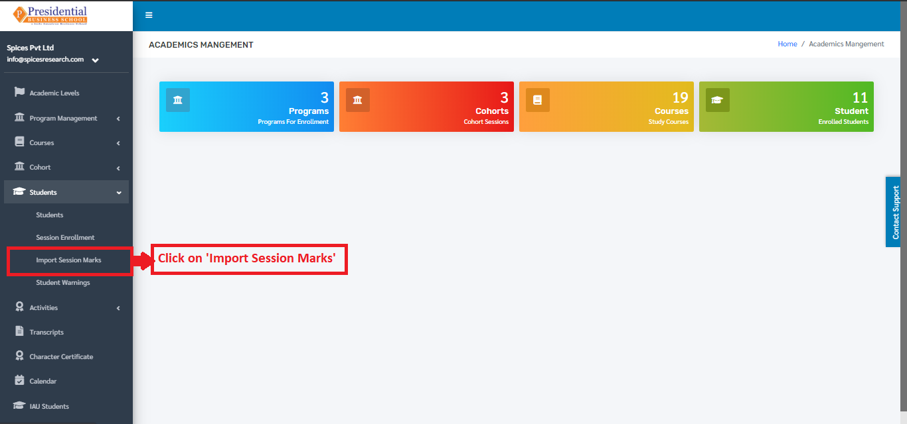

* The following page will appear on clicking Import Session Marks.

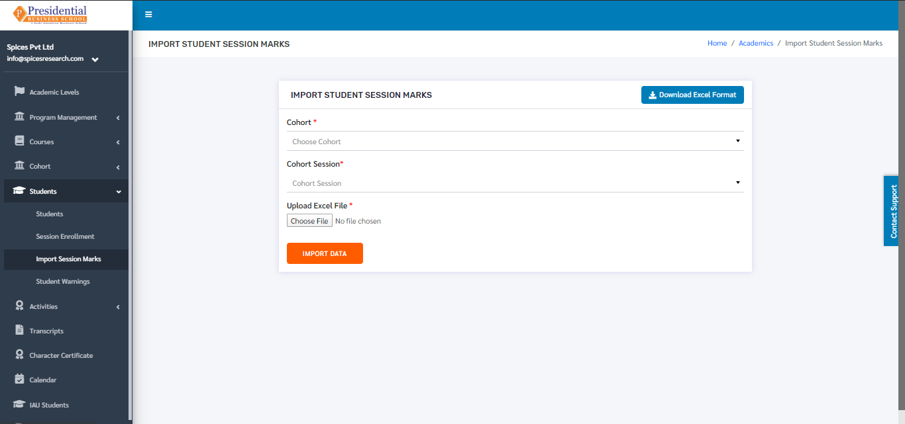

* Excel files with the correct format can be uploaded in order to provide marks to students. Before uploading the Excel file, the excel file of correct format must be downloaded first. This is done by clicking on the ‘Download Excel Format’ button.

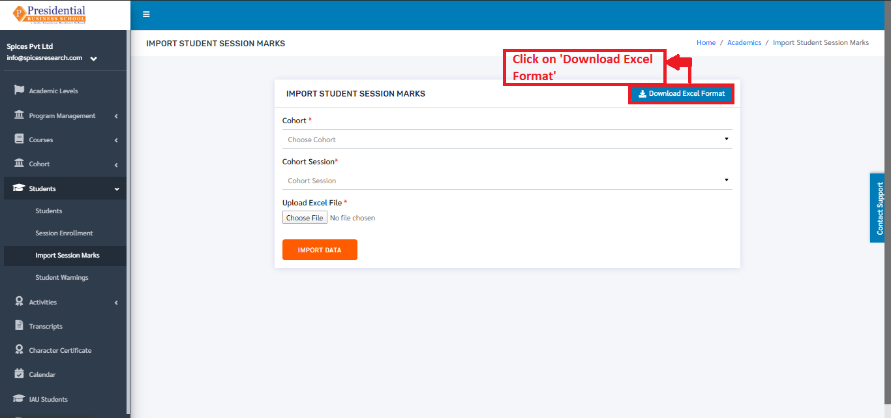

* An excel file of the following format will be downloaded on clicking **‘Download Excel Format’**.

.. image:: ./../../images/academic/image144.png

* Details such as Student Roll no., Course Code, Marks Obtained and Letter Grade must be filled out in the provided excel format. After adding the details, the user must save the excel file after editing(adding) the details.

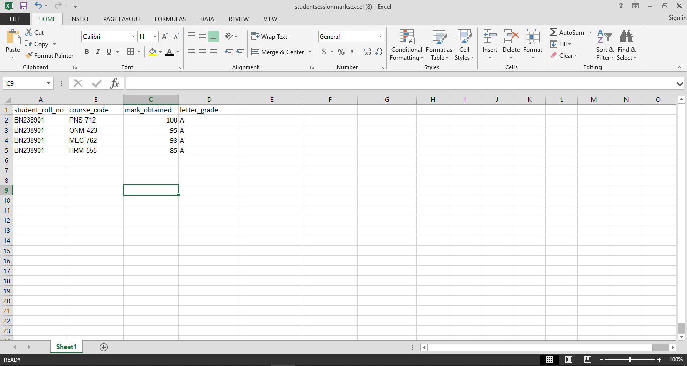

* After saving the file, the same file has to be uploaded. This is done by selecting the Cohort and Cohort Session from the drop down menu and choosing the excel file by clicking **‘Choose File’**.

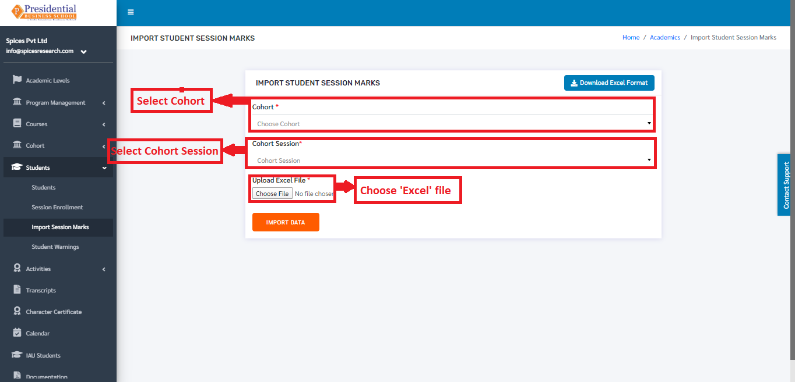

* To finish up the process, the user must click on the **‘IMPORT DATA’** button after choosing the cohort, cohort session and the excel file.

.. image:: ./../../images/academic/image138.png

* The marks of the students according to the Cohort and Cohort Session will be uploaded and the result can be seen on the Dashboard of student courses in **Student Sessions**.

.. image:: ./../../images/academic/image165.png

4. Student Warnings
------------------------

* This option is used to view the warnings given to the students for various foul behaviours. New warnings can be given to the students as well. To access this option, the user must click on the **‘Student Warnings’** subcategory under submodule Students.

.. image:: ./../../images/academic/image164.png

* On clicking the Student Warnings option, the user will be landed on the following page.

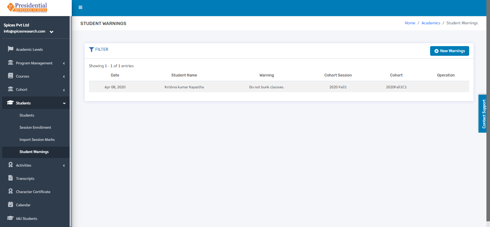

The page provides information of the students with the Warning for foul behaviour that is against the college policy.

4.1 Create New Warning
^^^^^^^^^^^^^^^^^^^^^^^

* If a student is given a warning for foul behaviour then it can be stored digitally in the system for future purpose. New Warning can be created on the ‘New Warnings’ button(icon) on the top right hand side of the dashboard as shown in the picture below.

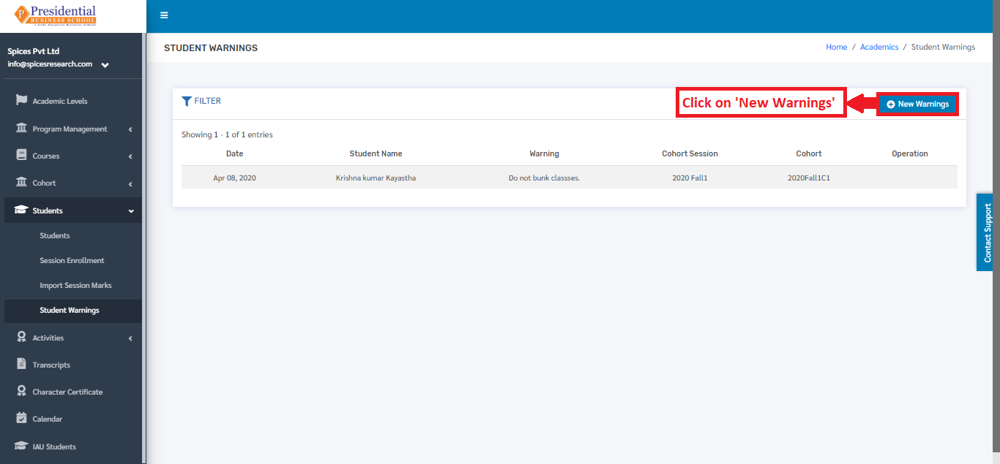

* The following page will appear on clicking the **‘New Warnings’** button.

.. image:: ./../../images/academic/image159.png

* The students who have performed some foul behaviours can be selected in the form with proper details.
* On selecting a particular student, the user must click on the **‘SUBMIT’** button to finish up the process.

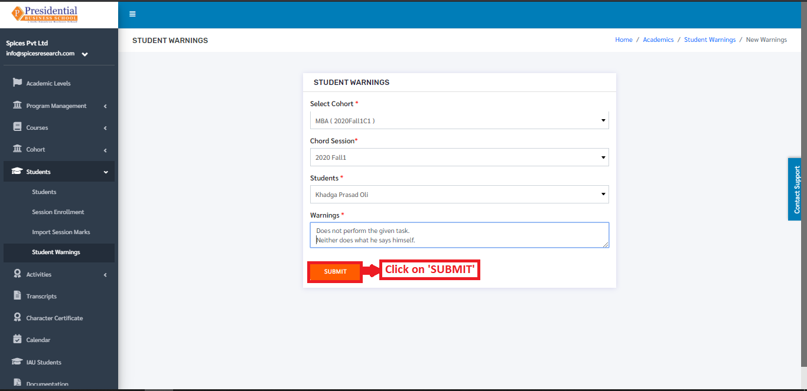

* The warning can be seen on the dashboard after the **‘SUBMIT’** button is clicked.

.. image:: ./../../images/academic/image163.png