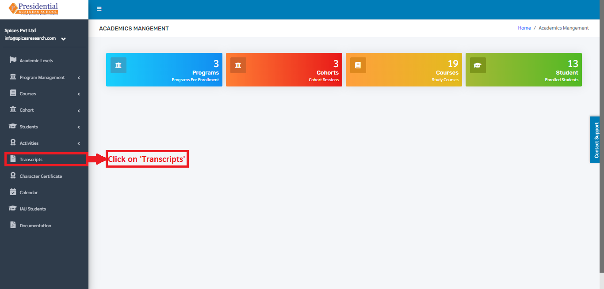
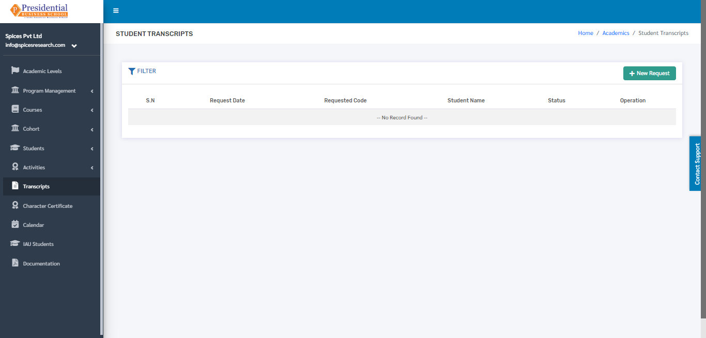
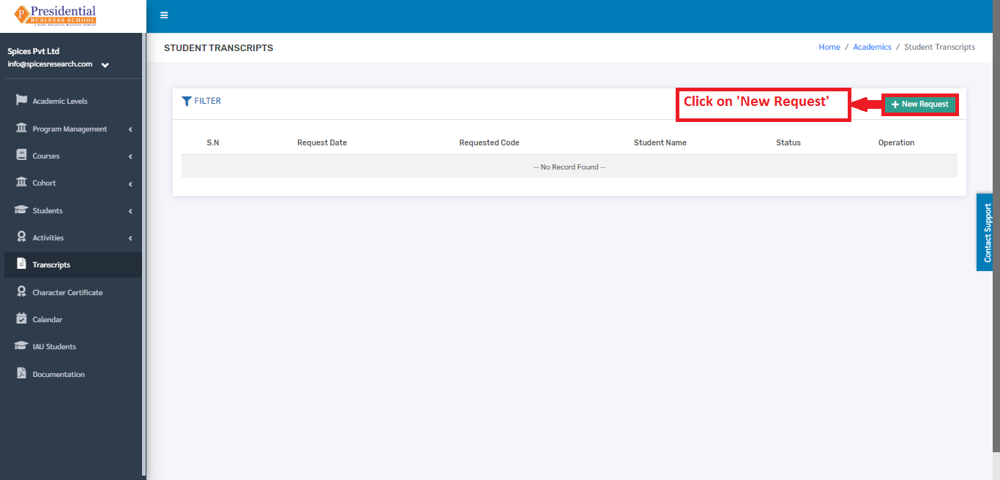
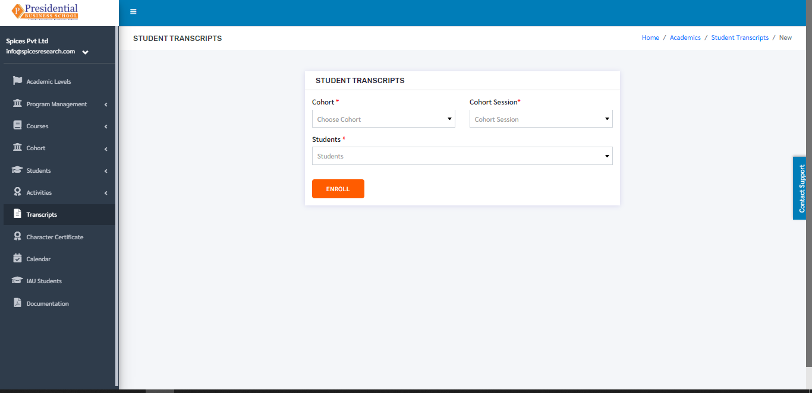
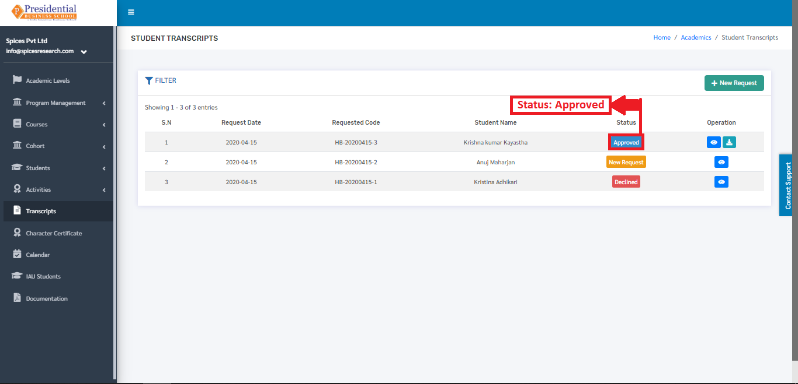
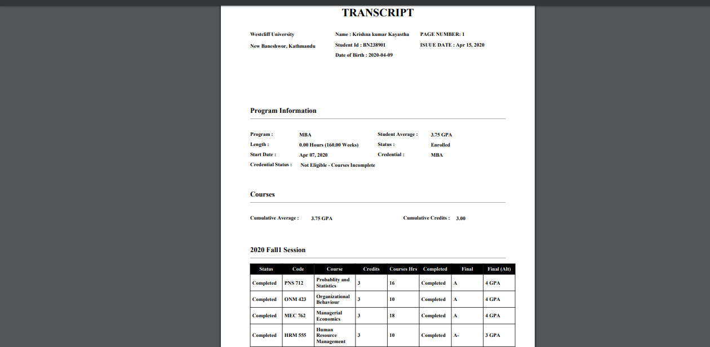

Transcripts
===========

A transcript is an inventory of the courses taken and grades earned of a student throughout a course of study. For the process of developing the transcript, the request is added by the normal user on behalf of a student and the requested transcript is either approved or declined by the admin user of the college.

* Users must click on **‘Transcripts’** on the left hand side of the dashboard to access it. This is done by the following process.

* On clicking **‘Transcripts’**, the following page will appear.

    
1. Create New Transcript Request
---------------------------------

* Creating a new request for the transcript is done by clicking **‘New Request’** on the top right hand side of the dashboard.

* On clicking the **‘New Request’** button, the following form will appear.

* The form must be filled out with the desired details to request for the transcript and click on the **‘ENROLL’** button.

.. image:: ./../../images/academic/image49.png

* On clicking the **‘ENROLL’** button, a new request is created and can be seen on the dashboard of Transcripts.

Once the request is sent then the admin user will have to accept(approve) or Decline the request which is shown in **‘Approve or Decline Request’**.

2. Approve or Decline Request(ADMIN USER)
-----------------------------------------

* Once the request is sent by the user, the request ought to be approved or declined by the admin personnel of the college. This is done by clicking the **‘View Details’** icon of the New Request under the Operation column.

.. image:: ./../../images/academic/image52.png

* On clicking the **‘View Details’** icon, the following page will appear where the Admin user can either approve or decline the request.

.. image:: ./../../images/academic/image85.png

* On clicking the **‘Decline’** button, it implies that the request is rejected and the status of the request can be seen as ‘Declined’ in the Transcript dashboard.

.. image:: ./../../images/academic/image83.png

* On clicking the **‘Approve’** button, it implies that the request is approved and the status of the request can be seen as ‘Approved’ in the Transcript dashboard.

* The transcript can be generated after the request is approved. This is done by clicking on the ‘Download’ icon under Operation column of the requests that is Approved.

.. image:: ./../../images/academic/image87.png

* On clicking the ‘Download’ icon the transcript will appear on the new tab of the browser.

