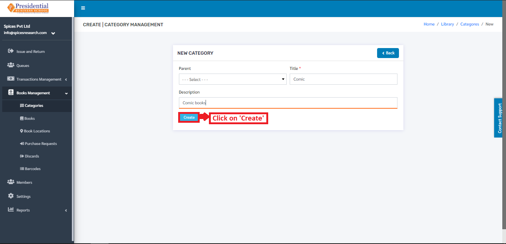
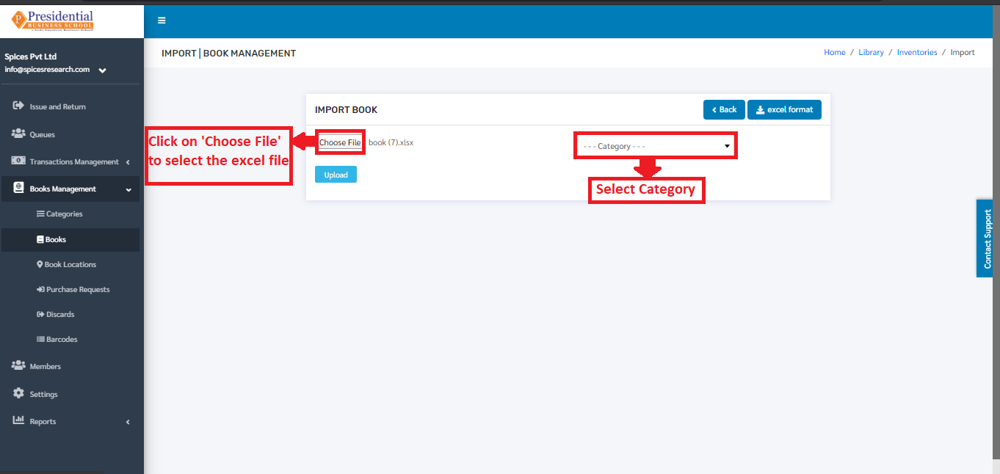
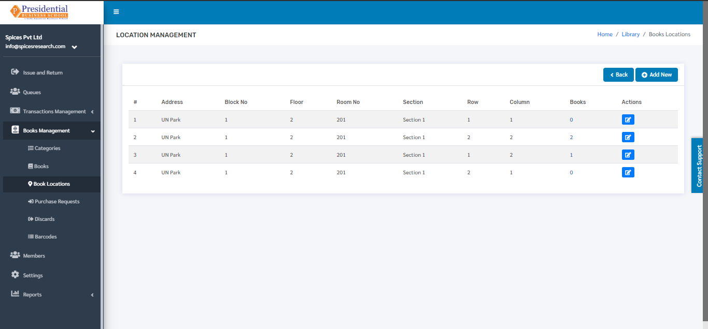
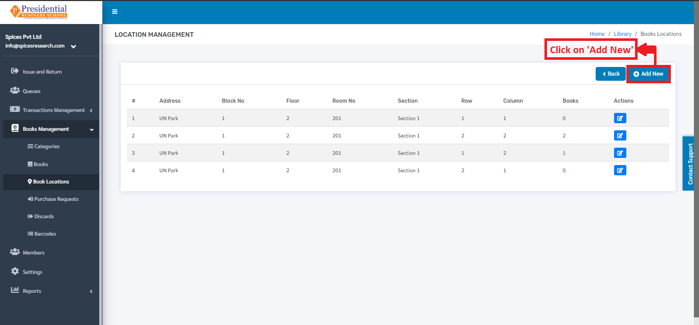

Books Management
=================

Book Management can be simply defined as the management of the books like adding,editing the details of the books. This sub-module ‘Book Management’ deals with the management of books along with the book categories, book location, discard of the books.

* Users(Librarian) must click on **‘Books Management’** on the left hand side of the dashboard to access it. This is done by the following process.

.. image:: ./../../images/library/image11.png

* On clicking **‘Books Management’**, six subcategories will appear namely Categories, Books, Book Locations, Purchase Requests, Discards and Barcodes.

Categories
-----------

* It deals with the types of book categories that the college will provide to the students in the library. This subcategory can be accessed by clicking on the ‘Categories’. This is done by the following process.

.. image:: ./../../images/library/image13.png

* The user will be landed on the following page by clicking on **‘Categories’**.

.. image:: ./../../images/library/image14.png

Add New Category
^^^^^^^^^^^^^^^^^

* The new book category can be added by clicking on the **‘Add New’** button on the dashboard.

* The following page will appear on clicking the **‘Add New’** button.

.. image:: ./../../images/library/image16.png

* The form must be filled out with the required details as shown in the picture below.

* **‘Create’** button must be clicked after filling up the form to finish up the creation of the New Book Category.

The new book category can be seen in the dashboard after clicking on the **‘Create’** button.

Edit Category
^^^^^^^^^^^^^^^^

* If necessary, details of the book categories can be edited as well. This is done by clicking on the **‘Edit’** icon(button) under the Operation column.

* The following page will appear on clicking the Edit icon(button).

.. image:: ./../../images/library/image20.png

Books
-------

* It deals with the different books that the college will provide to the students in the library. This subcategory can be accessed by clicking on the **‘Books’**. This is done by the following process.

.. image:: ./../../images/library/image1.png

* The user will be landed on the following page by clicking on **‘Books’**.

2.1 Add New Book
^^^^^^^^^^^^^^^^^^

There are two methods to add a new book in the system.

* Add by filling the form

* Add by uploading Excel File

Add by filling the form
""""""""""""""""""""""""""

* To create(add) a new book, the user has to fill out the form in the system. This is done by clicking on the **‘Add New’** button on the top right hand side of the page.

.. image:: ./../../images/library/image3.png

* On clicking the **‘Add New’** button, the following page will appear.

* The form must be filled out. The **‘Create’** button must be clicked to finish up the process.

.. image:: ./../../images/library/image5.png

* The new book can be seen on the dashboard of courses once the **‘Create’** button is clicked.

Add by uploading Excel File
""""""""""""""""""""""""""""
* An Excel file with the correct format can be uploaded in order to create(add) a new book in the system. Before uploading the Excel file, the excel file of correct format must be downloaded first. This is done by clicking on the **‘IMPORT’** button.

* The following page will appear by clicking the **‘IMPORT’** button.

* The user must now click on the **‘Excel Format’** button to download the correct excel format.

.. image:: ./../../images/library/image9.png

* An excel file of the following format will be downloaded on clicking **‘ Excel Format’**.

* The desired books can be added according to the format given and the user must save the excel file after editing(adding) the book details.

* After saving the file, the same file has to be uploaded. This is done by selecting the book category from the ‘Category’ drop down menu and choosing the excel file by clicking **‘Choose File’**.

* To finish up the process, the user must click on the **‘Upload’** button after choosing the book category and the excel file.

* The books from the excel file will be imported and can be seen on the dashboard of Books.

Edit Book Details
"""""""""""""""""""

* Details of the books can be edited as well. This is done by clicking on the **‘Edit’** icon(button) under the Operation column.

* The following page will appear on clicking the **‘Edit’** button.

Once the details are edited, **‘UPDATE’** button must be clicked in order to finish up the editing process.

All Books
"""""""""""

* **‘All Books’** gives the information on all the books in the college along with their status like In House, Issued, Damaged, Missing, Lost, Donate. This option is accessed by clicking on **‘All books’**.

* The following page will appear by clicking the **‘All Books’** button.

The page provides the information of the books along with their status.

Book Locations
-----------------

* **‘Book Locations’** implies the location in the library where different books are placed so that it gets easy to filter the books while finding it. This subcategory can be accessed by clicking on the **‘Book Locations’**. This is done by the following process.

* The user will be landed on the following page by clicking on **‘Book Locations’**.

Add New Location
^^^^^^^^^^^^^^^^^^^^^

* A New Book location is added by clicking on the **‘Add New’** button on the top right hand side of the dashboard.

* The following page will appear by clicking **‘Add New’**.

.. image:: ./../../images/library/image23.png

* The form must be filled out with the required details as shown in the picture below.

* **‘Create’** button must be clicked after filling up the form to finish up the creation of the New Book Location.

The new book location can be seen in the dashboard after clicking on the **‘Create’** button.

Edit Book Location
^^^^^^^^^^^^^^^^^^^^^

* If necessary, details of the book location can be edited as well. This is done by clicking on the **‘Edit’** icon(button) under the Operation column.

* The following page will appear on clicking the Edit icon(button).

Purchase Requests
-------------------

* **‘Purchase Requests’** is used to request the college(admin personnel) for the purchase of the new books. This subcategory can be accessed by clicking on the **‘Purchase Requests’**. This is done by the following process.

* The user will be landed on the following page by clicking on **‘Purchase Requests’**.

Create New Purchase Request
^^^^^^^^^^^^^^^^^^^^^^^^^^^^

* To create a new purchase request, the librarian has to click on the **‘Add New’** button in the dashboard as shown in the picture.

* The following page will appear by clicking **‘Add New’**.

* The form must be filled out with the required details as shown in the picture below.

* **‘Create’** button must be clicked after filling up the form to finish up the request for the purchase of the book.

The new request for the purchase of the book can be seen in the dashboard after clicking on the **‘Create’** button. The status of the new request is seen as **‘New Request’**.

Approve or Decline Purchase Request(Admin)
^^^^^^^^^^^^^^^^^^^^^^^^^^^^^^^^^^^^^^^^^^^

* The request made by the librarian is approved by the admin personnel of the college i.e. the Approving privilege is given mainly to the Admin Personnel of the college.

* For approving a new request, the Admin personnel have to click on the **‘View’** icon under the Action column. This is done by the following process.

* The following page will appear by clicking the **‘View’** icon.

* **‘Approved’** button must be clicked in order to approve the book purchase request.

* For declining the purchase request, the **‘Declined’** button must be clicked.

.. image:: ./../../images/library/image60.png

Discards
----------

* The books from the college library that are either missing, lost, damaged or donated can be denoted or assigned for the record in this subcategory. This subcategory can be accessed by clicking on the **‘Discards’**. This is done by the following process.

* The user will be landed on the following page by clicking on **‘Discards’**.

Create New Discard(Book Status)
^^^^^^^^^^^^^^^^^^^^^^^^^^^^^^^^^^

* To assign a book status i.e. creating a new discard, the librarian has to click on the **‘Add New’** button in the dashboard as shown in the picture.

* The following page will appear by clicking **‘Add New’**.

* The form must be filled out with the required details as shown in the picture below. The Status of the book must be chosen according to the status of the book i.e. if the book is lost then the status for lost book is Lost. Likewise the status for damaged book is Damaged, status for donated book is Donate and status for missing book is Missing.

* **‘Create’** button must be clicked after filling up the form to finish up the discard process of the books.

The book discard along with the status can be seen in the dashboard after clicking on the **‘Create’** button.

* The books that were missing could be found. In case the books are found, the status must be changed to found in the system. This is done by clicking on the **‘Found icon’** under the Action column of the books whose status are missing.

Once the **‘Found’** button is clicked, the book will disappear from the dashboard of ‘Discards’. The book can be seen on the dashboard of ‘All Books’ after being found.

Barcodes
----------

* To access the barcode option, the user will have to click on **‘Barcodes’** as shown in picture below.

* The user will be landed on the following page.

Add All Barcodes
^^^^^^^^^^^^^^^^^^^^

* The user will have to click on the **‘ADD ALL’** button to add the book barcodes in the system.

* The barcodes of all the books will be added on the system. The following picture can describe the scenario.

Remove All Barcodes
^^^^^^^^^^^^^^^^^^^^

* **‘REMOVE ALL’** button must be clicked in order ro remove all the barcodes from the system.

* The barcodes will be removed from the system on clicking the **‘REMOVE ALL’** button.

