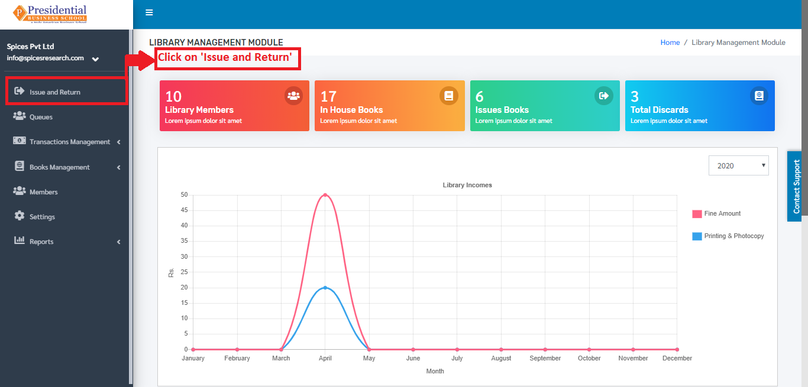
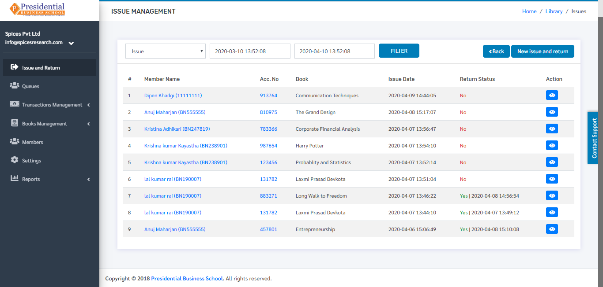
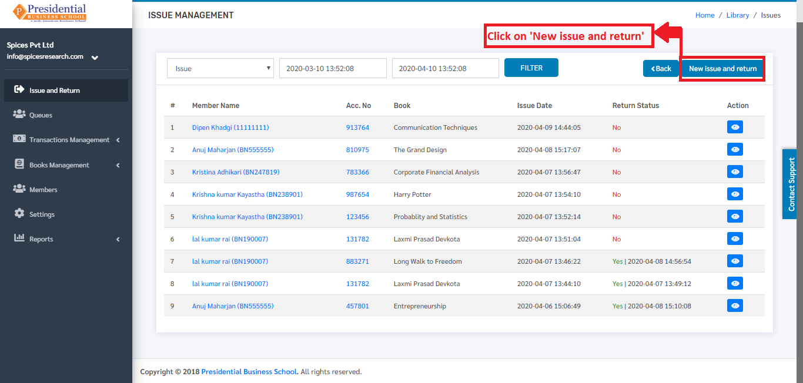
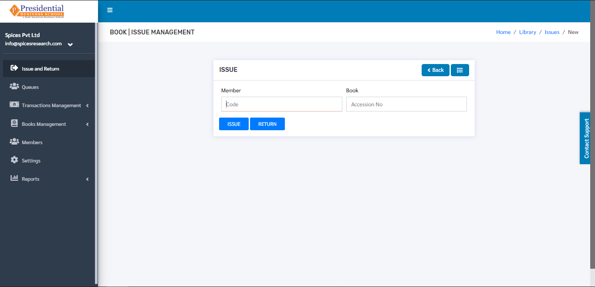
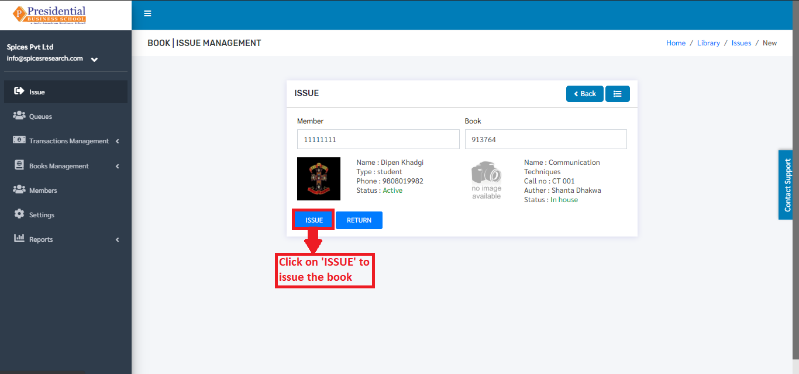
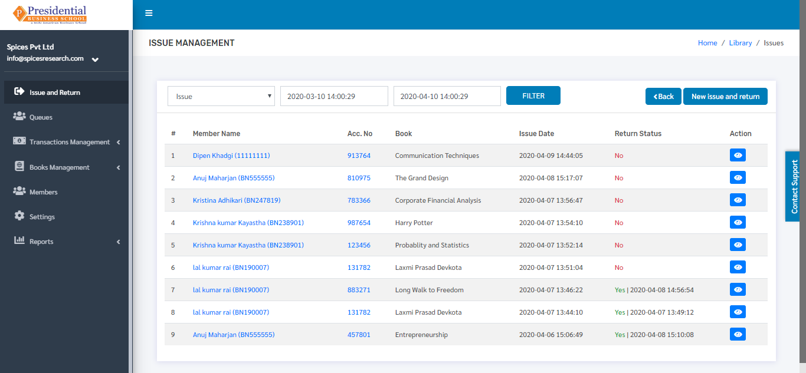
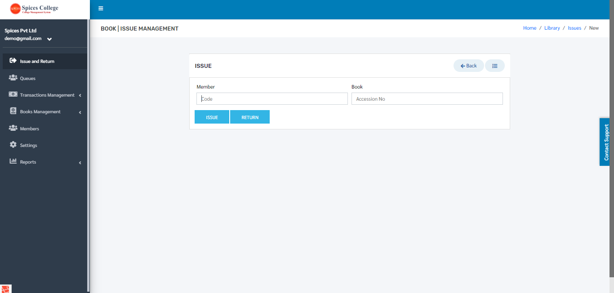
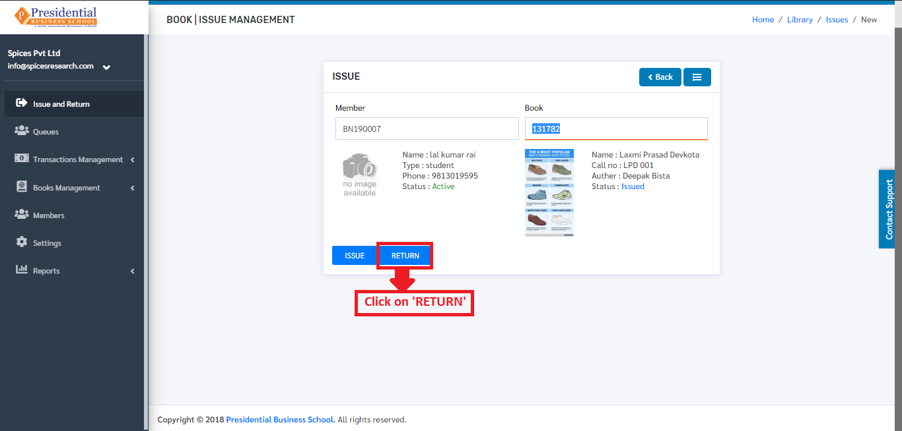

Issue and Return
==================

**‘Issue and Return’** sub-module is used by the librarian to keep the record in the system for issuing the books or taking the books back from the students. The returned books by the students or the books issued by the librarian will be recorded according to the Library Member number(Roll number) and Accession number of the book.

* Users(Librarian) must click on **‘Issue and Return’** on the left hand side of the dashboard to access it. This is done by the following process.

* The following page will appear on clicking Issue and Return.

Issue
--------

* When a student has issued a book, the librarian will have to keep the record of it. This is done by clicking on **‘New Issue and Return’**.

* The following page will appear on clicking the **‘New Issue and Return’** button.

* The books issued by the librarian will be recorded as per the Library Member number(Roll number) of the student  and Accession number of the book.

As shown in the picture above, the librarian will have to click on the **‘ISSUE’** button to finish the book issuing process.

* The issued book can be seen on the dashboard of ‘Issue and Return’ as return status ‘No’.

Return
---------

* The books that are returned back by the students to the library must be recorded as well. The returned books by the students are accepted by the librarian and marked as returned as per the Member number and Accession number of the book. This is done by clicking on **‘New Issue and Return’**.

* The following page will appear on clicking the **‘New Issue and Return’** button.

* The librarian will have to enter the member number of student and the accession number of the book & click on **‘RETURN’** button to finish up the return process. The book has to be returned on time as there will be a penalty of some amount per day if the due time exceeds.

* The returned book can be seen on the dashboard of **‘Issue and Return’** as return status ‘Yes’.

