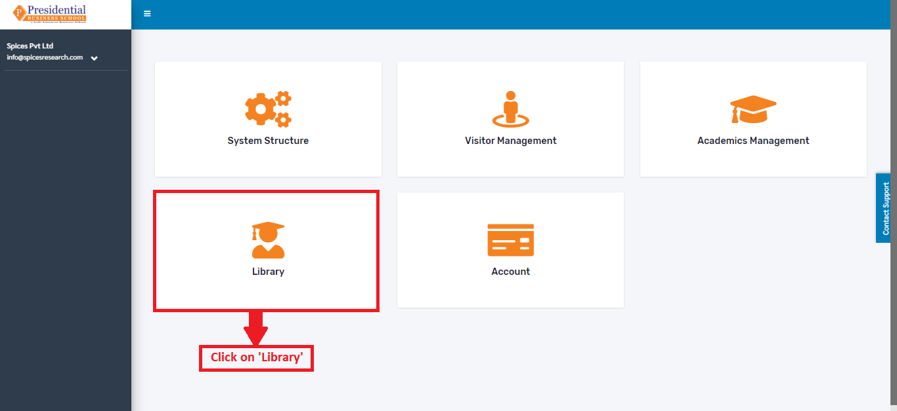
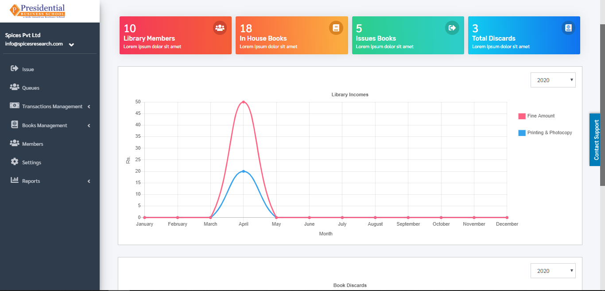
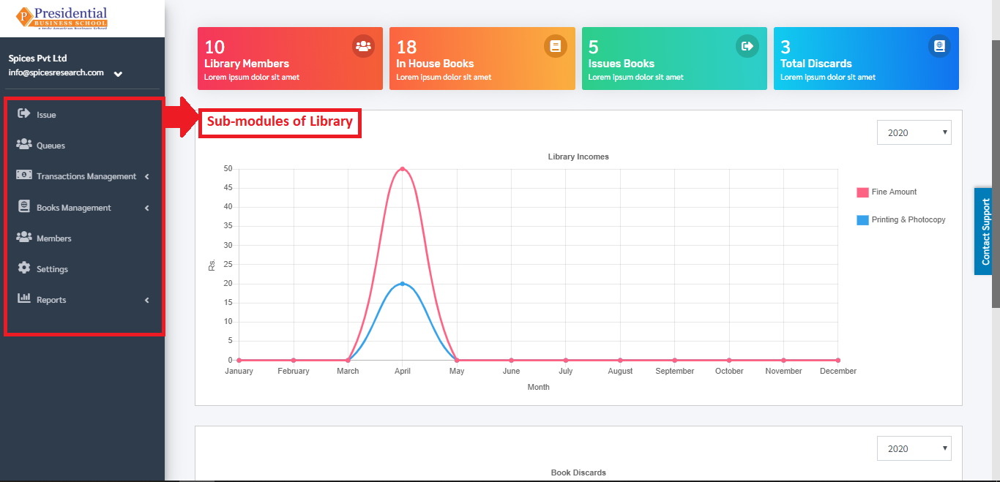

Introduction
=============

The module deals with the management of the library in the college. It deals with managing the catalog of a library. This helps to keep the records of whole transactions of the books available in the library. There are many features which help the librarian to keep records of available books as well as issued books.

* On the main Dashboard click on **“Library”** by the following process as shown in the picture below.

* The following page will appear on clicking **‘Library’**.

After user is landed on the dashboard of “Library”, user will be able to see some sub-modules on the left hand side of the page:

1. Issue and Return
2. Queues
3. Transaction Management
4. Book Management
5. Members
6. Settings
7. Reports

