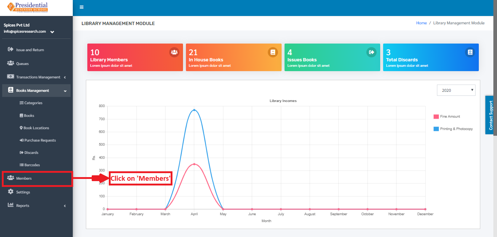
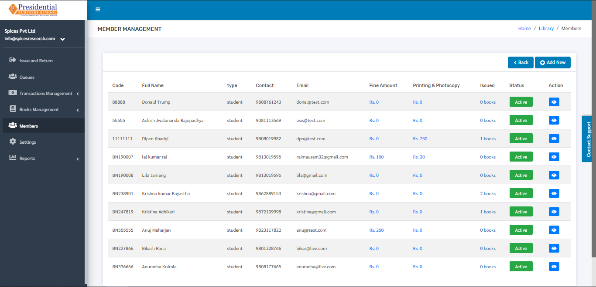
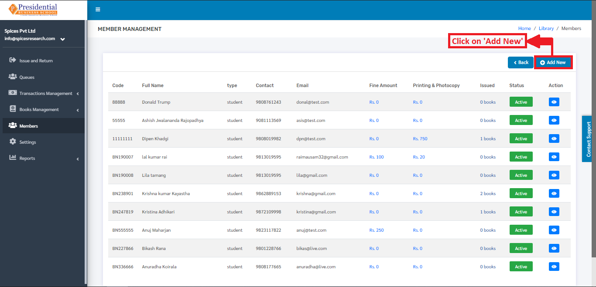
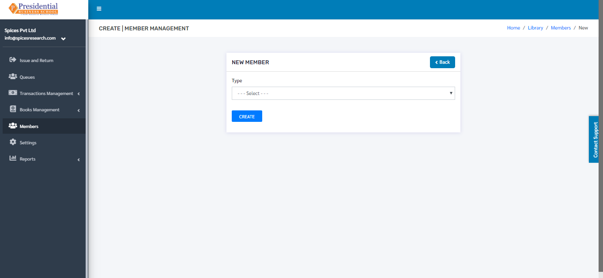
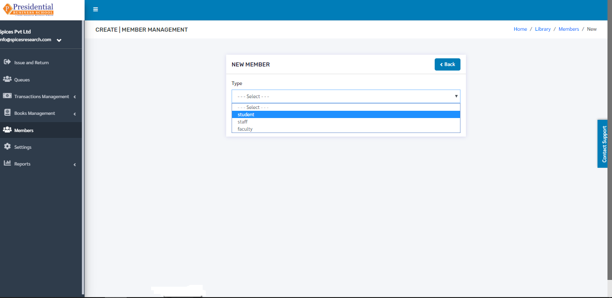
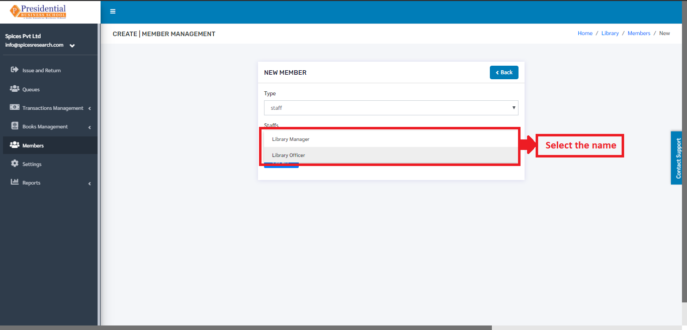
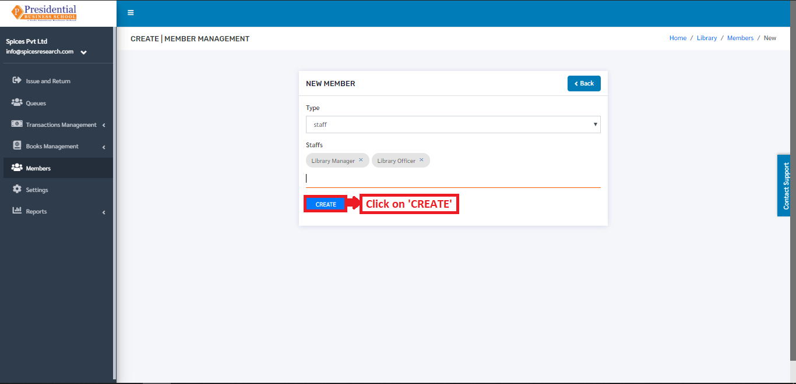
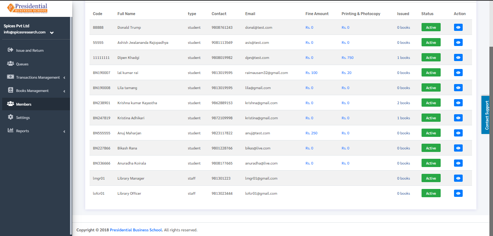

Members
========

Members implies the students who belong to the library group of the college. The students who are enrolled in the college having active sessions should be a member of the library to issue books. Without being a library member, the librarian will not issue the books to the students.

* The librarian can add the students as members of the library by clicking on the ‘Members’ on the left hand side of the dashboard. This is done by the following process.

* The following page will appear on clicking Members.

Add New Library Members
-------------------------

* New Members can be added to the library so that the librarian can issue the books to the students. This is done by clicking on the **‘Add New’** button on the top right hand side of the dashboard.

* The following page will appear by clicking **‘Add New’**.

* The librarian must choose the member type i.e. either student or teacher or staff from the faculty.

* After choosing the member type, a new drop down box will appear consisting of names of students or teachers or staff from the faculty. The type of drop down box depends on the Member type that is selected.

* After the desired names are selected, the librarian must click on the **‘Create’** button to finish up the creation of members of the library.

* New Members of the library will be created by clicking the **‘Create’** button. The new members can be seen on the dashboard of ‘Members’.

