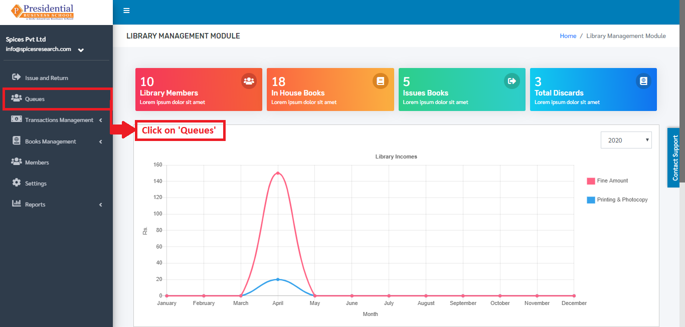
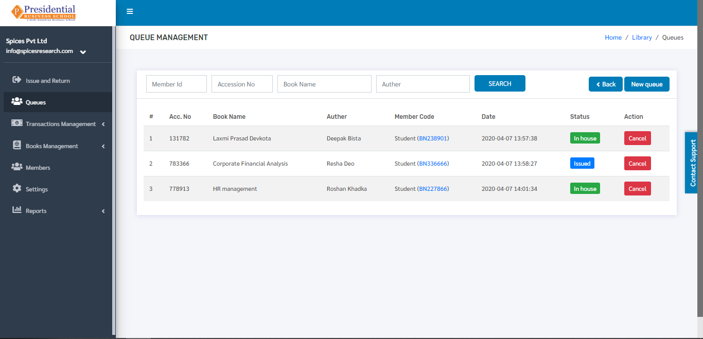

Queues
=======

Queue can be defined as a line or sequence of people or any other thing awaiting their turn to be attended to or to proceed. Here, the librarian will put the students in the queue if the book is not available in the library.

* Users(Librarian) must click on **‘Queues’** on the left hand side of the dashboard to access it. This is done by the following process.

* The following page will appear on clicking the **‘Queue’** button.

Create New Queue
-----------------

* In case the desired book by a student is not available at the moment i.e. the book is issued to some other student then the librarian can put the student in the queue for the book. **‘New queue’** button must be clicked in order to  put a student in a queue.

* The following page will appear on clicking the **‘New queue’** button.

* Librarians will have to select the book and the student to put on the queue. The options can be selected from the drop down option. Once the student and book is selected, **‘Create’** button must be clicked to finish up the queueing process.

* The student is put on the queue until the book is back in the library. It can be seen on the dashboard of **‘Queues’** as well.

Cancel Queue
---------------

* The queue of the student with the first queue request must be canceled once the book is back in the library i.e. the queue works as FIFO(First In First Out) mechanism if there are many queues for a particular book. The Cancellation process is done by the librarian.

* For accessing the cancel queue, the librarian will have to click on the ‘Cancel’ button under the Action column in the dashboard of **‘Queues’**.

After the librarian cancels the queue then the librarian must help the student to go through the ‘Issue’ process to get the book and **‘Return’** process to return back the book to the library. The librarian plays a vital role in all these processes.

