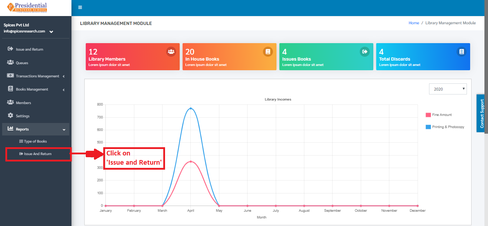

Reports
========

This sub-module provides detailed pie-chart report and bar graph report on **‘Types of Books’** and **‘Issue and Return’** respectively.

* The user (librarian) must click on **‘Reports’** on the left hand side of the dashboard to access it. This is done by the following process.

* On clicking **‘Reports’**, two subcategories will appear namely Types of Books & Issue and Return.

Type of Books
--------------

* The subcategory generates the report on the types of books present in the library. The report can be seen in the form of Pie- chart. This subcategory can be accessed by clicking on the **‘Type of Books’**. This is done by the following process.

* The user will be landed on the following page by clicking on **‘Type of Books’**.

The page provides information on different types of books present in the library in the form of Pie-chart.

Issue and Return
-----------------

* The subcategory generates the report on the number of books that are issued and returned by the students in the library. The report can be seen in the form of a bar-graph. This subcategory can be accessed by clicking on the **‘Issue and Return’**. This is done by the following process.

* The user will be landed on the following page by clicking on **‘Issue and Return’**.

The page provides information on the number of issued and returned books by the students in the library in the form of a bar-graph.

