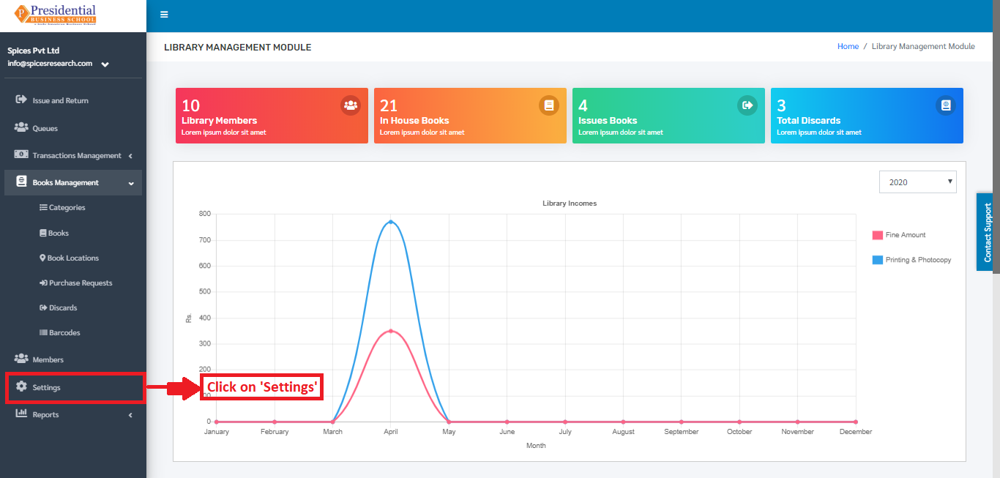
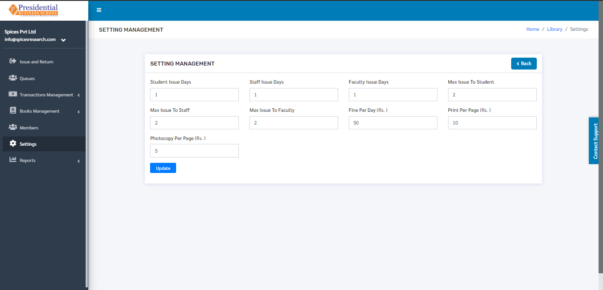
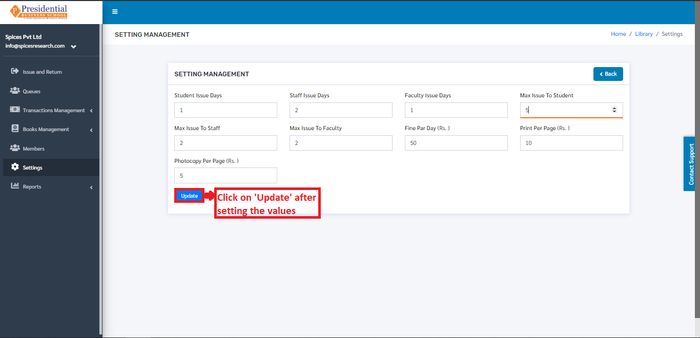

Settings
==========

The sub-module **‘Settings’** is used to set the different aspects of the library such as Student Issue Days, Staff Issue Days, Faculty Issue Days, Max Issue To Student, Max Issue To Staff, Max Issue To Faculty, Fine Per Day (Rs.), Print Per Page (Rs.), Photocopy Per Page (Rs.).

* **‘Settings’** is accessed by clicking on the Settings on the left hand side of the dashboard. This is done by the following process.

* The following page will appear by clicking the **‘Settings’**.

* The desired values can be set on different options in the Settings Dashboard.

* **‘Update’** button has to be clicked to finish up the setting of different aspects of the library.

