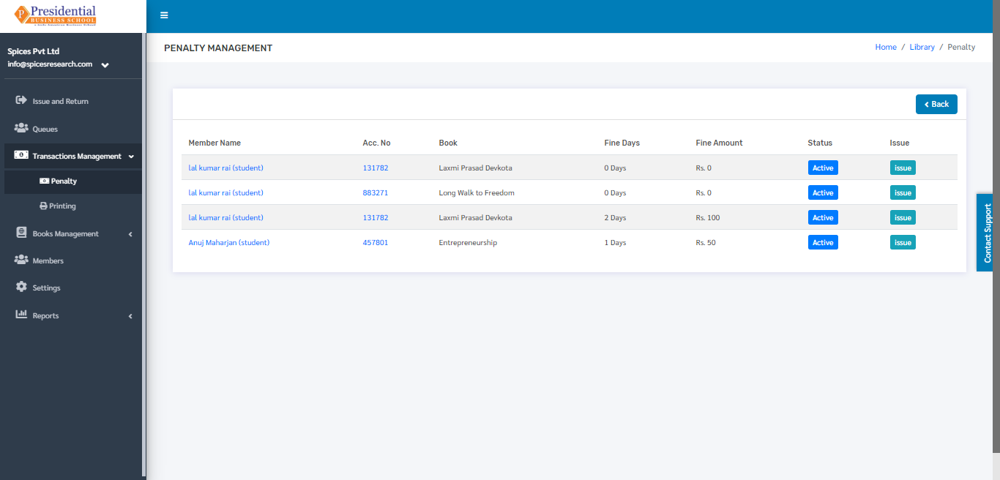

Transaction Management
========================

The penalty and printing action are the main factors that are dealt in the transaction management. Students must pay a penalty of some amount if he/she is not able to return the book on allocated time. Students are able to print and photocopy the desired documents or books or any other resource in the library; the librarian will charge some amount for printing or photocopy.

* Users(Librarian) must click on **‘Transaction Management’** on the left hand side of the dashboard to access it. This is done by the following process.

* On clicking **‘Transaction Management’**, two subcategories will appear namely Penalty and Printing.

Penalty
--------

* The user must click on **‘Penalty’** to access this subcategory. This is done by the following process.

* The following page will appear on clicking Penalty.

The penalty is generated after the book is being returned back to the library. The fine amount is generated as per the fine days and fine amount set in the system.

Issue
^^^^^^

The user can view the issue details of each penalty by clicking on the Issue button.

After clicking the issue button, the user will be redirected to the issue details page which looks like the following:

In this page, details of the book issue are shown such as Issue Date, Return Date, Fine Days and the Fine amount.

The user can click on the View More buttons to view the details of the member or the issued book. On clicking on the view more button the user is redirected to the respective details page of the member and book.

The Member details page looks like following:

Here the User can view all the details about the member to which the book is issued.

Similarly, the book detail page looks like following:

Printing
---------

* Printing is used to keep the record of the students who have either printed or photocopied any type of document.

* The user must click on **‘Printing’** to access this subcategory. This is done by the following process.

* The following page will appear on clicking Printing.

Record Printing or Photocopy Task
^^^^^^^^^^^^^^^^^^^^^^^^^^^^^^^^^^^^

* The record of the photocopy and printing is kept by clicking on the **‘Add New’** button.

* The user will be landed on the following page.

* The required details in the form must be filled out and click on the Submit button to finish up the process.

* On clicking the **‘Submit’** button the record can be seen on the dashboard of **‘Printing’**.

