*******************
Manage Users
*******************

User management is a section under the System Structure module. To access the user management section, click on System Structure in the dashboard.

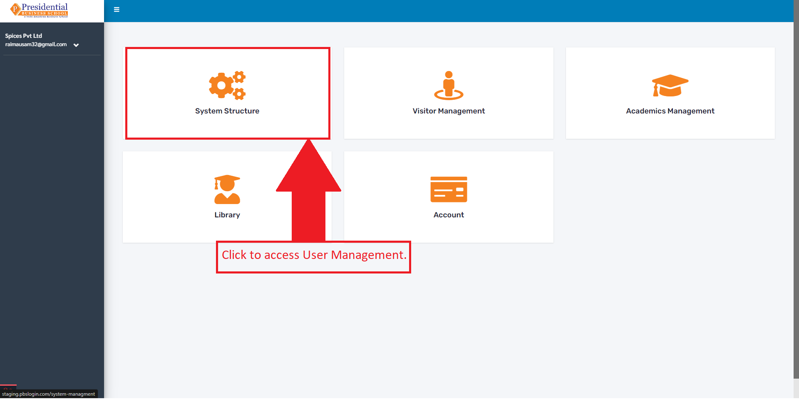

The user will then be redirected to the following page:

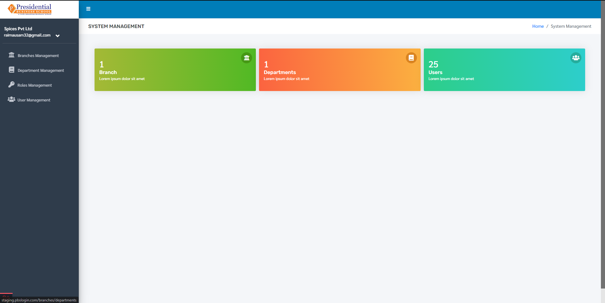

Click on the **User Management** link to manage users.

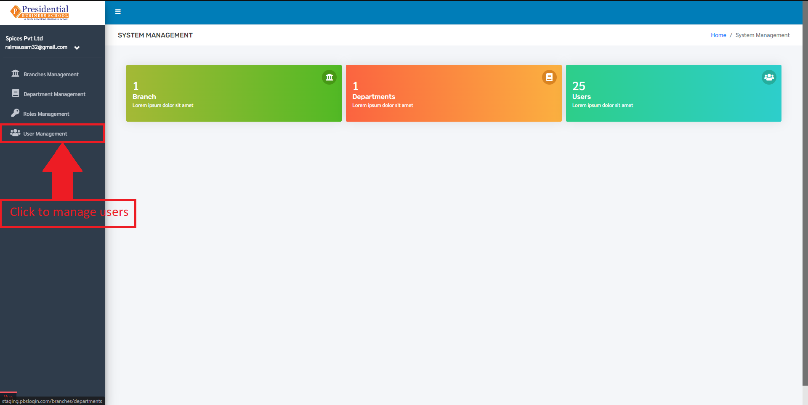

After clicking on the **User Management** link, the user will be directed to the following page:

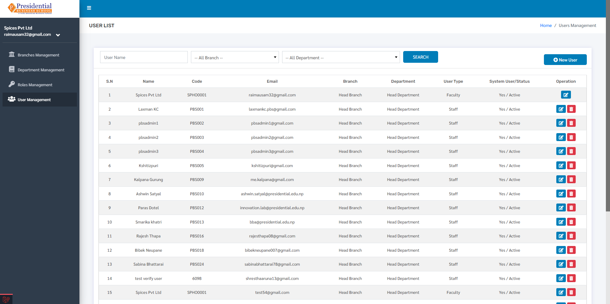

Here, the list of all the current users is displayed. To create a new user, click on the **‘New User’** button.

Create New User
--------------------

To create a new user, click on the **‘New User’** button.

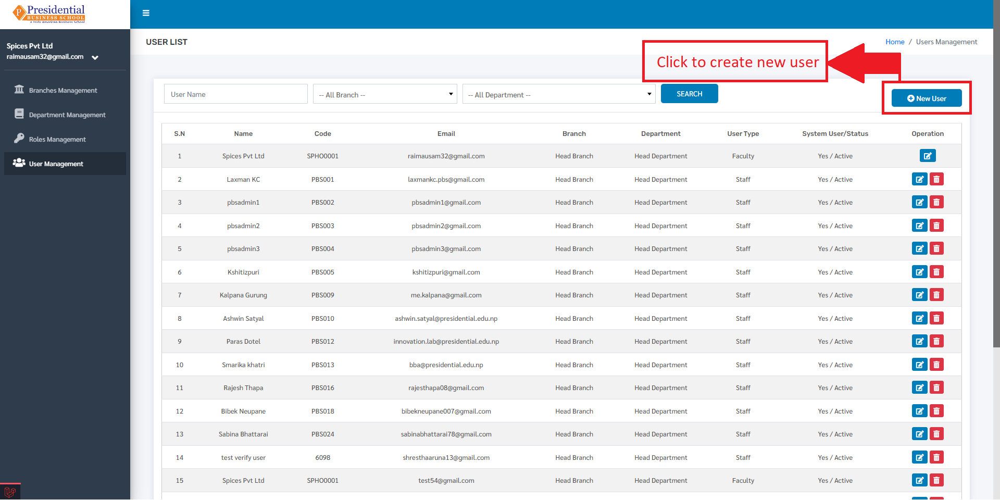

After clicking on the ‘New User’, the user will be redirected to a form to create a new user which looks like following:

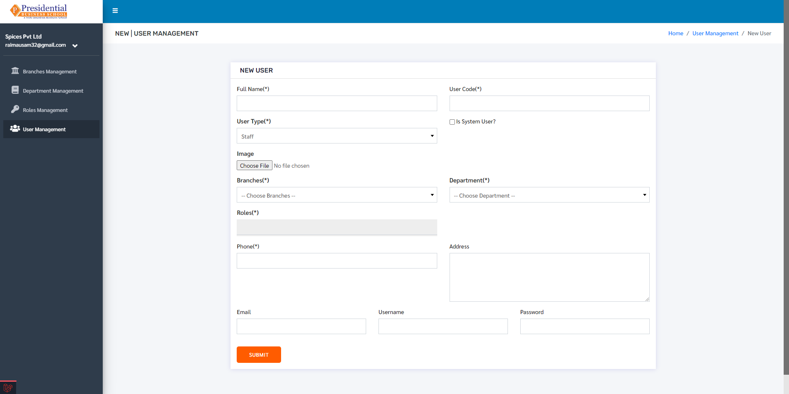

The user must specify primarily the roles of the new user as well as other details such as department, username and password.
After filling all the necessary details, click on the **‘Submit’** button to create a new user.

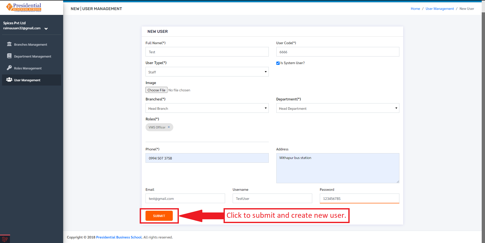

After clicking on **‘Submit’** new user will be created and will be displayed in the users section.

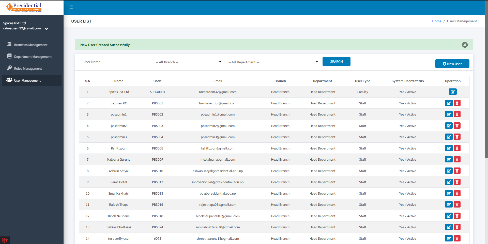

Edit User
--------------------

To edit the user details click on the edit button.

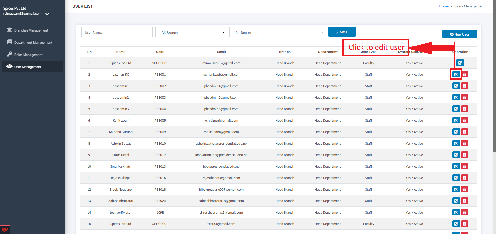

The user will be redirected to a form containing the user details. To update the details, edit the desired data and click on the update button.

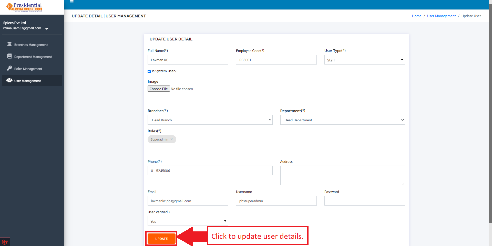

Delete User
--------------------
To delete a user, click on the delete button.

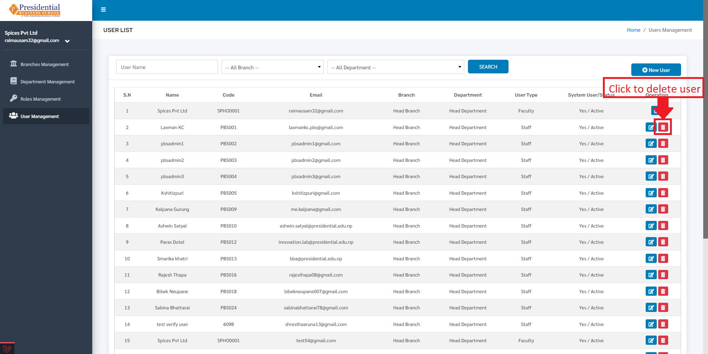

After clicking on the delete button, a confirmation modal will appear. Click on the check button to confirm delete or cross button to cancel deleting the user.

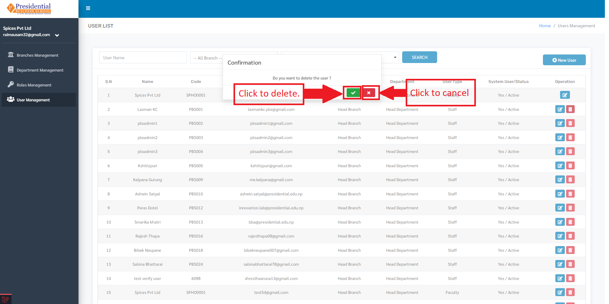

