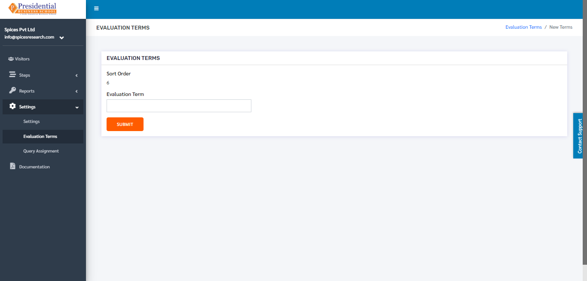
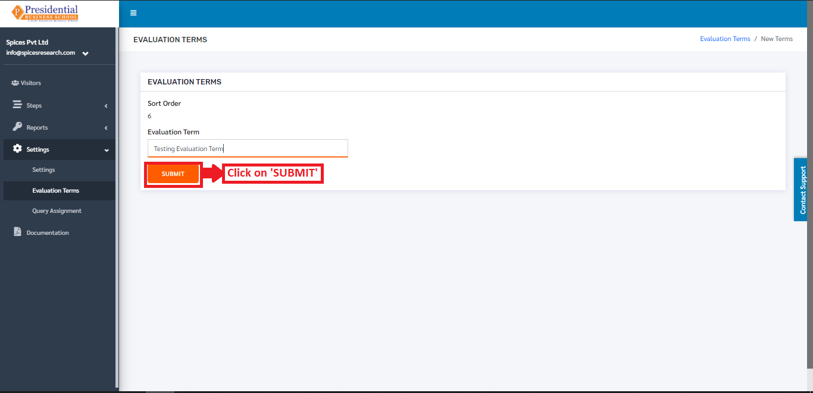
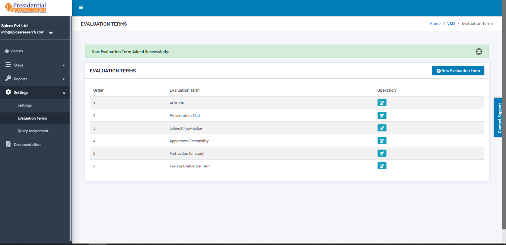
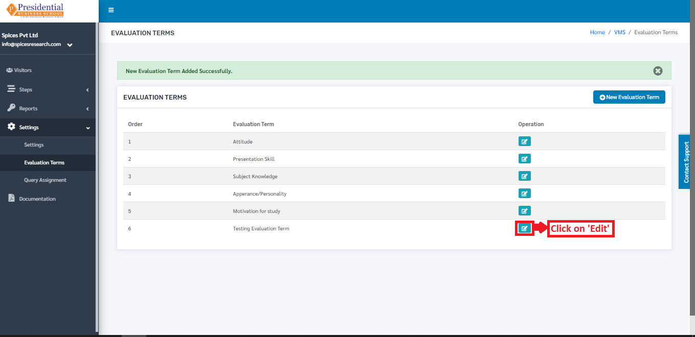
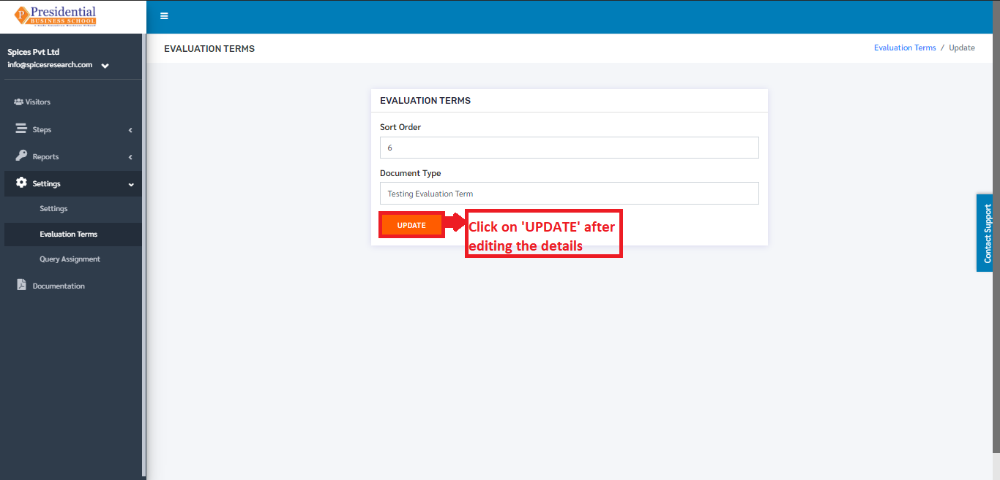
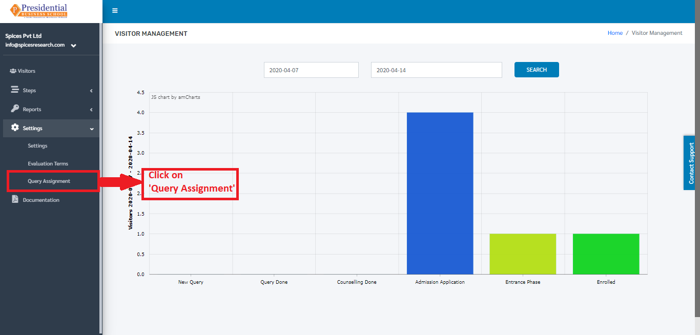
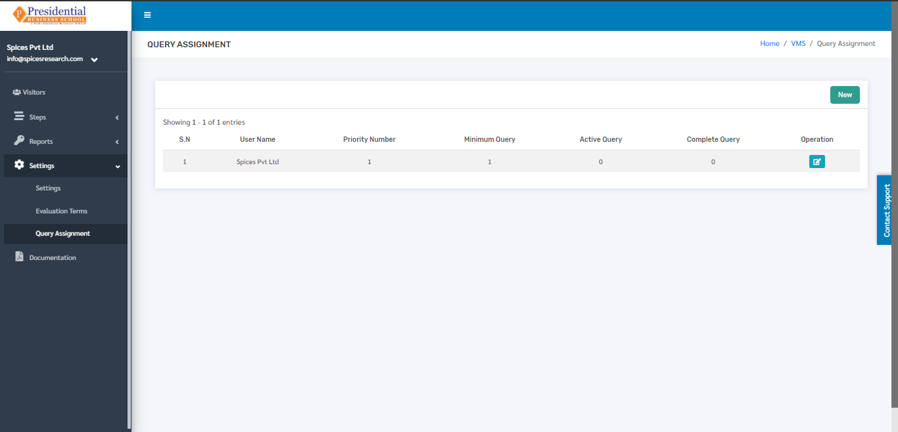
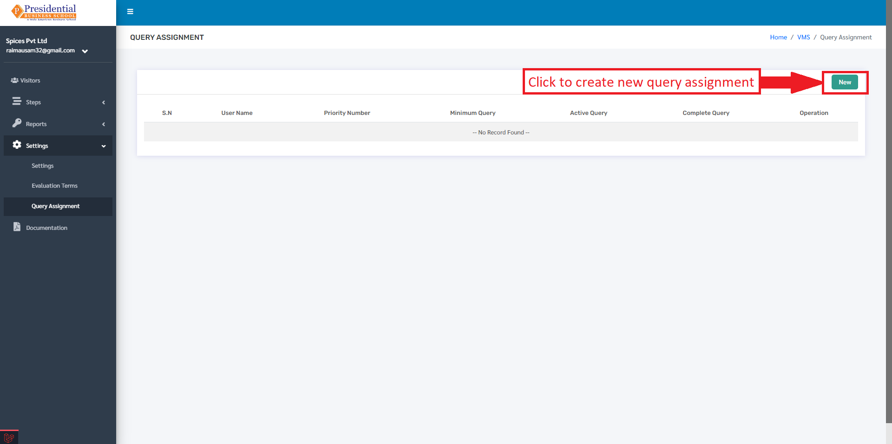
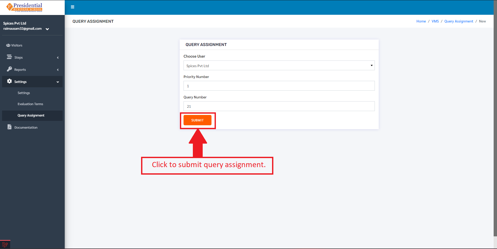
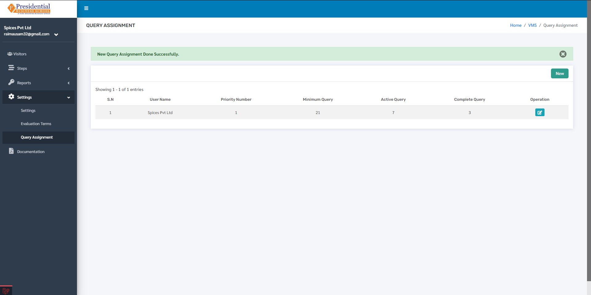

Settings
================

The sub-module **‘Settings’** is used to set the fee for Application Form and set the evaluation terms for Interview.

* Users must click on **‘Settings’** on the left hand side of the dashboard to access it. This is done by the following process.

 .. image:: ./../../images/visitormgmt/image33.png

* On clicking on Reports, three subcategories will appear namely Settings, Evaluation Terms and Query Assignment.

 .. image:: ./../../images/visitormgmt/image34.png

1. Settings
^^^^^^^^^^^^^^

This subcategory is used for setting up the fee for Application Form.

* The user from the college must click on **‘Settings’** to access this subcategory. This is done by the following process.

 .. image:: ./../../images/visitormgmt/image35.png

* The following page will appear on clicking Settings.

 .. image:: ./../../images/visitormgmt/image37.png

 The Form Application Fee can be set up to the desired amount as per the college rule. The user must then click on the **‘SUBMIT’** button to finish up the process.

2. Evaluation Terms
^^^^^^^^^^^^^^^^^^^

This subcategory is used for setting up the evaluation terms for the Interview.

* The user from the college must click on **‘Evaluation Terms’** to access this subcategory. This is done by the following process.

 .. image:: ./../../images/visitormgmt/image26.png

* The following page will appear on clicking Evaluation Terms.

 .. image:: ./../../images/visitormgmt/image27.png

The page provides the information on the existing evaluation terms used for the interview.

2.1 Create New Evaluation Term
""""""""""""""""""""""""""""""

* Users can create a new evaluation term in the system by clicking on the **‘New Evaluation Term’** button(icon) on the top right hand side of the dashboard as shown in the picture below.

 .. image:: ./../../images/visitormgmt/image52.png

* On clicking the **‘New Evaluation Term’** button(icon), the user will be landed on the following page.

* As shown in the picture below, the user must fill out the form and click on the **‘SUBMIT’** button to finish up the creation of the new evaluation term.

* Once the **‘SUBMIT’** button is clicked a new evaluation term is created and seen on the dashboard of Evaluation Term.

2.2 Edit Evaluation Terms
""""""""""""""""""""""""""

* Details of the evaluation terms can be edited as well. This is done by clicking on the **‘Edit’** icon(button) under the Operation column.

* On clicking the **‘Edit’** button, the following page will appear.

Once the details are edited, the user must click on the **‘UPDATE’** button to finish up the editing process.

3. Query Assignment
^^^^^^^^^^^^^^^^^^^^

* The user(admin) from the college must click on **‘Query Assignment’** to access this subcategory. This is done by the following process.

* The following page will appear on clicking the Query Assignment.

Here, User can create a new Query assignment by clicking on the New button.

After clicking on the **‘New’** button, a form will appear. After filling the form for the new query assignment, the user should click on the submit button to submit the new query assignment.

After clicking on Submit, a confirmation message will appear as well as the new Query Assignment which looks like the following.

