Steps
=========  

As the name implies, **‘Steps’** provides the steps(phases) that are necessary to get enrolled in the college.

* Users must click on **‘Steps’** on the left hand side of the dashboard to access it. This is done by the following process.

.. image:: ./../../images/visitormgmt/image78.png

* On clicking **‘Steps’**, the subcategory of **‘Steps’** can be seen.

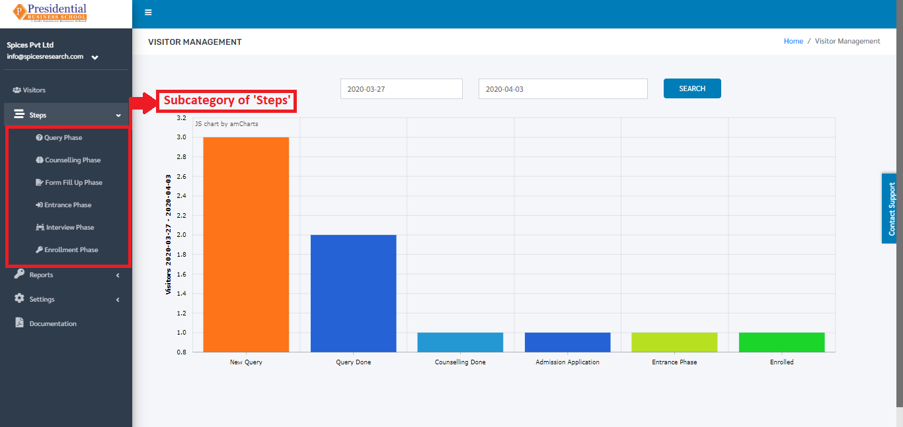

The subcategory of **‘Steps’** consists of following phases:

1. Query Phase
2. Counselling Phase
3. Form Fill Up Phase
4. Entrance Phase
5. Interview Phase
6. Enrollment Phase

1. Query Phase
^^^^^^^^^^^^^^

This phase is considered to be the first phase of the Visitors visiting the college. In this phase, the inquiry takes place with the student and the form is filled out accordingly.

* The user from the college must click on **‘Query Phase’** to access this subcategory. This is done by the following process.

.. image:: ./../../images/visitormgmt/image80.png

* The following page consisting of a form will appear on clicking **‘Query Phase’**.

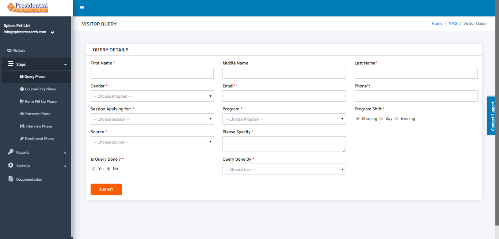

* As shown in the picture below, the user must fill the form and click on the **‘SUBMIT’** button to finish up the Query phase.

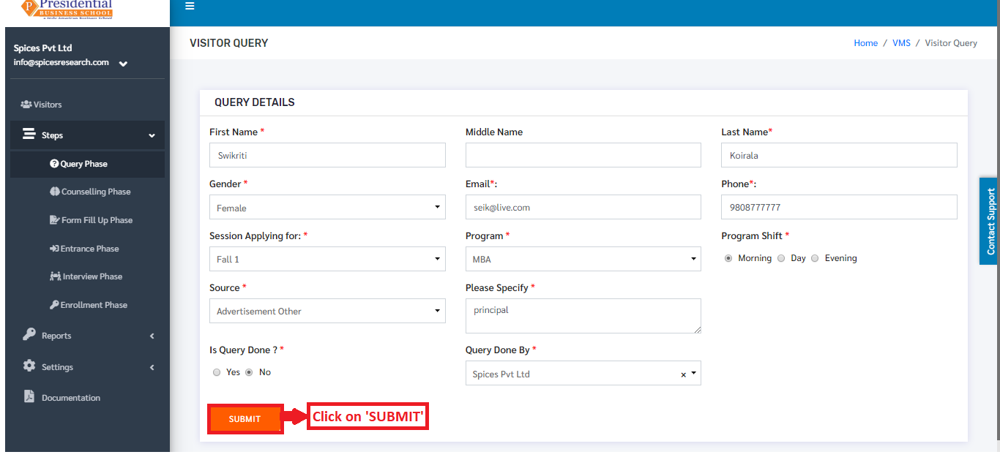

* People visit and finish the query on the same day. But there are people who visit the college but do not finish the query on the same day.

* The status of the Query phase is completed if the radio button of *‘Is Query Done’* is clicked on *‘Yes’* in the form. The status is seen as *‘New Query’* if the radio button of *‘Is Query Done’* is clicked on *‘No’* in the form.

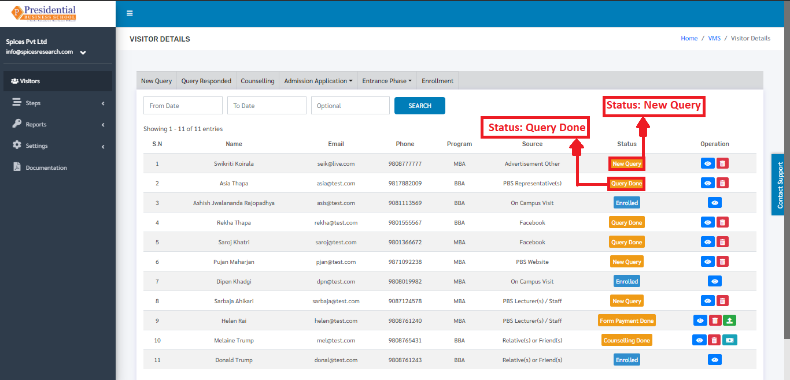

* After the query of a student is finished, the status of the *‘New Query’* can be changed to *‘Query Done’*. This is done by clicking on the View button under Operation column whose status is *‘New Query’*.

.. image:: ./../../images/visitormgmt/image82.png

* The following page will appear on clicking the **‘View’** button.

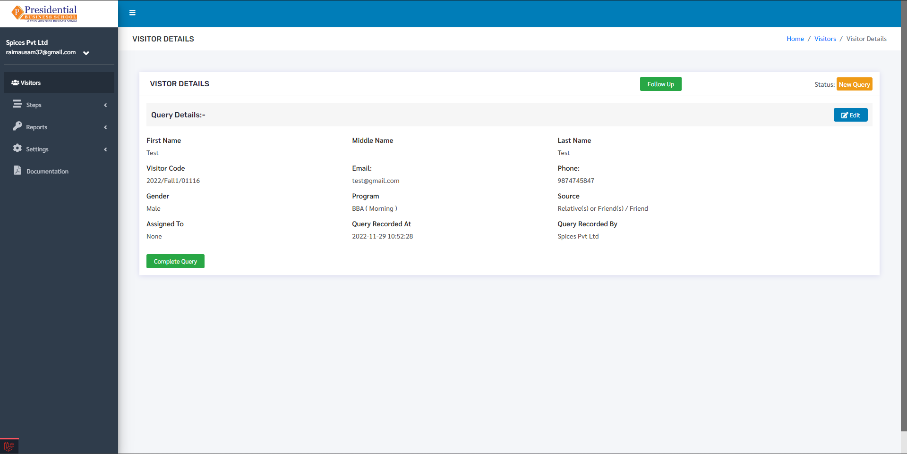

* **‘Complete Query’** button must be clicked once the query of a person(student) is finished.

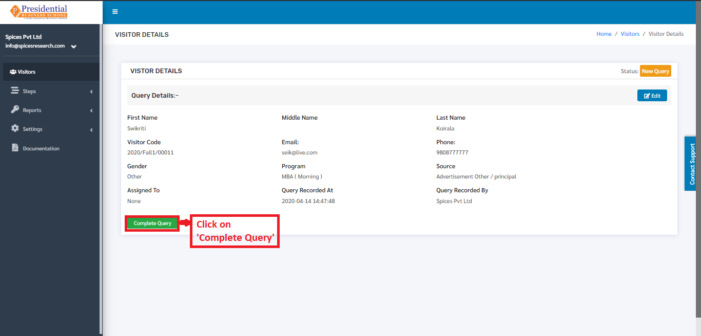

On clicking the **‘Complete Query’** button, the status will change from New Query to Query Done. The change can be seen on the dashboard of **‘Visitors’**.

The User can also click on the **‘Follow up’** button to save remarks regarding the query.

.. image:: ./../../images/visitormgmt/image3.png

After clicking on the ‘Follow Up’ button a ‘Visitor Follow Up Form’ will be displayed where the user can enter the follow up details which looks like following:

.. image:: ./../../images/visitormgmt/image14.png

The user can then fill up the form to add visitor follow up remarks. On clicking the check button, the remarks will be saved and will be displayed under the **Follow Up Details** table as follows:

.. image:: ./../../images/visitormgmt/image38.png

* In any case, if the details of the students in the Query phase need to be viewed or edited then the user can do it by clicking on the **‘View’** icon(button) under the Operation column.

.. image:: ./../../images/visitormgmt/image85.png

* The following page will appear on clicking the **‘View’** button.

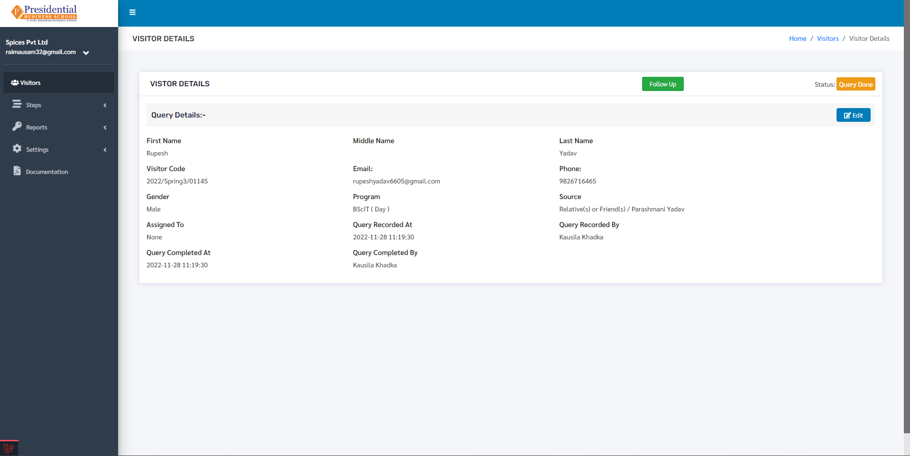

* For editing, the user must click on the **‘Edit’** button.

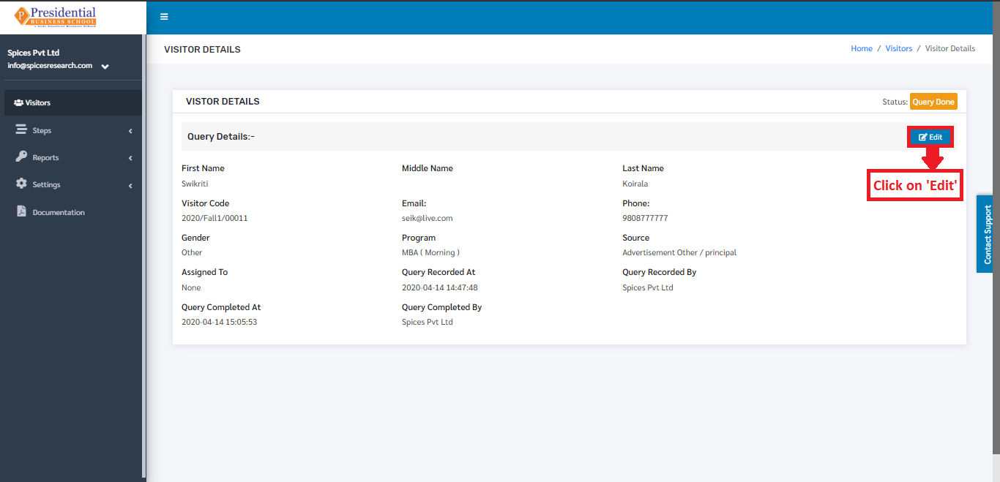

* The following page will appear on clicking the **‘Edit’** button.

.. image:: ./../../images/visitormgmt/image87.png

* After editing the desired details, the user will have to click on the **‘UPDATE’** button to finish up the process.

.. image:: ./../../images/visitormgmt/image88.png

2. Counseling Phase
^^^^^^^^^^^^^^^^^^^

This phase is the second phase of the Visitors after the query phase is done. The students can only be in the counseling phase after their query phase is completed. In this phase, counseling is provided to the students about the importance and advantages of studying in college.

* The user from the college must click on **‘Counseling Phase’** to access this subcategory. This is done by the following process.

.. image:: ./../../images/visitormgmt/image89.png

* The following page consisting of a form will appear on clicking **‘Counseling Phase’**.

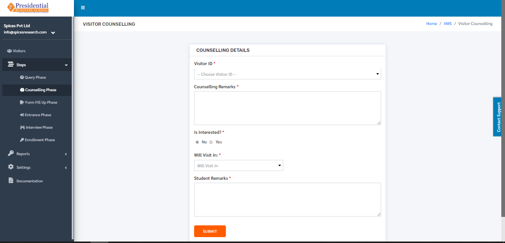

* As shown in the picture below, the user must fill out the form and click on the **‘SUBMIT’** button to finish up the Counselling phase.

.. image:: ./../../images/visitormgmt/image61.png

The name of the student will appear in Visitor ID only if the query phase is finished. After clicking on the submit button, the visitor details will be shown with a message showing that the visitor counseling was recorded successfully.

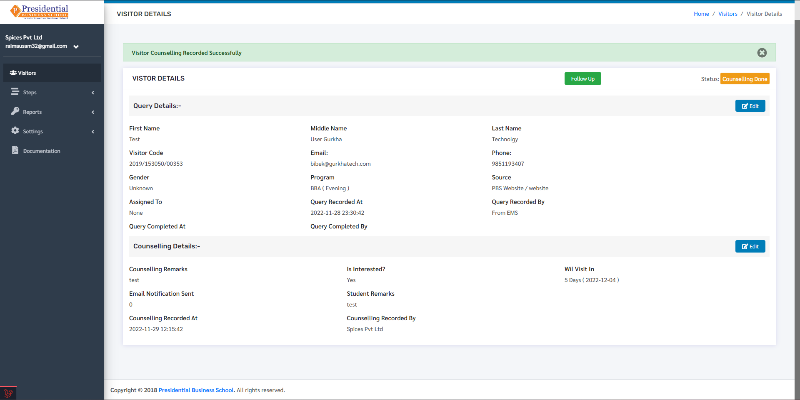

* Once the ‘SUBMIT’ button is clicked, the Counseling Phase is completed and the status can be seen on the Visitors dashboard as **‘Counseling Done’**.

* In any case, if the details of the students in the Counseling phase need to be viewed or edited then the user can do it by clicking on the **‘View’** icon(button) under the Operation column.

.. image:: ./../../images/visitormgmt/image63.png

* The following page will appear on clicking the **‘View’** button.

.. image:: ./../../images/visitormgmt/image13.png

* For editing, the user must click on the **‘Edit’** button.

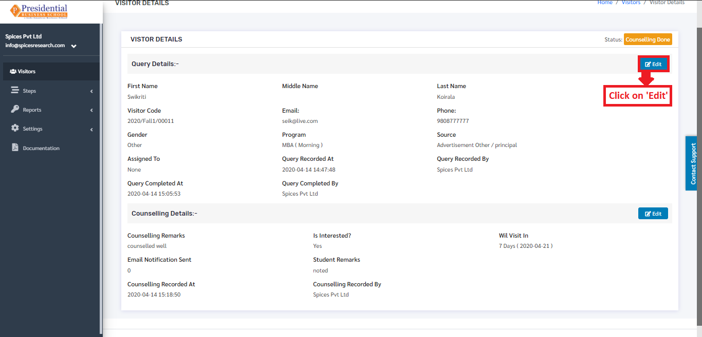

* The following page will appear on clicking the **‘Edit’** button.

After editing the desired details, the user will have to click on the **‘UPDATE’** button to finish up the editing process.

* After the counseling is done, the students must pay the fee of the form for the entrance exam. Once the payment is done by the student, the user will have to indicate that the form fee is paid.

* This is done by clicking on the ‘Form Application Payment’ icon under the Operation column.

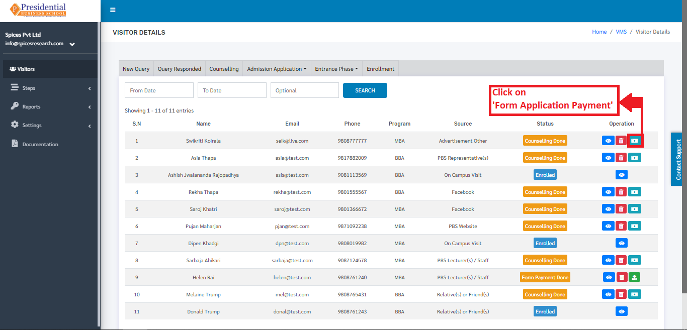

* On clicking ‘Form Application Payment’, the following page will appear.

* Once the student pays the fee for the form then the user must click on the **‘PAY’** button to finish up the process.

* The status will appear as **‘Form Payment Done’** in the Visitors Dashboard after the payment is done.

* Once the payment for the form is done, the link of the Form can be sent to the students in their email as well. This is done by clicking on the **‘Send Form Application Link’** icon under the Operation column.

A confirmation modal will appear to confirm whether the user wants to send the form to the visitor.

.. image:: ./../../images/visitormgmt/image90.png

Here the user can click on the Tick button to send the form or click on Close button to cancel sending the form.

3. Form Fill Up Phase
^^^^^^^^^^^^^^^^^^^^^

    This phase is the third phase of the Visitors after the Counseling phase is done. The payment for the form is done in the Counseling phase. The students can only be seen in the ‘Form Fill Up’ phase form after their Counseling phase is completed. In this phase, the form is filled with different Personal details of the students along with their Academic details.

* The user from the college must click on **‘Form Fill Up Phase’** to access this subcategory. This is done by the following process.

* The following page will appear on clicking **‘Form Fill Up Phase’**.

* As shown in the picture below, the user from college must fill out the Personal Details form and click on the **‘NEXT’** button.

* After the **‘NEXT’** button is clicked, the page is redirected to the form of Academic Details.

.. image:: ./../../images/visitormgmt/image21.png

* The college user must fill out the Academic details of the student and the academic certificates of the degrees have to be uploaded as well.

* After the form fill up is done then the **‘SUBMIT’** button must be clicked.

* On clicking the **‘SUBMIT’** button, the form fill up phase is completed and is sent to the Admin User of the college to approve it. The status will change to **‘Form Applied’** in the dashboard of Visitors.

* The form that is applied can either be approved or rejected by the admin personnel of the college by viewing the details which includes the Academic qualifications.

3.1 Approve Form(ADMIN USER)
"""""""""""""""""""""""""""""

* If the academic qualification and other details meet the required criteria of the college then the **Admin** personnel(user) of the college can approve the form.

* For Approving, the Admin-User must click on the **‘View’** icon.

* The following page will appear on clicking the **‘View’** button.

* On clicking the **‘Approve’** button, the form is approved by the college and the status of the student can be seen as **‘Form Approved’** in the Visitors dashboard.

* The entrance card can be printed and given to the student. This is done by clicking on the **‘Print Entrance Card’** icon under Operation Column.

* On clicking the **‘Print Entrance Card’** icon, a new tab will open and the entrance card can be viewed and printed so it can be given to the particular student.

3.1  Reject Form(ADMIN USER)
"""""""""""""""""""""""""""""

* If the academic qualification and other details do not meet the required criteria of the college then the Admin personnel(user) of the college will reject the form.
* The Admin-User must click on the **‘View’** icon to access the Reject option.

* The following page will appear on clicking the **‘View’** button.

* On clicking the **‘Reject’** button, the form is rejected by the college and the status of the student can be seen as **‘Form Declined’** in the Visitors dashboard.

If the form is declined by the college, the student will not be able to join the college or he/she will have to apply in the next intake.

4. Entrance Phase
^^^^^^^^^^^^^^^^^^

 This phase is the fourth phase of the Visitors after the Form Fill Up phase. This phase is done once the student has given the entrance exam. In this phase, the form is filled with the obtained marks and remarks of Pass or Fail in the entrance exam. This can be considered as the marksheet of the entrance exam.

 * The user from the college must click on **‘Entrance Phase’** to access this subcategory. This is done by the following process.

* The following page will appear on clicking **‘Entrance Phase’**.

.. image:: ./../../images/visitormgmt/image11.png

4.1 Entrance Passed
""""""""""""""""""""

* As shown in the picture below, the user from college must fill out the form which can be considered a marksheet of the student and click on the **‘SUBMIT’** button. Clicking on the radio button **‘Pass’** indicates that the student has passed the entrance.

* On choosing the Radio button as Pass and clicking the **SUBMIT** button, the entrance exam is considered as Passed by the student and the status on the Visitors dashboard can be seen as **‘Entrance Passed’**.

4.2 Entrance Failed
""""""""""""""""""""

* As shown in the picture below, the user from college must fill out the form which can be considered a marksheet of the student and click on the **‘SUBMIT’** button. Clicking on the radio button **‘Fail’** indicates that the student has failed the entrance.

* On choosing the Radio button as Fail and clicking the SUBMIT button, the entrance exam is considered as Failed by the student and the status on the Visitors dashboard can be seen as **‘Entrance Failed’**.

5. Interview Phase
^^^^^^^^^^^^^^^^^^

 This phase is the fifth phase of the Visitors after the Entrance phase. This phase is done once the student has passed the entrance exam. The passed students in the Entrance exam are called for the interview. In this phase, the form is filled on the basis of some evaluation terms of the interview. This can be considered as the marksheet of the interview.

 * The user from the college must click on **‘Interview Phase’** to access this subcategory. This is done by the following process.

 .. image:: ./../../images/visitormgmt/image43.png

* The following page will appear on clicking **‘Interview Phase’**.

 .. image:: ./../../images/visitormgmt/image44.png

* On the basis of the interview, the marks are given to the student. As shown in the picture below, the college user must fill out the form on the basis of the evaluation terms of the interview and click on the **‘SUBMIT’** button to finish up the Interview phase.

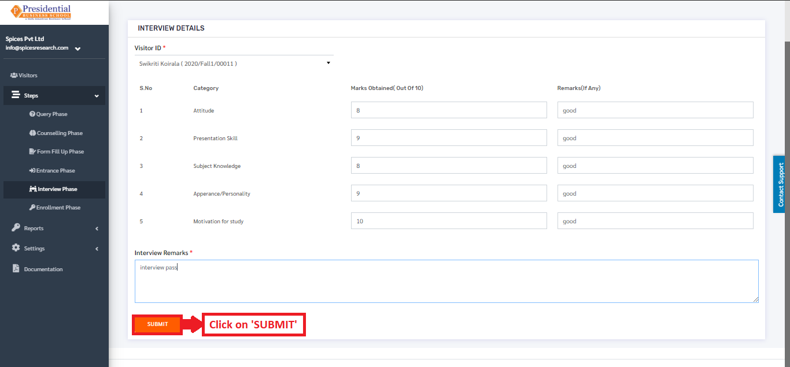

* Once the **‘SUBMIT’** button is clicked, the Interview Phase is completed and the status can be seen on the Visitors dashboard as **‘Interview Done’**.

6. Enrollment Phase
^^^^^^^^^^^^^^^^^^^

  This phase is the last(sixth) phase of the Visitors after the Interview phase. This phase is done once the student has passed the Interview. The passed students in the Interview are called for the Enrollment.

* The user from the college must click on **‘Enrollment Phase’** to access this subcategory. This is done by the following process.

* The following page will appear on clicking **‘Enrollment Phase’**.

.. image:: ./../../images/visitormgmt/image48.png

* As shown in the picture below, the user must fill out the form and click on the **‘SUBMIT’** button to finish up the Enrollment phase.

Once the **‘SUBMIT’** button is clicked, the Enrollment Phase is completed and the student is enrolled in the college i.e. the particular enrolled person is a new student in the college.
