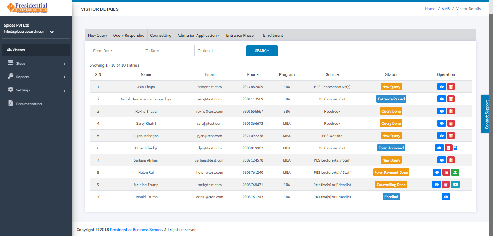

Visitors
==============   

**‘Visitors’** module allows users to view details about different people(students) who have visited the college. The dashboard of the module gives different status according to the phase that is completed for the enrollment of the student.

* Users must click on **‘Visitors’** on the left hand side of the dashboard to access it. This is done by the following process.

 .. image:: ./../../images/visitormgmt/image75.png

* On clicking **‘Visitors’**, the following dashboard will appear.

The page provides information about different people(students) along with the phase they have completed to get enrolled in the college. The phase can be seen as status.